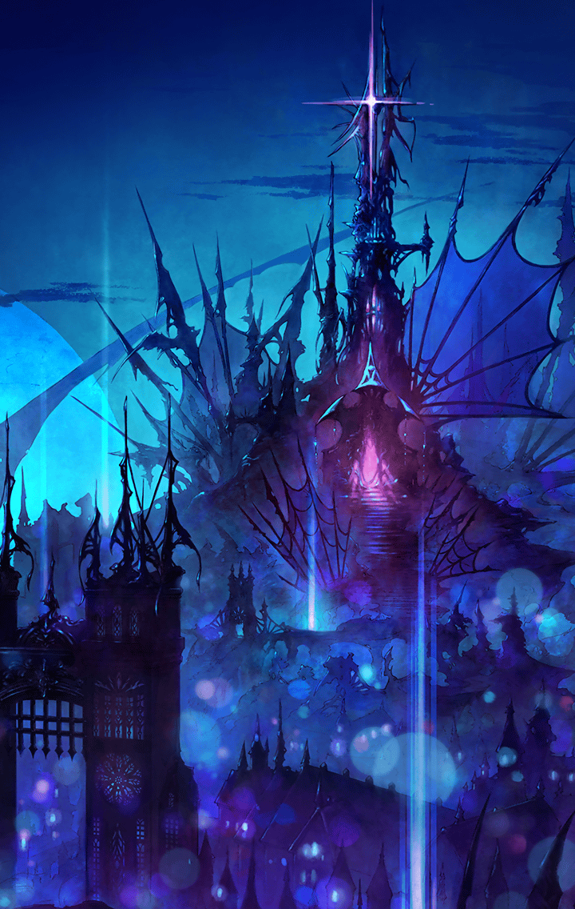

100304020 ロストラグナロク編(失われた千年王国編) 第3章 デモンズルール 第４話 鬩ぎ合う信念 STAGE2

[View script in lisp](../scripts/100304020.txt)

【アルマス】
それで、「あの方」って誰？
前も口にしていたけれど、
皇帝のこと？

【芭蕉扇】
そうよ
でも、あなた達の想像している
存在とは違うかもしれない

【芭蕉扇】
「力こそ正義」
その本当の意味を理解している方よ

【アルマス】
どんな考えをもっているのか
知らないけれど、ナディアは決して
殺させない

【芭蕉扇】
ああ、そういえば言ってなかったわね
ナディアを殺すのはやめたわ
「あの方」は方針転換したの

【アルマス】
どういう風の吹き回し？

【芭蕉扇】
それは私が考えることじゃないわ
全ては「あの方」がお決めになるの

【芭蕉扇】
ちょっと喋りすぎたわね
そろそろ帝都に帰るわ
助けてくれて、ありがとう

【アルマス】
ゲバルト伯爵からナディアを
取り返さなくていいのっ？

【芭蕉扇】
私は今回、ただの伝達役なのよ
帰る途中で変な斬ル姫に襲われて
しまったけれど…

【芭蕉扇】
あの斬ル姫、ヘレナと言ったわね
私を地べたに這いつくばらせたこと
必ず後悔させてあげる

【芭蕉扇】
ああ、そうだ
あの坊やに一つ伝言をお願い

【アルマス】
坊や…ギルのこと？

【芭蕉扇】
私達がオベロンを殺したって
言ってたでしょ
それで思い出したの

【芭蕉扇】
そういえば、私はオベロンが死ぬ
ところを見ていないわねって

【アルマス】
なんですって！？

【芭蕉扇】
あなたは知らないでしょうけど、
ナディアを逃がすためにオベロンは
転移魔法を使ったの

【芭蕉扇】
それで、私達斬ル姫は三人とも
すぐにナディアを捜して外に出た
だからトドメを差していないわ

【芭蕉扇】
あの場には三国の兵士が残って
いたから、彼らに殺されたものだと
思っていたけれど

【アルマス】
それなら、オベロン様はっ…

【芭蕉扇】
悪いけど、生きてる可能性は低いわよ
あの時点でかなり弱っていたから
それじゃあね

【アロンダイト】
妖精王オベロン…
以前、トレイセーマにいた妖精の
代表ですね

【アルマス】
ティニは…あのときオベロンの気配が
消えたって言ったわ…
でも、もしそれが…

【アルマス】
ダメよ！
下手に希望を持たない方が良い
みんなには黙っておくわ

【アロンダイト】
希望は持って良いと思いますけど…
私が口出しすることではありませんね
失礼しました

【アルマス】
いいの…
それより改めて言っておくわ

【アルマス】
ゲバルト伯爵からナディアを
取り戻したら、私はあなたと戦う
ことも、ためらわないから！

【アロンダイト】
はい…
私もです

Next: [100304031](100304031.md)

[Back to index](index.md)
