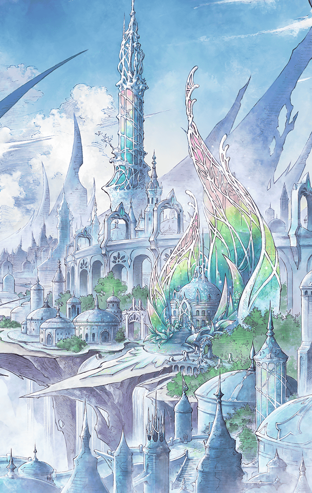

**【モラ】**
ねえねえ知ってる？
ねえ知ってる？
こんな喜劇をねえ知ってる？

**【ベガ】**
ねえねえ知ってる？
ねえ知ってる？
こんな悲劇をねえ知ってる？

**【モラ】**
いざ！新天地へ！
おいらを呼ぶ声が聞こえるぜ！

**【ベガ】**
あのー…
昔、お会いしましたよねー？

**【モラ】**
おいら過去は振り返らない主義さ！

**【ベガ】**
あのー…
随分と困ったことになってましてー

**【モラ】**
おいら他人の揉め事には口も手も
差し挟まない主義さ！

**【ベガ】**
あのー…
皆殺しにしても良いですかー？

**【モラ】**
おいら皆殺しに…皆殺し！？
そいつは是非とも見せてもらおう！

**【ベガ】**
それではまずはあなたから！

**【モラ】**
こいつはしまった
間違えた
皆殺しにおいらも入ってた

**【ベガ】**
こいつは良かった
ひっかかった
皆殺しにこいつも入れられた

**【モラ】**
罠ともしらずに
愚か者め
ああ愉快愉快♪

**【ベガ】**
ああ愉快愉快♪

**【モラ＆ベガ】**
ねえねえ知ってる？
ねえ知ってる？
こんなお話し、ねえ知ってる？
