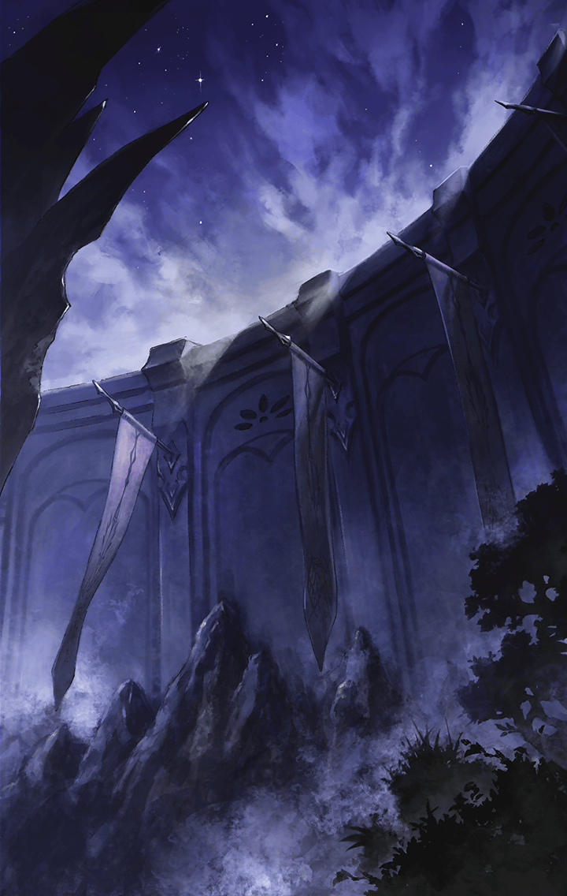

[View script in lisp](../scripts/100404041.txt)

**【ギル】**
やった！
もうすぐティルヘルムだぜ

**【ナディア】**
皆さん、もう少しです
頑張って下さい

**【ラグナロク国民達】**
よかった…
助かるんだっ

**【ナディア】**
そうです、もうすぐ――

**【ゲイボルグ】**
ああ、間に合った
今度こそ任務を完遂する

**【ギル】**
えっ…？
うわあああ！？

**【ゲイボルグ】**
まさか一番包囲陣が分厚い
私達の包囲を抜けていくとは…

**【ミストルティン】**
見つかったんですね
これで捨てられずに済みます…

**【ゲイボルグ】**
よくやってくれたミストルティン
貴様が木々に意識を張り巡らせて
いなければ察知できなかった

**【ゲイボルグ】**
隊長達は
アルマスとシユウの戦いに
気を取られて隙だらけだからな

**【ギル】**
嘘だろ…
あとちょっとだったのに…

**【ナディア】**
ギル、諦めないで下さい
まだ彼女がいます

**【天沼矛】**
あら～
いつの間にか夜になってました～
皆さん、ご無事ですか～？

**【ギル】**
天沼矛！
こうなったら、俺と天沼矛で
こいつらを足止めしてみせるぜ

**【ギル】**
ナディア様！
ここは俺達に任せて先に行って…

**【ギル】**
うおっとっとっと？

**【ナディア】**
何をしているんですかっ
ここは天沼矛に任せて走りますよ！

**【ラグナロク国民達】**
うわあああ…！
い、急げぇっ…！

**【ギル】**
俺の格好良い出番がぁぁっ…

**【ゲイボルグ】**
ハルモニアの斬ル姫が
ナディア姫の逃亡を手助けするとは、
どういう了見だ？

**【天沼矛】**
そうですね～…
話すと長くなるんですよ～
どこからお話ししましょうか～？

**【ゲイボルグ】**
もういい！
そこを通してもらうぞ！

Next: [100404043](100404043.md)

[Back to index](index.md)
