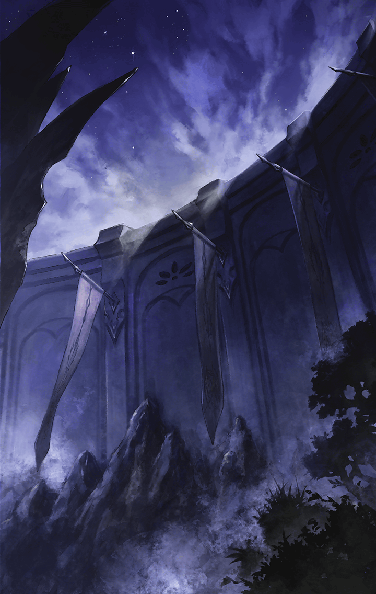

100405053 ロストラグナロク編(失われた千年王国編) 第4章 ブレイク・アゲイン 第５話 ブレイク・アゲイン5話　STAGE5　戦闘後

[View script in lisp](../scripts/100405053.txt)

【三国の兵士達】
相手はたった一人だ！
恐れるなー！！

【ナディア】
アルマス！

【アルマス】
えっ…？
ナディア、早く下がって！
敵が来るわ！

【ナディア】
いいえ、下がりません
あなたの側が一番安全ですから

【アルマス】
そんなふうに言われたら
何も言い返せないわね

【アルマス】
マスター！
せっかくだからあなたも
側にいなさいよ！

【ティターニア】
私もいますよ！

【アルマス】
何だか不思議ね
大軍と向き合っているのに…
力が湧いてくるのよっ

【アルマス】
私は、どんな絶望的な状況でも
諦めたりしない！

【アルマス】
それがアルマスのキラーズを宿した
私自身の宿命よ！！

【ナディア】
アルマス…！
あなた一人に背負わせはしません！
私も力にっ

【三国の兵士達】
な…何だ、この光はっ？

【アルマス】
何これ…？
力が漲ってくる
マスター…じゃない…

【アルマス】
この感覚は…ナディア？

【ナディア】
…………

【ティターニア】
ナディアから
強い力が流れ込んできます！

【アルマス】
良く分からないけど、
これならいける！！

【アルマス】
はああああああああああ！！

【三国の兵士達】
うわあああああああ…

【アルマス】
…何だったの、今の？
たった一振りで全員を薙ぎ倒した

【ティターニア】
しかも皆、気絶しているだけです

【アルマス】
もしかして、ナディアの力が…

【ナディア】
…………

【アルマス】
ナディア！？
しっかりしてっ

Next: [100405060](100405060.md)

[Back to index](index.md)
