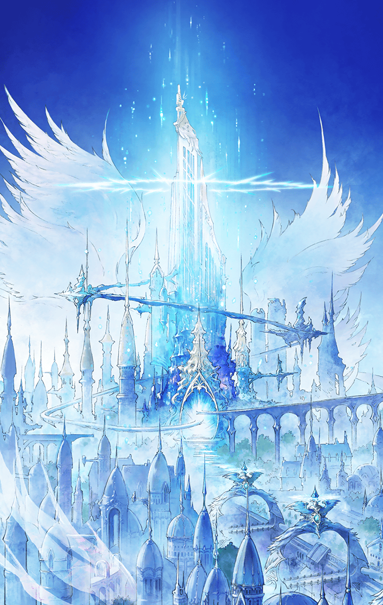

[View script in lisp](../scripts/100503051.txt)

**【魔獣ミョルニル】**
グアアアアアアアアアアアア！

**【ハルモニア国民】**
ひぃぃぃぃっ…！
助けてくれぇっ…！

**【ハルモニア兵】**
化け物を取り囲みなさい！
斬ル姫が到着するまで
時間を稼ぐのです！

**【トレイセーマ兵】**
くそっ…
なんでこんなときに
化け物が出るんだよ…！

**【トレイセーマ兵】**
あれって
ラグナロク王国に駐屯してた部隊を
襲ったって奴か…？

**【トレイセーマ兵】**
首都の近くに現れた奴は
退治されたって聞いたけど、
とんでもない被害が出たらしいぞ…

**【魔獣ミョルニル】**
ガアアアアアアアアアアアアアア！

**【ハルモニア兵】**
ぐぅっ…
とても、持ち堪えられません…

**【ロンギヌス】**
お待たせしました
ここは私に任せてください

**【ハルモニア兵】**
ロンギヌスです！

**【ハルモニア兵】**
セイントキラーズを
送り込んでくださるとは
教皇様はなんと慈悲深い…

**【フォルカス】**
兵士は住民の避難を手伝ってください
教皇様の命により私が指揮を執ります

**【ハルモニア兵】**
教皇様の命令ですか…
ならば従いましょう

**【フォルカス】**
ヴァナルガンド、
あなたはトレイセーマ兵を
追い払う手伝いをしてください

**【ヴァナルガンド】**
それは他の斬ル姫で十分でしょう？
私はロンギヌスとともに、
キラーメイルを駆逐します

**【フォルカス】**
今のあなたでは無理です…

**【ヴァナルガンド】**
そうやって、あなたは私を
排除しようとするのですね…
なぜ、私を嫌うのですか？

**【フォルカス】**
…嫌ってなどいません

**【フォルカス】**
あなたこそ、
教皇様の御心を
理解していないでしょう

**【ヴァナルガンド】**
教皇様の御心？
なにを言っているのか――

**【ロンギヌス】**
お二人とも、そのくらいに…
言い争っているときではないと
私は思います…

**【フォルカス】**
そうでした
行きますよ、
ヴァナルガンド

**【ヴァナルガンド】**
…ここはお願いします、
ロンギヌス

**【トレイセーマ兵】**
ハルモニアの強力な斬ル姫が
出てきたようだ
早く撤退しなければ…！

**【トレイセーマ兵】**
でもっ…
どうやって逃げれば良いんだ
向こうには化け物がいるしっ…

**【グリモワール】**
まったく、
腰抜けばかりね！

**【トレイセーマ兵】**
識別系統Ｇ・○六…！？
た、助かった…
いや、もっと早く来い！

**【グリモワール】**
でぇ？
…っとと

**【グリモワール】**
キミ達の退路を作ってあげるから
ワタシの邪魔にならないよう、
さっさと引っ込みなさい！

**【トレイセーマ兵】**
ま、任せたぞ…！
識別系統Ｇ・○六！

**【ロンギヌス】**
トレイセーマの斬ル姫ですね
あのキラーメイルは
あなた達の仕業ですか？

**【グリモワール】**
そう見えるんだったら、
キミもたいしたことないわね
こっちも迷惑してんのよっ

**【ロンギヌス】**
そうですか…
では、あなたは後回しにします
先にあちらを倒さないと

**【グリモワール】**
それはこっちの台詞よ
こんなに理不尽な死をまき散らして…
死者の怒りが燃えさかっているわ

**【グリモワール】**
キラーメイル…
死者の怒りを
その身に受けるがいいっ！

Next: [100503053](100503053.md)

[Back to index](index.md)
