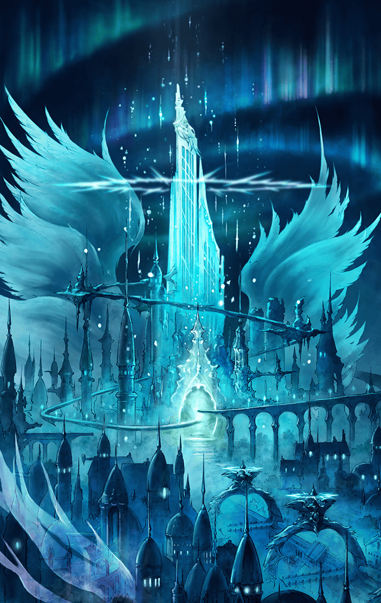

[View script in lisp](../scripts/100600000.txt)

【モラルタ】
ねえねえ知ってる？
ねえ知ってる？
こんな喜劇をねえ知ってる？

【ベガルタ】
ねえねえ知ってる？
ねえ知ってる？
こんな悲劇をねえ知ってる？

【モラルタ】
やいやい王様、顔を見せろ！
お前に聞きたいことがある

【ベガルタ】
あれあれ無礼な、通しはせぬ！
貴様は絶対、通しはせぬ

【モラルタ】
やいやい門番、そこをどけ！
お前を殴って押し通る

【ベガルタ】
あれあれ無体な、乱暴な！
貴様は迷子になっておれ

【モラルタ】
力を示せば全てが変わる
俺は世界を手に入れる

【ベガルタ】
力を示せば全てが変わる
私は全てを失うの

【モラルタ】
あちらを立てればこちらが立たず
こちらを立てればあちらが立たず

【ベガルタ】
とかく、この世は面倒だらけ
果ては地の底、覗き込む

【モラルタ】
おやおや？誰かが俺を見ているぞ

【ベガルタ】
あれあれ？誰かが私を見ています

【モラルタ】
覗いたつもりが覗かれた

【ベガルタ】
見ていたつもりが見られてた

【モラルタ】
全てはコインの裏表
くるくる回れば同じこと
ああ愉快愉快♪

【ベガルタ】
ああ愉快愉快♪

【モラルタ＆ベガルタ】
ねえねえ知ってる？
ねえ知ってる？
こんなお話し、ねえ知ってる？

Next: [100601010](100601010.md)

[Back to index](index.md)
