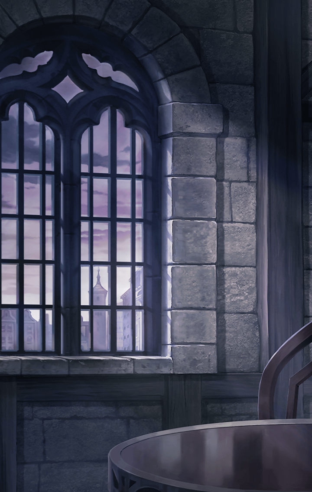

[View script in lisp](../scripts/100603020.txt)

**【？？？】**
いらっしゃい
お好きな席にどうぞ

**【？？？】**
俺の名前？
しがないバーテンダーの名前など
どうでもいいでしょう

**【？？？】**
おや、これは驚いた
ご存知だったんですか

**【オクタビオ】**
ええ…俺がここの店主、
オクタビオ・イエロ・モンテシーノス
ですよ

**【オクタビオ】**
名刺ですか
こんな時代にご丁寧なことだ
頂戴しますよ

**【オクタビオ】**
へぇ…貴方、N.W.G.財団に勤めて
おられるんですね

**【オクタビオ】**
俺のような場末のバーテンダーでも
財団の名前くらい知ってますよ
かの有名なビッグ４の一つ

**【オクタビオ】**
悪魔に対抗する組織…何と言ったかな
そうそう、ラグナロクだ

**【オクタビオ】**
ラグナロクの執政官が多く所属して
いる巨大企業体ですからね

**【オクタビオ】**
ははっ
拍手ありがとうございます
さて…

**【オクタビオ】**
そろそろご注文を
ここはバーですから

**【オクタビオ】**
…ご冗談を
俺などただのバーテンダーですよ
財団のエージェントなど勤まりません

**【オクタビオ】**
…その事件を調べたのですか
ええ、彼は自殺しましたよ
それだけのことです

**【オクタビオ】**
確かに俺は心理学の大学教授でした
博士号も持っている
そして…

**【オクタビオ】**
自殺した男は数年前、俺の友人を
死に追いやった
そちらの調べた通りです

**【オクタビオ】**
でも、それだけですよ
俺に繋がる糸はそこで途切れます
決して…

**【オクタビオ】**
俺が友人の仇討ちのために相手を
同じ目に遭わせたなどという証拠は
見つからない

**【オクタビオ】**
再びの拍手ありがとうございます
ご注文は？

**【オクタビオ】**
…なるほど
貴方は場末のバーテンダーに
過度な期待をするのですね

**【オクタビオ】**
いいでしょう
こういうのはどうですか？
ここに一枚のコインがあります

**【オクタビオ】**
これを弾いて裏表で決めましょう
表なら貴方の誘いを受けます
裏なら…お引き取り願います

**【オクタビオ】**
コインは表だった

**【オクタビオ】**
当然だ
そういう細工のしてあるコインを
使ったのだから

**【オクタビオ】**
財団の引き抜きに応じてみようと
思った理由なら幾らでも挙げられる
ただ、強いて挙げるとするならば…

**【オクタビオ】**
地上を支配しつつある悪魔に対抗し
ようなどという大博打になら
残り少ない人生を賭けるに足る

**【オクタビオ】**
そう思ったからだ

**【オクタビオ】**
俺もまだまだ青かったな

**【オクタビオ】**
財団のエージェントとして有望な
人間を幾人も引き抜いていく中で
さらに面白い話を聞いた

**【オクタビオ】**
キラーメイル実験…成功率の低すぎる
悪夢の実験…その被検体を集めている
そうだ

**【オクタビオ】**
俺はコインを弾いた

**【オクタビオ】**
そして、ガンバンテインになった