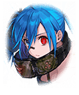

[View script in lisp](../scripts/100704030.txt)

【アルマス】
カシウス！
あなたがトレイセーマの
本当のトップなのね！？

【カシウス】
その問いには答えがあってないような
もの…すでに因果は決し、空蝉の中を
覗くに等しい

【アルマス】
つまり…何なのよ…？

【カシウス】
わたしは頂点を深奥に置いたの
還るべき地と同じように

【アルマス】
もっと端的に言いなさいよ！
つまりカシウスはトップだけど
トップじゃなくて黒幕のような…

【ギル】
アルマスも端的に言えてねぇじゃ
ねえか…

【アルマス】
ああ、もういいわ！
私がここに来た理由、
あなたなら分かってるわよね？

【アルマス】
トレイセーマには、どんな“遺物”が
伝わっているの！？
地底世界にはなにがあるのっ？

【ティターニア】
切り込みましたね、アルマス
でも、良い判断ですっ

【カシウス】
遺物？
あの二人は、そんなものに頼らないと
いけない状態なのね…可哀想

【アルマス】
カシウス？

【カシウス】
過去の遺物など必要ない
わたし達の役割は普遍にして自明

【カシウス】
地底には何があるのか？
アルマスがそんなことを尋ねるなんて
…強いて答えるなら“全て”よ

【アルマス】
ちょっと…
大きく出すぎじゃない？

【カシウス】
地底は原初の母、最古の導き手、
そして終焉へと至る場所

【カシウス】
生まれ、死に、再び生まれる輪廻の
観察者…だから、わたし達は向かう
そう望まれているから

【カシウス】
アルマス…あなたには刻まれなかった
使命よ
あなたは排除され、故に自由になった

【カシウス】
そのせいで辛酸の沼を這い回ったのね
けれど、こうして再び巡り会えた

【カシウス】
最後に会えて嬉しかった…
その身が朽ちるまで、地上で平穏な
日々を過ごしなさい

【カシウス】
わたしはそろそろ行くわ
あなたに会いたがってる者達が
いるから、後はよろしくね

【アルマス】
ちょっと待ちなさいよ！
一方的に言うだけ言って
はい、さよならって何！？

【アルマス】
あなたの言ったこと、
半分も理解できなかったんだけどっ

【カシウス】
理解する必要はないわ
あなたは舞台から降ろされたのだから
でも、それは幸せなことよ

【カシウス】
フェイルノートのようにあなたを
利用しようと考えたり

【カシウス】
ティファレトのようにあなたを
懐かしんだりすることは、
わたしにはない…

【カシウス】
ただ、運命の糸は紡がれ、織り込まれ
巨大なタペストリーを作り上げる
それが歴史なの

【カシウス】
さようなら、アルマス
永劫の果てで、また

【アルマス】
だから意味が分からないんだって！
待ちなさいよ！

【ケラウノス】
はいはーい
君達はここまでだよ

【アルマス】
邪魔しないで
まだ彼女と話したいことがあるのよっ

【ケラウノス】
でも、君に会いたがってる子達が
いるって巫女様が言ってたでしょ？

【アルマス】
誰よ、そいつら！？
私は別に会いたいなんて――

【モラルタ】
つれねえなあ、お嬢ちゃん
俺はあんたを忘れたことなんて
一度もねえってのによぉ

【ベガルタ】
あたいのこと忘れたなんて言ったら
承知しないよ

【アルマス】
あなた達、どうしてここに！？

Next: [100704040](100704040.md)

[Back to index](index.md)
