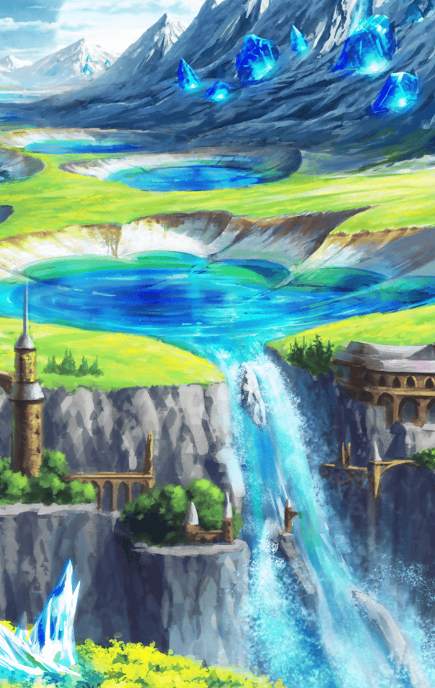

**【アロンダイト】**
はぁッ！はぁッ！はぁッ！

**【アロンダイト】**
す…素振り…百万回…
お…終わりッ…！

**【アロンダイト】**
…はぁ…はぁ…
…あ、マスター
まだ…見てらしたのですか…？

**【アロンダイト】**
さっきは…素っ気無く断ってしまい
申し訳ありませんでした…
せっかく誘って頂いたのに

**【アロンダイト】**
でも…少し気分が晴れました…
それは、いつも気に掛けて下さる
マスターのおかげかも

**【アロンダイト】**
ま…まだ間に合うのであれば…
お付き合い願えますか…？
遊びに…

遠慮がちに、
上目遣いで尋ねてくるアロンダイト

選択肢:
- アロンダイトは本当に真面目だな → [select_label_01](#select_label_01)へ
- 稽古も大事だけどリフレッシュもね → [select_label_02](#select_label_02)へ
- そんな、遠慮しなくていいんだよ！ → [select_label_03](#select_label_03)へ

遠慮がちに、
上目遣いで尋ねてくるアロンダイト

#### select_label_01:
 → [select_label_end](#select_label_end)へ

**【アロンダイト】**
ゆ…融通が利かなくて…
頑固なだけです…

#### select_label_02:
 → [select_label_end](#select_label_end)へ

**【アロンダイト】**
はい…その心の余裕がなければ
強くはなれませんね

#### select_label_03:
 → [select_label_end](#select_label_end)へ

**【アロンダイト】**
それではいけないのです…
常に強くなければ…

#### select_label_end:

**【アロンダイト】**
マスターをお守りするのが、
私の使命ですから
いつだって…強くありたいのです

**【アロンダイト】**
冷たく…愛想がないと
お感じかも知れませんが…

**【アロンダイト】**
マスターをお守りしたい…
その気持ちは本物ですから

真剣な目で、
マスターをじっと
見つめる彼女

**【アロンダイト】**
…あ、蝶々さん
ふふ、あなたも一緒に
遊びに行く？

目の前で、ひらひらと舞う蝶
アロンダイトは優しく手を
差し出した…が、

**【アロンダイト】**
…っ！
なぜ…蝶々さんを捕まえる事が
出来ないのでしょうか

**【アロンダイト】**
何度やっても…

蝶は彼女の手から
身をかわし逃げてゆく

**【アロンダイト】**
これはもしかして…
新たな稽古になるかも！

そう言って目を閉じ、
精神を統一し始めた
アロンダイト

「あの…遊びは…？」
尋ねるマスター

**【アロンダイト】**
申し訳ありませんが…
今はそれどころでは
ありませんから

本当に真面目で稽古の虫…
まあ、そこが彼女のいいところか…
と思うマスターだった