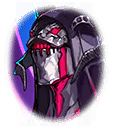

100802041

[View script in lisp](../scripts/100802041.txt)

【レーヴァテイン】
ユグドラシル切断の衝撃でティルは
二人に分裂してしまった――

【レーヴァテイン】
兄さん達は二人のティルを別々に
封印して、体内のマナを回復させる
ことにしたの――

【レーヴァテイン】
分けて封印したのは、地底の奴に
察知されて二人とも奪われるリスクを
避けるためだったみたい――

【レーヴァテイン】
そして封印の解除とティルの復活を
私に託した――

【ゼロ】
そうしてティルフィングが復活する
のを待つ作戦ってわけだ

【ゼロ】
また面倒かけちまうが、後を頼むぜ
アマネ

【レーヴァテイン】
…兄さんは、どうなるの？

【ゼロ】
俺はティルフィングを封印したら…
そうだな…魔獣化するまで、
好きにさせてもらう

【ゼロ】
もし魔獣化した俺に会ったら、
迷わず叩っ斬ってくれ
じゃあな

【レーヴァテイン】
兄さん！
兄さん、待って…！
兄さぁぁぁん！

【レーヴァテイン】
兄さんは一度も振り返らず
行ってしまった…

【レーヴァテイン】
私は決心した…
託された者として、
必ず責務を果たすって――

【レーヴァテイン】
でも、現実は予想外の連続だった
ユグドラシルが消滅した後、
大穴から瘴気が噴き出したの――

【レーヴァテイン】
混乱の中、私は出遅れた…
瘴気を越えて辿り着いた『大穴』には
結界が張られてしまっていた――

【レーヴァテイン】
幾度も破壊を試みたけれど、
私の力ではどうにもならなかった
そして、あいつらが現れた――

【ミカエル】
世界に新たな秩序をもたらし、
人々を救済しましょう

【ルシファー】
戦い、奪い、勝ち残れ
力ある者こそが真の覇者だ

【ウロボロス】
全ては輪廻の理の中に
永劫の平穏は統制によってのみ
成し遂げられる

【レーヴァテイン】
ミカエル、ルシファー、ウロボロス…
遠く忘れ去られた存在だったはずの
天使、悪魔、幻獣――

【レーヴァテイン】
奴らが再び台頭して…
人々を支配し始めたの――

【レーヴァテイン】
ただ、奴らは瘴気に対抗する術を
持っていた――

【レーヴァテイン】
天使の“白羽”や悪魔の“血”を
体内に入れることで人々は瘴気への
耐性を身につけて生き存えたの――

【レーヴァテイン】
だから私も、今は奴らの力を利用する
しかないと考えていた――

【レーヴァテイン】
真実を知るまではね

【レーヴァテイン】
はぁ…侵入成功っと
ミカエルが保管してる“白羽”は
ここのどこかにあるはず…

【レーヴァテイン】
それを使えば…瘴気から人類を守る
ことができるはず…
天使の力に頼るのは癪だけどっ…

【レーヴァテイン】
あった！
この瓶に入っている羽根…
これを使えば…

【ミカエル】
ほほう
これは驚きました
あなた、斬ル姫ですね

【レーヴァテイン】
ミカエル！
…人類の救済があなたの目的
なんでしょ？

【レーヴァテイン】
勿体ぶってないで、ここに保管して
ある“白羽”を…もっと配って

【ミカエル】
ああ、そんな理由でわざわざ
ご苦労なことですね

【ミカエル】
それにしても…ふふっ

【レーヴァテイン】
何がおかしいのっ？

【ミカエル】
失礼
こちらにも事情があります
無計画にばらまくわけにはいきません

【ミカエル】
その“白羽”は置いていきなさい
そして、あなたは私の物に

【レーヴァテイン】
イヤよ
この“白羽”は返さない
私はあなたの物になんかならない

【ミカエル】
強情な斬ル姫ですね

Next: [100802050](100802050.md)

[Back to index](index.md)
