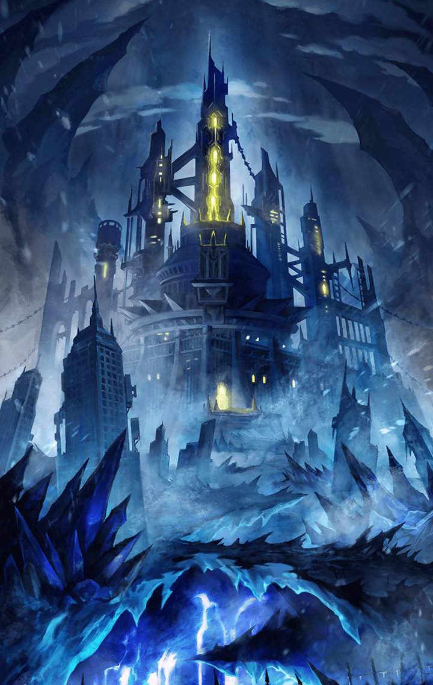

[View script in lisp](../scripts/100805040.txt)

**【アルマス】**
バカなこと言ってないで
淘汰を始めましょう！

**【アルマス】**
さもないと共振反応を起こして
二人とも消えることになるわ！

**【アビス・アルマス】**
ふふっ
ファントムみたいなこと
言わないでよ

**【アビス・アルマス】**
私達はそういうんじゃない
だから共振反応なんて起こさない
ただ…

**【アビス・アルマス】**
また一人に戻りたいのなら
他の自分を皆殺しにするしか
ないだけよ

**【アルマス】**
！？

**【ティターニア】**
あの…あなたは何を知って――

**【アビス・アルマス】**
黙ってて、小さな妖精さん
これは私達の問題なの

**【アビス・アルマス】**
そうよね、最後の私？

**【アルマス】**
ここを見て回ったら、
私は大切なことを思い出せるって
こと？

**【アビス・アルマス】**
もしくは全て失うかもね
こっちよ

**【アルマス】**
マスター、ティニ、
悪いけど…黙ってついてきて

**【アビス・アルマス】**
ここが培養槽…
今は何も入ってないけど

**【ミョルニル】**
おっきなしけんかんがいっぱい
ならんでるね、マスタ！

**【アビス・アルマス】**
ここで設計を行ってたみたい
生物標本もかなりの数あったんだけど
全て廃棄された

**【アルマス】**
…………

**【アビス・アルマス】**
データには事欠かなかったから
幾つものパターンを試したのね
そして培養と経過観察…

**【アビス・アルマス】**
ねえ、少しは思い出した？
自分の生まれ故郷について

**【アルマス】**
…何となくね
私は…私達はここで生まれた…
そして選別されて…

**【アビス・アルマス】**
四人にまで絞られたの
そこまで安定して成長できた
個体はそれだけだったみたい

**【アルマス】**
四人…そう…四人よ…
でも…

**【アビス・アルマス】**
でも…？

**【アルマス】**
もっと…もっとたくさんいたっ
だって私…みんなと過ごしていた
はずだものっ

**【アルマス】**
それに…あの人っ…
あの人がっ…私のことをっ…！

**【アビス・アルマス】**
思い出してきたみたいね
じゃあ、とっておきのやつを
見せてあげる

**【アビス・アルマス】**
これが残ってて良かった
見つけたときは少しだけ…
いや、そんなのどうでもいいわね

**【アルマス】**
何を言ってるの？

**【アビス・アルマス】**
ほら、この記録よ
まだ再生できるの

**【？？？】**
アルマスの複製作業は順調だ
もはや廃棄を待つだけかと思って
いたが、こんな使い道があるとはな

Next: [100805051](100805051.md)

[Back to index](index.md)
