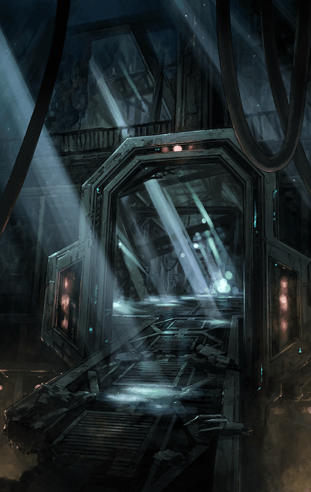

[View script in lisp](../scripts/100901060.txt)

**【アルマス】**
私、ちょっと眠いから
今夜は早めに
休みたいんだけど…

**【フェイルノート】**
昨夜、私の寝室に忍び込んで
この子を盗んでいったわね

**【ティファレト】**
フェイルノートがいつも抱いている
ぬいぐるみのことですか？
でも、今も持っているのでは…

**【フェイルノート】**
夜に盗んで、私が起きるまでの間に
元に戻したのよ
一体、どういうつもりかしら？

**【アルマス】**
何を言ってるのか、
絶・意味不明よ

**【カシウス】**
フェイルノートのぬいぐるみを
修繕したの
アルマスが一晩でやってくれた

**【アルマス】**
カシウス！？
何でばらすのっ？
絶・裏切られたんだけどっ

**【フェイルノート】**
この私がぬいぐるみの傷くらいで
心を乱すとでも思ったのかしら
冗談じゃないわ！

**【フェイルノート】**
二度と、こんな真似しないで！

**【フェイルノート】**
私は…
お前達に情けをかけられるような
存在じゃない…！

**【アルマス】**
だから黙ってようって言ったのに…
何で正直に言ったのよ、カシウス

**【カシウス】**
負い目を抱かせたままにする方が
ずっと残酷よ…

**【ティファレト】**
カシウスはいつも私達より
はるか先を見ているのですね…

**【ティファレト】**
フェイルノートのぬいぐるみが
傷ついているのにいち早く気づいたり
彼女の気持ちを推し量ったり

**【アルマス】**
でも、フェイルノートも
絶・かわいげがないわっ
お礼を言えとまでは言わないけど…

**【アルマス】**
少しは喜んで欲しかったのに…

**【アルマス】**
絶・恥ずかしい…
何でこんな記憶を見せるのよっ？

**【フェイルノート】**
あのとき言いそびれたから…
お礼を…

**【アルマス】**
えっ？

**【フェイルノート】**
あくまでほんの少しだけだけど、
助かったわ
…感謝してあげる

**【アルマス】**
フェイルノート！？
どうしたのっ？
何か変なものでも食べたのっ？

**【フェイルノート】**
黙りなさい！
アルマス、お前が受けた仕打ちに
対して怒るなとは言わないわ

**【フェイルノート】**
でも、怒りに飲まれて何もかもを
憎むのは愚かなことよ
怒りの対象を明確に絞りなさい

**【フェイルノート】**
ビフレストでの日々は…
悪くないときだって、あったでしょ？

**【アルマス】**
…そうね、忘れてた

**【アルマス】**
色々なことがあり過ぎたけど…
あなた達と過ごした日々は、
絶・楽しかったわ

**【アルマス】**
ありがとう、フェイルノート
私はもう大丈夫
ちゃんと戻れる

**【フェイルノート】**
そう
なら、戻ってから
大いに働いてもらうから

**【アルマス】**
えっ？
何のこと？

**【フェイルノート】**
何ごとにも対価は必要よ
詳しい話は戻ってから
マスターに聞きなさいな

**【アルマス】**
ちょっと、フェイルノート！？
ああ、もう！
絶・意味不明よーっ

Next: [100902011](100902011.md)

[Back to index](index.md)
