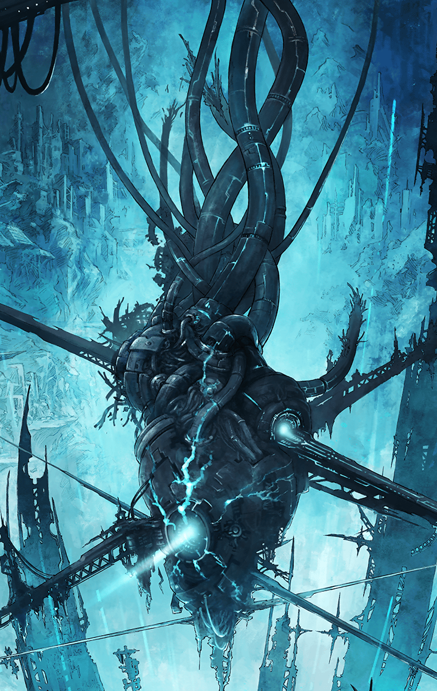

**【ティルフィング】**
それでは、ハルモニア軍のところに
向かいましょう

**【ヘレナ】**
これからはハルモニア軍と一緒に
行動するんだね
面白いことになりそうだ…くふっ

**【ニール】**
アタチ、上手く馴染めるかしら？
心配だわ～

**【ソロモン】**
安心して、ニール
グラウに分析させて、最初の挨拶に
最適な言葉を導き出したわ

**【グラウ】**
高い汎用性を持ち、適度な距離感を
保つことができる挨拶は…
「こんにちは」です

**【ソロモン】**
こんにちは
それが私の最適解！

**【ティルフィング】**
あ、ええと…そうね
ところでレーヴァとムーは？

**【カリス】**
はい
レーヴァに、これを渡すよう
言われてたんだ

**【キプル】**
渡すのが遅くなって
すみませぇぇぇん…

**【ティルフィング】**
手紙ですか…？
えっ…？

**【手紙】**
親愛なるティルへ
私はハルモニアとは組めない

**【手紙】**
あなたの考えを否定するつもりは
ないし、あなたの方が正しいとも
思ってる

**【手紙】**
ただ、私の中に整理できない何かが
あって、それを残したまま上辺を
取り繕うのが嫌なだけ

**【手紙】**
自分でも面倒くさいと思うけど、
この気持ちに嘘はつけないの

**【手紙】**
ハルモニアとの共闘は
本当にいい話だと思うから、
あなたは彼女達と一緒に進んで

**【手紙】**
あなたの護衛として
三人は残していくから

**【手紙】**
私は一人で深奥を目指す
そして決断する
だから、あなたも遠慮しないで

**【手紙】**
きっと最後は、
自分の意思こそが
全てを切り拓く鍵になると思うから

**【手紙】**
ワガママでごめんなさい
　　　　　　　　　　　　　レーヴァ

**【ティルフィング】**
レーヴァ…そんなっ…

**【ソロモン】**
譲れない信念があったのよ
ただ、自分の信念にティルフィングを
巻き込みたくなかったのね…

**【カリス】**
大丈夫だよ！
レーヴァは強いから…
またすぐに再会できるよっ

**【ヘレナ】**
さあ、ヘレナ達はハルモニアに
合流して悠々と
降りていこうじゃないか…くふっ

**【ティルフィング】**
…皆さんは、レーヴァの下へ
行ってあげて下さい

**【ヘレナ】**
それだとティルフィングを
護衛する者がいなくなっちゃうよ？
せっかくレーヴァが残したのに

**【ティルフィング】**
一人で行くのが
レーヴァのワガママなら、
これは私のワガママです

**【ティルフィング】**
三人はレーヴァを追って下さい！

**【ティルフィング】**
私に護衛は不要です
私も自分の意思で進んでいきますから

**【ソロモン】**
それがあなたの最適解なのですね

**【ティルフィング】**
はい
レーヴァにお伝え下さい

**【ティルフィング】**
深奥で会いましょう、と