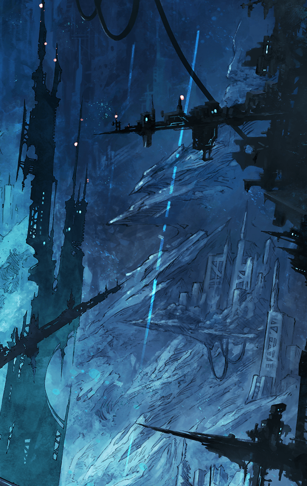

[View script in lisp](../scripts/100904040.txt)

トレイセーマ陣営内――

**【カシウス】**
せっかく逃れ得た宿命の奔流に
自ら飛び込んでくるなんて…
度し難い天衣無縫っぷりね

**【アルマス】**
よく分からない挨拶、ありがとう
この前は、もう話すことはない、
みたいな態度だったのに…

**【カシウス】**
刻一刻と刻まれる時の流れは
全ての事象を変化させ、裏を表に
表を裏にすることもあるの

**【アルマス】**
…ようするに気が変わったって
言いたいんでしょ

**【ティターニア】**
よく分からないと言いながら、
アルマスは彼女の言葉を理解できて
いるようですね

**【アルマス】**
昔、そこそこ長く一緒にいたから
でも、カシウスの考えが
絶・意味不明なのは間違いないわよっ

**【カシウス】**
あなたがマスター…
運命の導き手なのね？

**【アルマス】**
カシウスはマスターについて
何か知ってるの？

**【カシウス】**
原初の母である地底にその記録は
残されていない…
興味深い存在よ

**【アルマス】**
つまり何も知らないから知りたい
って言いたいのよね？

**【カシウス】**
その問いに関しては、否と答える
道理をわたしは持ち合わせていない

**【アルマス】**
普通に「はい」って言えーっ

**【ティターニア】**
なかなか手強そうな方です…

**【カシウス】**
アルマス…
あなたにとっては自明な事柄を
改めて問いの天秤にかけるわ

**【カシウス】**
残酷で凄惨な過去と直面してまで
原初の地へ赴こうとしているのは
如何なる理由からなの？

**【カシウス】**
あなたには、
何も知らず幸せに朽ちる道も
あったはずなのに…

**【アルマス】**
本当に、聞くまでもないことを
聞くのね
カシウス、勘違いしないで

**【アルマス】**
私にとって、何も知らないまま
一人だけのうのうと生き延びることは
幸せなんかじゃない

**【アルマス】**
確かに残酷な過去があった…
危うくそれに飲まれかけもしたわ
でもね…

**【アルマス】**
私は私が何者であるかを知って、
何を為すべきかを知った

**【アルマス】**
あなたの言う通り、私には何の
「運命」も刻まれなかった
私は不要な存在だった

**【アルマス】**
でも、私を大切に思ってくれる人が
地上まで逃がしてくれて、
オベロン様やティニに出会って

**【アルマス】**
空っぽだった私の中に、
為すべきことが生まれていったの

**【アルマス】**
与えられた「運命」じゃない
私が見つけた「運命」
それに従って私はここまで来た

**【アルマス】**
もちろん、ティニやナディアや
マスターや、たくさんの力を借りてね

**【アルマス】**
だから私は私の意思で深奥を目指す！
そして「神」にガツンと一発、
食らわせてやるのっ

**【アルマス】**
あなた、何様のつもり！？
ってね

**【ティターニア】**
アルマスっ
この子はまた、乱暴なことを…

**【カシウス】**
そう…憐憫も遠慮も
相応しくなかったのね
あなたはあなたの道を見つけた

**【カシウス】**
ならば…わたしもわたしの言葉を
あなたに向けて紡ぎましょう

Next: [100904050](100904050.md)

[Back to index](index.md)
