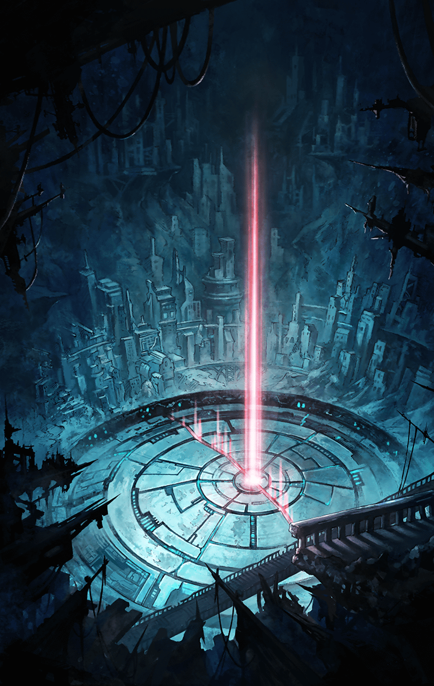

**【フェイルノート】**
戻る？
ここまで来て？
話にならないわっ

**【カシウス】**
あなたの惑いも恐れも焦りも全て
私達に刻まれた宿命によるもの
深奥に至るのは自明の理だから…

**【カシウス】**
でも…それを打ち破らないと
“観察者”が勝利のラッパを
吹き鳴らすの

**【フェイルノート】**
勝つのは私よ！

**【フェイルノート】**
いい、カシウス？
私があのお寝坊さんと甘ちゃんを
足止めしたのは

**【フェイルノート】**
ケイオスリオンの
実力至上主義において、
力不足と判断したからよ！

**【フェイルノート】**
あいつらは深奥での戦いに
耐えられない
だから――

**【カシウス】**
螺旋を描き、己に深く突き立てた
自己欺瞞は真実という名の虚像を
映し出すようになるわ

**【フェイルノート】**
私は自分を偽ってなんかいない！
アルマスもティファレトも
ただの手駒に過ぎないの！

**【フェイルノート】**
カシウス！
もちろん、お前もよっ

**【カシウス】**
フェイルノート…
私達では刻まれた宿命が邪魔をして
“観察者”には勝てないの

**【カシウス】**
もし勝つことができる者がいると
したら…それは理を破る者

**【カシウス】**
もしくは…理の外にいる者よ

**【フェイルノート】**
それって、まさか…

**【ゲバルト伯爵】**
オオッティモオオ！！

**【フェイルノート】**
うるさい羽虫ね…

**【ゲバルト伯爵】**
ついに到達したよ、フェイルノート！
これが恐らく、深奥へと至る
最後の扉だ！

**【ゲバルト伯爵】**
精巧で静寂でありながら圧倒的な
存在感を見せる巨大な造形！
審判の扉に相応しい！

**【ケイオスリオン兵】**
皇帝陛下！
どんなに攻撃をしかけても
ビクともしませんっ…

**【ケイオスリオン兵】**
斬ル姫達も動員しておりますが
全く歯が立たず…

**【フェイルノート】**
カシウス、残念だけど時間切れよ

**【フェイルノート】**
兵を退かせなさい
深奥へはケイオスリオンが
一番乗りするわ

**【カシウス】**
…終わりと始まりは
等しく輪廻の輪を為す

**【カシウス】**
惑える明けの明星に幸運の星が
瞬くことを願って…

**【ケイオスリオン兵】**
トレイセーマ兵が退いていくぞっ
所詮、我らには力及ばぬ！

**【ケイオスリオン兵】**
今のうちにこの巨大な扉を
突破するぞ！

**【フェイルノート】**
どきなさい
私が行くわ

**【ゲバルト伯爵】**
おお、フェイルノート！
愛しき我が娘よっ
君の眩しい輝きに――

**【フェイルノート】**
うるさいわね
そこで大人しく見ていなさい！

**【フェイルノート】**
至高の音色をつま弾いてあげる！

**【ケイオスリオン兵】**
ウオオオオオオオオオオ！

**【ケイオスリオン兵】**
やったぞ！
あんなに頑丈だった扉を
いとも容易くっ

**【ゲバルト伯爵】**
オオッティモオオオ！！
素晴らしいよ、フェイルノート！

**【フェイルノート】**
賛辞は不要よ
それより隊列を組み直しなさい
ここからが…本番なんだから

**【ケイオスリオン兵】**
オオオオオオオオオオオオ！！

**【ティターニア】**
アルマス、見て下さい！

**【アルマス】**
扉が破壊されてケイオスリオン軍が
さらに下へと降りていくわ…

**【ティターニア】**
恐らく、あの先が深奥です
完全に先を越されてしまいました…

**【アルマス】**
それでも進むしかないわ
逆転の可能性はまだ失われていない！

**【アルマス】**
ティニ、マスター、みんな！
降りるわよ、深奥にっ