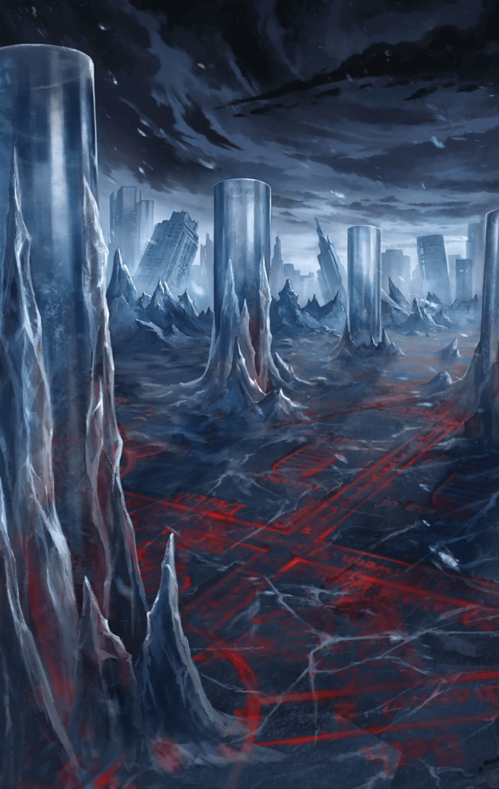

101102030

[View script in lisp](../scripts/101102030.txt)

【？？？】
私がいつから存在しているのかという
疑問は、あくびが出るほど
どうでもいいことだ

【？？？】
大切なのは、神々と悪魔が相争って
いた時代――のちに神魔戦争と
呼ばれることになる時代に

【？？？】
私がすでにこの世界を
“観察”していたという事実だよ

【フェイルノート】
急に何？
お前に時間稼ぎをさせる気は
ないのよっ

【？？？】
フフフ…
そう言わずにもう少し聞いて欲しいな

【？？？】
あの長い長い戦乱を経て、
神と悪魔は一つの契約に至った

【？？？】
世界を二つに分け、天上世界を神々が
地上世界を悪魔が支配するという
神魔契約だ

【？？？】
その頃、地上に栄えつつあった
人間にとっては、あまりに理不尽で
一方的な契約だったといえるね

【？？？】
それでも彼我の力量差は
歴然としていた

【？？？】
神々は地上から幾らかの人間を
天上世界に運び入れ、理想の世界を
作り上げる実験を行い――

【？？？】
悪魔は地上に残った人間達を
力で支配することにした

【？？？】
正直、私は幻滅したよ

【？？？】
これでは人間が
あまりに不利ではないか、とね

【フェイルノート】
それがどうだというの？
力の無い者は支配される
当然の帰結だわ

【？？？】
君らしいね、フェイルノート
でも、あまりに一方的な蹂躙は
私の好みではないんだ

【？？？】
長いこと世界を観察してきたけれど、
そんなつまらない展開は
容認できなかった

【？？？】
だから私は一つだけ
世界に干渉してみることに
したんだ

【？？？】
君もよく知っているだろう？
世界樹ユグドラシル
あれを世界に具現化させたんだ

【フェイルノート】
具現化させた…
面白い表現ね
あれはお前が作ったとでも言うの？

【？？？】
とんでもない
私にそんな力はないよ
私はただ…

【？？？】
あれを「不完全な」ものにした
だけなんだ

【？？？】
本来、あれは実体を
持つことなどない
「完全な」存在だった

【？？？】
けれど、そのままでは
「不完全な」存在である人間には
ユグドラシルを認識できない

【？？？】
だから私はあえて実体を与え、
「不完全な」世界樹を世界に
披露したんだよ

【？？？】
神々と悪魔、双方に対し
人間が抗う術を持てるよう…

【？？？】
ユグドラシルで
天上世界と地上世界を繋いだ

【？？？】
どちらの世界に住んでいても、
ユグドラシルの恩恵を
受けられるようにね

【？？？】
効果は覿面だった
人間は世界樹からマナを見出し
神器を得た

【？？？】
神器からマナの亜種である
キラーズを抽出し、それを体内に
入れて自らを強化する術まで作った

【？？？】
そして驚くべきことに
人間は天上世界で神々からの干渉を
排除し――

【？？？】
地上世界で悪魔の支配から脱して
地上の支配権を手にしたのだ

【フェイルノート】
悪くないわね
新たな力を得て下克上を果たす
それこそ実力主義の世界よ

【？？？】
私も、まさか人間がここまで
やってくれるとは思っていなかった

【？？？】
退屈な展開にならないよう
ほんの少しスパイスを
加えただけだったのに

【？？？】
あの頃、地上世界の人間に
希望などなかったのだからね

【？？？】
希望がゼロの状況から覆した様は
私をとてつもなく楽しませてくれた

【？？？】
けれど、その後が良くなかった…

【フェイルノート】
その後…？

【？？？】
私は世界の“修正”を
余儀なくされたのだよ

Next: [101102040](101102040.md)

[Back to index](index.md)
