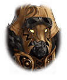

101105041

[View script in lisp](../scripts/101105041.txt)

【ティルフィング】
結界が…消し飛びました！
アルマスがやってくれたのですねっ

【ソロモン】
では、ここからは私達の出番よ
ティルフィング、あなたが鍵に
なるのだからお願いね

【カリス】
やっほい！
守りと回復はカリスちゃんにお任せ！

【ヘレナ】
ヘレナは出番なさそうだから
のんびり昼寝でもしていようかなあ
…くふっ

【ソロモン】
ヘレナ！君の力も必要よっ
一緒に戦って！

【ヘレナ】
ソロモンは冗談が通じないから
やりにくいんだよなあ…

【ティルフィング】
さあ、行きますよ！

【フェイルノート】
やったわね、アルマス
それにしても結界の一部を破れば
十分だったのに

【ティファレト】
全て消し去ってしまうなんて
いざというときの力には
目を見張るものがありますね

【カシウス】
…………吉凶は裏表よ

【魔獣】
グアアアアアアアアアアア！

【ハルモニア兵】
結界の中から夥しい数の魔物が
姿を現しました！

【ケイオスリオン兵】
恐れることはねぇ！
全て叩き潰せぇ！

【トレイセーマ兵】
冷静に対応しろ！
斬ル姫を繰り出して圧倒しろ！

【フェイルノート】
ここは任せられそうね
さてと、借りを返しに
いきましょうか

Next: [101105043](101105043.md)

[Back to index](index.md)
