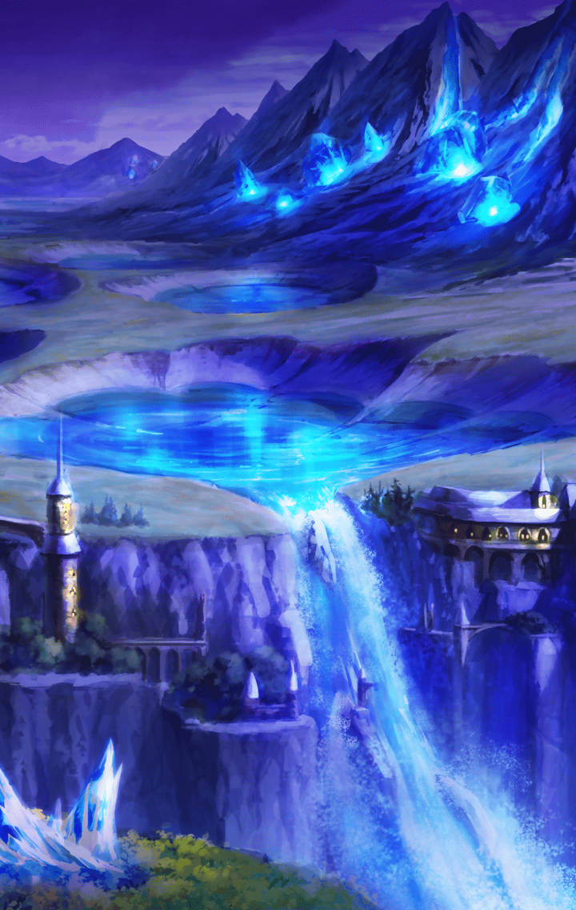

[View script in lisp](../scripts/10111203.txt)

**【エクスカリバー】**
…はぁ…はぁ…はぁ！
絶対に…絶対に…っ！

傷つきながらも、
マスターを守るため
剣を振り続けるエクスカリバー

**【エクスカリバー】**
勝てなくても…
敵わなくても…
命を捨ててでも…絶対に守る！！

しかし、その想いも虚しく
敵の非情な攻撃が彼女を切り裂く

**【エクスカリバー】**
…ぅぐっ！
マ…マスターだけは！
マスターだけは…っ！

**【エクスカリバー】**
…っ！！
…マ…マスター？

薄れ行く意識の中で、
確かに感じた
マスターの温かさ

**【エクスカリバー】**
マスターが…私を…
守ろうと…
う…うぅ……っ

**【エクスカリバー】**
うあぁぁぁぁぁーーーーっ！！

静かな星空に
こだまする彼女の叫び…
次の瞬間、奇跡は起きた

**【エクスカリバー】**
マスターが私を…守ってくれた…
こんな不完全で…
不甲斐ない私を…

**【エクスカリバー】**
誰も…マスターに触れさせない…
命を捨ててでも…じゃない…
この命を燃やし続けて…

**【エクスカリバー】**
守るッ！！

聖なる光を放ちながら
敵を斬り進むエクスカリバー

それはまさしく、
彼女が新たなるスキルに
目覚めた瞬間だった

**【エクスカリバー】**
新奥義！
『ホーリーゲイザー』！！

その光の前に
無数の異族たちは…消滅した

**【エクスカリバー】**
くっ…はぁ…はぁ…はぁ！
マ…マスター…

**【エクスカリバー】**
さ…鞘がなくても…
魔法…使えましたよ…

**【エクスカリバー】**
マスターが私を…
守ってくれたから…

**【エクスカリバー】**
傷を…分かち合おうと…
してくれたから…
共に傷つこうと…戦ってくれたから…

**【エクスカリバー】**
そしたら…
もうダメだと思ったのに…
体の奥底から湧き上がってきたんです

**【エクスカリバー】**
“愛”という名の…力が！

**【エクスカリバー】**
それはマスターが私にくれた…
究極の魔法です！

星の光に照らされ微笑んだ彼女は、
とても、とても美しかった

**【エクスカリバー】**
マスター…少しだけ
わがまま言ってもいいですか？

**【エクスカリバー】**
もう少しだけ…
見ていていいですか？
この星空を…

**【エクスカリバー】**
だって、こんな夜は…
もう二度とないかも知れないから

彼女がこつんと
マスターの肩に頭を乗せた

**【エクスカリバー】**
今を生きるとは…
そういう事ですよね？

**【エクスカリバー】**
大丈夫…また異族が現れても、
私が必ずお守り致します
だから、ご安心を

マスターを見つめ、目を閉じる彼女
夜空に一筋の流れ星が光った
