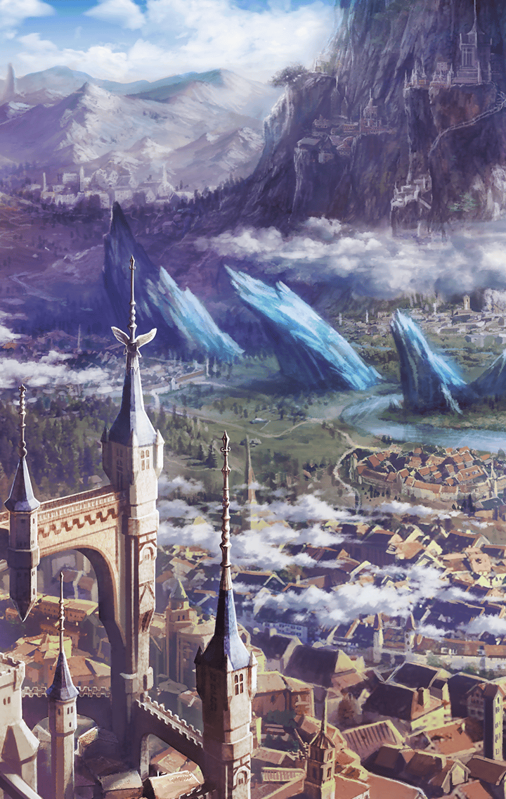
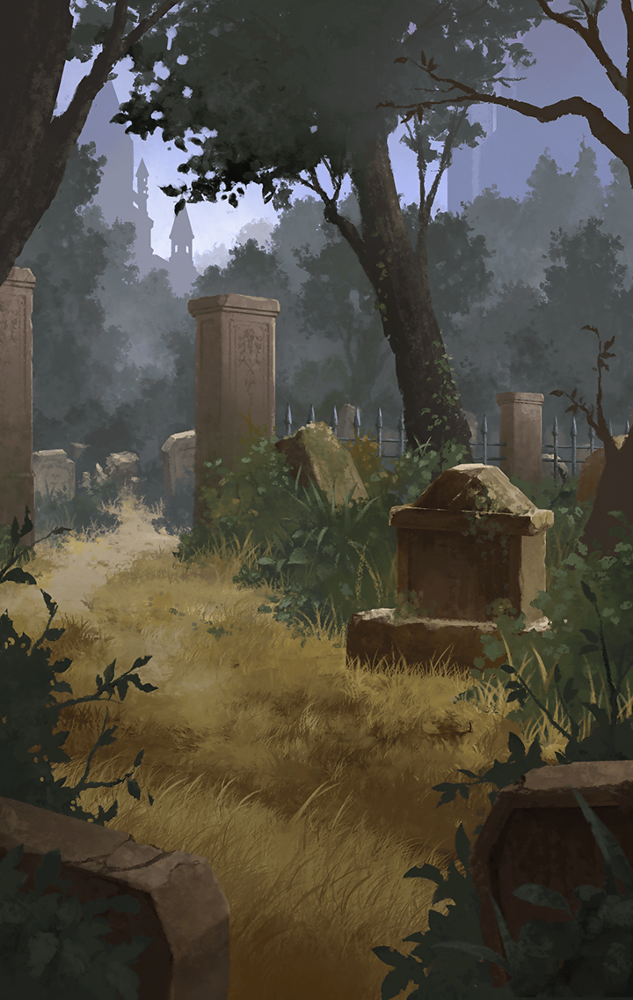

[View script in lisp](../scripts/101203050.txt)

【ティバルト】
斬ル姫を地上に送るのが無理！？
何故だ！？

【エドガー】
座標が分からないんだよ！
ユグドラシルで繋がっていたときは
簡単だった

【エドガー】
だが、繋がりが断たれた今、
地上に降りるのは極めて難しい

【エドガー】
地上世界がここの真下にあるとでも
思っているのか！？
とんでもないっ

【エドガー】
迂闊に飛び降りれば最後…
永遠に時空の狭間を
彷徨うことになるぞ！

【ティバルト】
じゃあ、どうすればいい！？
地上世界の座標はどうやって
調べれば良いんだっ？

【教皇】
…お待ちなさい
伝承にはこうあります

【教皇】
淘汰の果て、記憶を取り戻した
斬ル姫達は赤い海へとその身を投げ
地上に舞い降りていった…と

【教皇】
斬ル姫達なら時空を越えて
地上世界に辿り着けるのでは？

【エドガー】
恐れながら教皇猊下…
それはユグドラシルが地上にも
存在していたときの話です

【エドガー】
彼女達ならユグドラシルを目印に
地上世界へ至ることも可能だったの
でしょう

【エドガー】
しかし、今はユグドラシルが
地上に存在していないんですっ
目印がないんです！

【エドガー】
そんな状況で地上に送り込んでも…
無事に辿り着く可能性は
ゼロに等しいっ…！

【エドガー】
もし万が一辿り着けたとしても…
まともな自我を保っていられるか
どうか分からない

【エドガー】
自我を失い、生ける屍の如く
彷徨い続ける存在…
そんなものになるのが関の山です！

【ティバルト】
…それでも、可能性はあるのだろう？
賭けるしかないんじゃないか

【教皇】
確かに可能性は限りなく低い
けれど、このまま手をこまねいている
わけにもいきません

【教皇】
もちろん無闇矢鱈に地上へ送り込めば
良いというものでもないでしょう

【教皇】
可能な限り成功確率を上げるよう努め
その上で斬ル姫達を地上に
送り込みましょう

【教皇】
逡巡している時間すら惜しい
そうではありませんか？

【エドガー】
教皇猊下がそう仰るのなら…
しかし…あまりに無謀ですよ…

それから様々な研究と実験が
繰り返された

気は急いていたが、斬ル姫の安全を
可能な限り確保するため
皆、寝食を忘れて取り組んだ

そして――

【教皇】
頼みましたよ、斬ル姫
あなた達が無事、地上に辿り着く
ことを祈っています

【斬ル姫達】
任せて！
必ず地上に辿り着いて
奪われた仲間を奪還してみせるから！

【斬ル姫達】
行ってくるね、マスター！

選択肢:
- 気をつけて → [select_label_01](#select_label_01)へ
- 信じてるよ → [select_label_01](#select_label_01)へ
- また会おう → [select_label_01](#select_label_01)へ

【斬ル姫達】
行ってくるね、マスター！

#### select_label_01:
 → [select_label_end](#select_label_end)へ

【斬ル姫達】
うん！

#### select_label_end:

そうして彼女達は地上世界を
目指し降りていった

彼女達には、
その居場所を把握できるよう
「糸」が結びつけられていた

彼女達が首尾良く地上世界に
着いたなら、その「糸」を辿って
座標を特定できる

そんな思惑は一瞬にして潰えた

【エドガー】
そんなっ…何でだ！？
何で…彼女達の反応が全て…
霧散した…

【ティバルト】
おい、どういうことだエドガー！？
何で反応が消えた！？

【エドガー】
分からない…
分からないんだ…
「糸」が切れたというより、これは…

【エドガー】
無数に分裂してしまった…
「糸」の行き先が
無限に拡散してしまったんだ

【エドガー】
失敗だ…
彼女達の足取りを追うことは…
もう…不可能だっ

無謀な計画だと
理解していたはずだった

それでも絶望はあまりに大きすぎた
皆の心を押し潰してしまうほどに

【ゼロ】
取り戻してくれ…！
奪われたあいつらを…
奪還して欲しいんだっ

だから決意した

選択肢:
- 自分が、地上に降りる → [select_label_02](#select_label_02)へ

だから決意した

#### select_label_02:
 → [select_label_end2](#select_label_end2)へ

#### select_label_end2:

Next: [101203060](101203060.md)

[Back to index](index.md)
