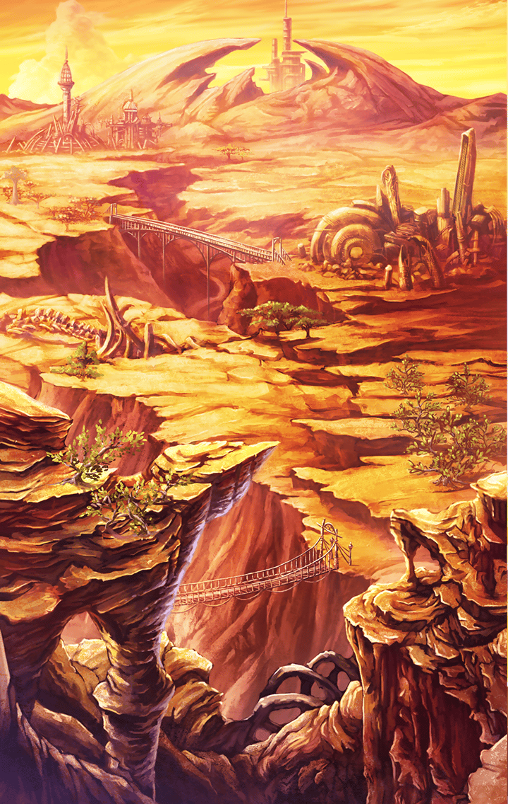

10231103

[View script in lisp](../scripts/10231103.txt)

【アスカロン】
ダメ…このままじゃ…
呪いが解けてしまう…

【アスカロン】
このままじゃ…
マスターをお守りする事が
できません…！

【アスカロン】
お願いです、マスター！
皆さんに…助けを呼びに
行って下さい！

選択肢:
- 恐怖を…乗り越えるんだ！！ → [select_label_01](#select_label_01)へ
- 勇気を持て！自分を信じるんだ！ → [select_label_02](#select_label_02)へ
- 君なら大丈夫！自信を持って！ → [select_label_03](#select_label_03)へ

お願いです、マスター！
皆さんに…助けを呼びに
行って下さい！

#### select_label_01:
 → [select_label_end](#select_label_end)へ

【アスカロン】
そんなこと…言われても…

#### select_label_02:
 → [select_label_end](#select_label_end)へ

【アスカロン】
自分を…？で、でも…

#### select_label_03:
 → [select_label_end](#select_label_end)へ

【アスカロン】
自信…なんて…無理…

#### select_label_end:

戦うんだ！自分自身と！！
ティルフィングのように！！
マスターが檄を飛ばす

【アスカロン】
！！

【アスカロン】
…ティル…フィングさん…

【アスカロン】
あの人も…巨大な呪いと
戦い続けている…
わ…私も…

【アスカロン】
ティ…ティル…ティル…
うぅぅぅうぅぅ…！！

ま、まさか…また…！
身構えるマスター

【アスカロン】
…うぐっ！！ティ…
ティルフィングさんのように！！

彼女が自分の裡に眠る
呪いに打ち勝った
その瞬間…！

【アスカロン】
ハァァァァァーーーッ！！

天に向かい剣をかざす彼女
まばゆい光が放たれる

【アスカロン】
消えよ！！私の中の…
弱き心よ！！

振り下ろされる無数の光
そして切り裂かれる大地

巨大熊は、
その大きな力の前に
逃げ出した

【アスカロン】
はぁ…はぁ…！
できました…マスター！
奥義…『ブレイヴハート』です！！

それはまさしく、
彼女が新たなるスキルに
目覚めた瞬間だった

【アスカロン】
マスター…
本当に怖いのは…
呪いじゃなくて…

【アスカロン】
呪いの恐怖に押し潰されそうになる…
私自身の弱さなんですね…

【アスカロン】
マスター！私…決めました！
これからは…呪いの力を
制御するためじゃなく…

【アスカロン】
弱い心を乗り越えられるよう…
己の精神を高めるために、
鍛錬します！！

マスターは、ひたむきに
頑張ろうとする彼女の瞳の光に
心打たれるのだった

Next: [10231104](10231104.md)

[Back to index](index.md)
