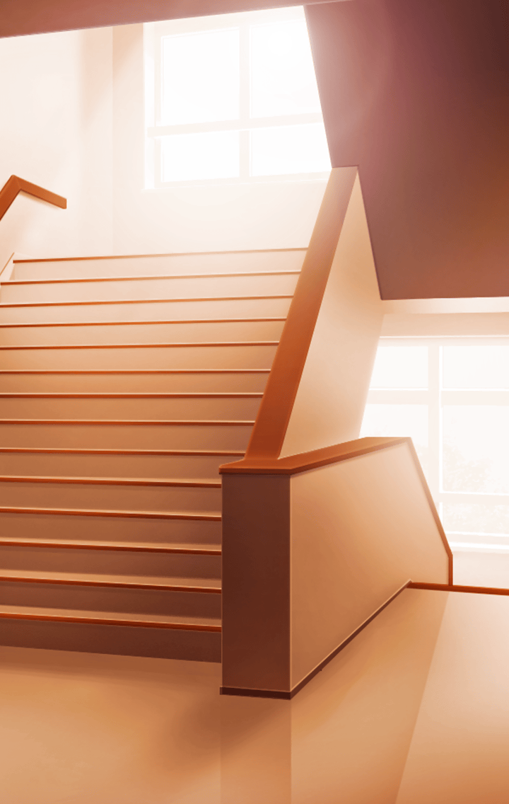

[View script in lisp](../scripts/10253204.txt)

ムラマサとマサムネの
果し合いが終わり――

翌日から見回りに励む
いつもの日々が戻ってきた

手際よく日課を済ませた
マスターは、さっさと帰ろうと
玄関にやってきた

**【ムラマサ】**
…ふぅ

ムラマサがいた

先日はなにかを探すように
ウロウロしていたムラマサだが…

今日は、間違いなく…
マスターの下駄箱の前に
立っている…！！

**【ムラマサ】**
…でもやはりこれは
武士道に反するのでは…

**【ムラマサ】**
…いいえ！！でも…
これは乙女道であって
武士道とはまた別の話！

**【ムラマサ】**
書物でも確認しました…
やはり王道は、下駄箱だと…

ぶつぶつとなにかを
つぶやきながら
右往左往するムラマサ…

…見ていても帰れないので
マスターはそっと声をかける…

**【ムラマサ】**
ふぁぁぁ！？

**【ムラマサ】**
しゅ…しゅ、くん…

選択肢:
- もしかして待っててくれた…？ → [select_label_01](#select_label_01)へ
- この前もここにいたよね…？ → [select_label_02](#select_label_02)へ
- 僕の靴でも気になった…？ → [select_label_03](#select_label_03)へ

しゅ…しゅ、くん…

#### select_label_01:
 → [select_label_end](#select_label_end)へ

**【ムラマサ】**
し、主君！あ、いえ！その！

#### select_label_02:
 → [select_label_end](#select_label_end)へ

**【ムラマサ】**
ぐぐ、偶然ですね主君！！

#### select_label_03:
 → [select_label_end](#select_label_end)へ

**【ムラマサ】**
そうなのです！あ、いえ…そうでは…

#### select_label_end:

**【ムラマサ】**
あ、う…
こ、これは、あの…
うぅぅ…あぅ…

**【ムラマサ】**
は！そうでした！
姉上と買い物へ行く
約束をしていたのでした！

**【ムラマサ】**
拙者！これにて失礼いたします！！

苦しすぎる言い訳を残して
走り去ろうとするムラマサだが…

よほど慌てていたのか
マスターと肩がぶつかってしまった

**【ムラマサ】**
あっ！！

ムラマサの手から
なにかが落ちて床に転がる

とっさにマスターは手を伸ばした

**【ムラマサ】**
あああ！
それはダメです…！！

ムラマサも急いで拾い上げようとする
すると…二人の手が触れそうになり…

思わす二人とも手を引っ込めていた

そこには、綺麗な和紙で包装された
小さな包みが転がっていた

**【ムラマサ】**
あ…ぅ…

**【ムラマサ】**
き…気づかれましたよね…？

はい…
いや、多分？
マスターは苦笑いする

ムラマサは涙目で落ち込む…
しかし次の瞬間、包みを拾い上げ
しゃんとした姿でその場に正座した

**【ムラマサ】**
主君…このたびは…
見届け、立会…
ありがとうございました

**【ムラマサ】**
この未熟な拙者に愛想をつかさず
最後まで根気よく
お付き合いいただいた恩…

**【ムラマサ】**
決して忘れません…！

**【ムラマサ】**
いただいた恩は必ず返す
それが拙者の信条です

**【ムラマサ】**
『二の太刀 -恩返-』
主君が我が名を呼んだならば
どこにでも馳せ参じましょう…！

それはまさしく
彼女が新たなスキルに
目覚めた瞬間だった

**【ムラマサ】**
どうか…受け取って下さい！

マスターはありがたく
ムラマサのチョコを受け取る

**【ムラマサ】**
えっと…
この…チョコは…

ムラマサの顔が
沸騰しそうに赤くなる…

**【ムラマサ】**
あ、姉上を待たせているので！
抹茶を買いに行く約束が…

立ち上がろうとする
ムラマサだったが…

**【ムラマサ】**
あ…わわっ！

正座をしていたせいで…
足がしびれてしまったのだろうか

ムラマサはバランスを崩して…

マスターに寄りかかってしまった

**【ムラマサ】**
！！！！！！！！！

**【ムラマサ】**
しゅ、しゅ…しゅくん！！！！

しびれているであろう足で
無理やり立ち上がったムラマサは…

よろよろと走り去っていった…

残されたマスターは
ムラマサのくれた包みを見て

早く見回りを終わらせようと
思うのだった