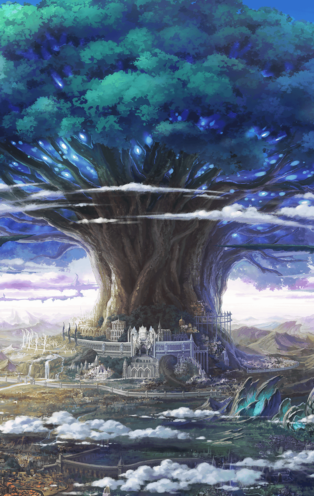

[View script in lisp](../scripts/1100201.txt)

**【オベロン】**
神は天上世界で選民による
理想郷の建国に勤しみ、

**【オベロン】**
悪魔は地上で
弱肉強食の世界を具現化させた

**【オベロン】**
地上の人類は
強大な力を持つ悪魔に対抗するため、

**【オベロン】**
伝説の武具の力
「キラーズ」を宿す娘達を
天上世界に送る

**【オベロン】**
彼女達は神々に奪われていた
伝説の武具を取り戻し、
地上へと帰還した

**【オベロン】**
天上世界では
“悪魔”と忌み嫌われた少女達が

**【オベロン】**
地上世界に
“天使”として降臨したのだ

**【オベロン】**
彼女達は悪魔と熾烈な戦いを繰り広げ
ついに勝利を掴み取った
世界に平和が戻ったのである

**【オベロン】**
人々は伝説の武具を持つ
彼女達のことを、
敬愛の念を込めて「斬ル姫」と呼んだ