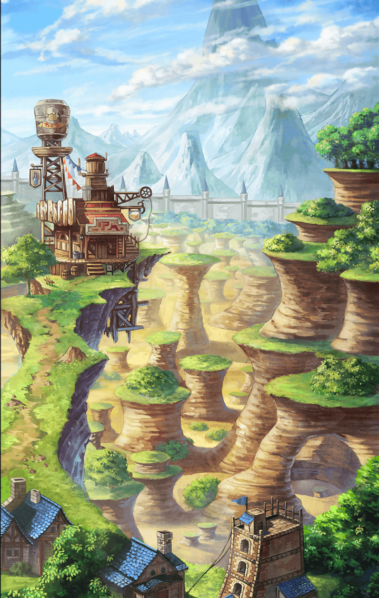

[View script in lisp](../scripts/110150320.txt)

[View source in markdown](110150320.md)

**【隊長】**
やっと来たか、ホップ！
お前が最後だぞ！

**【ホップ】**
ごめんなさい、隊長
この人達が…

**【隊長】**
おや？
村の者じゃないな
誰だい、あんたら？

**【アルマス】**
私はアルマス
人探しの旅をしているの

**【隊長】**
旅人かい
宿なら広場の方だよ
俺達は用事があるから――

**【アルマス】**
魔物退治に行くそうね
同行させて欲しいんだけど

**【ティターニア】**
アルマスっ
それは不躾ですよ

**【隊長】**
旅人のお嬢さんを守りながら
戦えるほど、俺達は器用じゃない
遠慮してもらおうか

**【アルマス】**
あなた達に守ってもらう必要はないわ
むしろ、私は戦力になるわよ！

**【ホップ】**
うわっ？
その剣、すごいな…

**【ホップ】**
ちょっと見せてくれないかっ？
俺、将来、鍛冶職人になりたくて
こういう剣、作ってみたいなあ

**【隊長】**
ホップ、後にしろ！

**【隊長】**
しかし、あんたら…
たった二人、いや、その小さな
妖精を入れると三人かい？

**【隊長】**
そんな少人数で旅をしてんのなら、
腕に自信があるんだろうな
くれぐれも足を引っ張らないでくれよ

**【アルマス】**
ええ、もちろん

**【ティターニア】**
アルマス、思いつきで行動するのは
控えて下さい…

**【アルマス】**
大丈夫よ
魔物がどんな奴なのか、
手っ取り早く確認できるでしょ？

**【ホップ】**
よぉし！
腕が鳴るぜ！

**【リーフ】**
ホップ、気をつけてね…
初めての魔物退治なんでしょ？

**【ホップ】**
大丈夫だって！
魔物退治に出て初めて一人前なんだ！

**【隊長】**
それでは、出発するぞ

**【村人達】**
おおーっ！

**【隊長】**
先日、魔物を見たというのは
この辺りだな？

**【村人１】**
はい！
一匹、うろうろしているのを
見かけましたっ

**【隊長】**
では、二人一組になって周辺を
探ってくれ

**【隊長】**
魔物を見つけたら、すぐ戻って
報告するんだ
自分達だけで戦ったりするなよ！

**【村人達】**
はい！

**【隊長】**
ホップはここで俺と待機だ
旅人さん達もな

**【ホップ】**
何でだよ！？

**【隊長】**
当たり前だろう
お前は初めてなんだ
まずは雰囲気に慣れろ

**【ホップ】**
つまんねぇの…

**【アルマス】**
あの向こう見ずな感じ
誰かさんを思い出すわよね

**【ティターニア】**
アルマスのことですか？

**【アルマス】**
ギルのことよ！