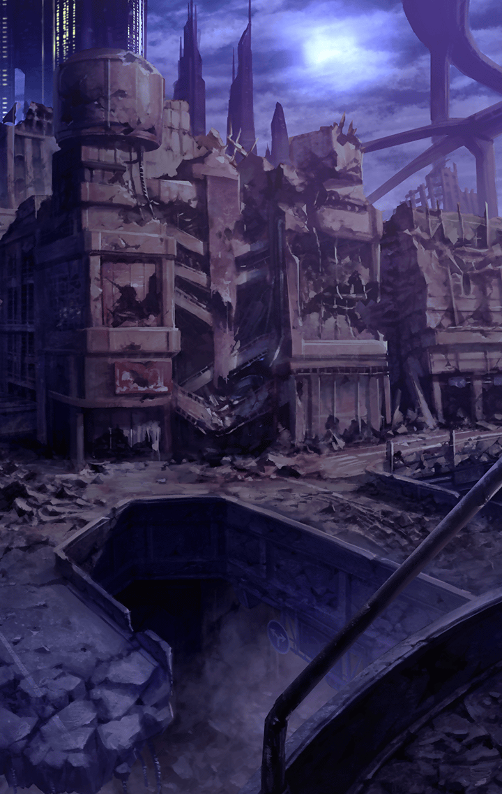

[View script in lisp](../scripts/110150511.txt)

【エルキュール】
いつになったら
争いはなくなるのですか――

【エルキュール】
いつになったら
この戦いは終わるのですか――

【エルキュール】
みんなの希望に
私はなりたいのに――

【エルキュール】
やぁ！

【芭蕉扇】
痛っ…！
あなた、また邪魔をするの？

【ロンゴミアント】
せっかくの戦場なのに
あかぁく染めさせないなんて、
死にたいようですねっ

【エルキュール】
何度だって止めます！
私はみんなが笑って暮らせる世界を
目指していますからっ

【芭蕉扇】
そんなものには興味ないって
何度も言ってるでしょう？

【芭蕉扇】
私のマスターが幸せなら、
それでいいの

【芭蕉扇】
マスターにお願いされたから、
邪魔者を殺す
それだけよ

【ロンゴミアント】
戦場をあかぁく染め上げるんです
それこそがマスターの望み
つまり、私の望みなんですよぉ

【ロンゴミアント】
そこをどいて下さい
でないと、あなたまであかぁく
染めることになります

【エルキュール】
私は退きません！
みんなの希望になるんですからっ

Next: [110150513](110150513.md)

[Back to index](index.md)
