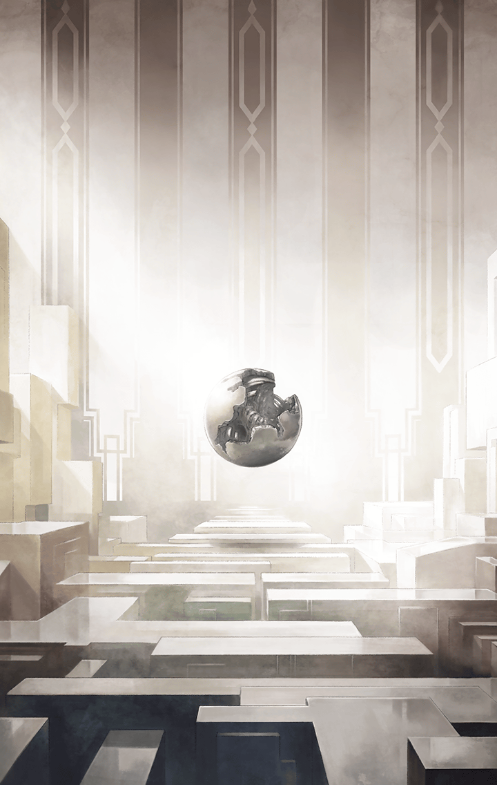

[View script in lisp](../scripts/110160220.txt)

**【ラグナロク】**
罪？
そんな話はしていない

**【ラグナロク】**
人間が不完全であるだけなら、
大した問題ではなかった

**【ラグナロク】**
その欠陥はやがて克服され、
いつか完全な存在に至っていた
はずだから

**【アルマス】**
…そう、かもね
そういう世界線から、
私は来たわ

**【ティターニア】**
アルマス…

**【アルマス】**
それに、地底でもそういう人に
会ったわ…

**【フェイルノート】**
完全なる生命、ね…

**【ティルフィング】**
“地底に潜む者”も人類がそうなる
道を歩むと考えていたようでした

**【レーヴァテイン】**
でも、違ったから干渉してきた…
それがこの世界よ…

**【ラグナロク】**
何故、そうならなかったのか
バイブスが存在したからだ

**【ラグナロク】**
バイブスはキラーズを求め続ける
つまり、他を求め続ける
自分以外の存在を

**【ラグナロク】**
不完全な人という器を得て、
バイブスは際限なく他者を求めた

**【ラグナロク】**
外へ向けられる欲望はとめどなく、
バイブス所持者自身ですら、
それを制御できない

**【ラグナロク】**
人類は、手にしてはいけなかったの
かもしれないな
バイブスを…キラーズを…

**【ティルフィング】**
そんな…マスターは、そんな方では
ありません…！

**【ラグナロク】**
言ったでしょう
バイブス所持者ですら、制御できない
のだと

**【ラグナロク】**
各人の意思など関係ない
バイブスはそういうものとして
存在している

**【ラグナロク】**
そして、それに共鳴する者達が
争いを続けてしまう

**【ラグナロク】**
共鳴を断ち、バイブスを排除しない
限り、世界に平穏は訪れない

**【ラグナロク】**
一時の平和が手に入ったとしても、
やがて再び争いが起きる

**【ラグナロク】**
この世界でも、
歴史がそれを証明している

**【ラグナロク】**
ティルフィング…
あなたは世界を見守ってきた
そうだな？

**【ティルフィング】**
どうして、そのことを…？

**【ラグナロク】**
すでに観測済みだ
この世界の記録も全て手中に収めた

**【ラグナロク】**
エルキュール達があなた達の相手を
している間にな

**【ティルフィング】**
…確かに悪魔との戦いに勝利した後、
平和な日々が続いたとは言い切れ
ません

**【ティルフィング】**
けれど、それでも人々は少しずつ
理想に向かって歩んでいましたっ
争いだって…

**【ラグナロク】**
減っていたと、言えるのか？

**【ティルフィング】**
…………

**【アルマス】**
ティルフィング、バシッと言って
やってよ！

**【ティルフィング】**
残念ながら…
あまり目立たなくなっていただけ…
でした…

Next: [110160231](110160231.md)

[Back to index](index.md)
