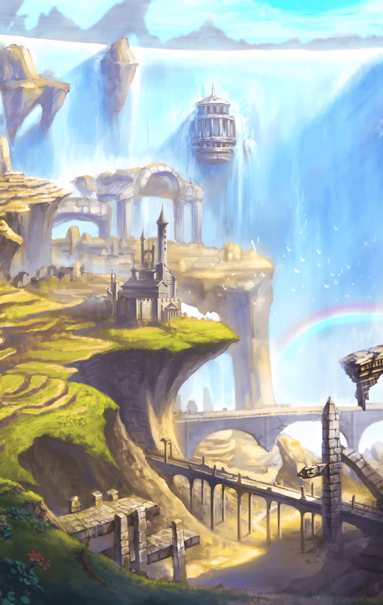

1311003 天上編 第３章 マスターの条件 第１話 暴走 バトル終了後の会話

[View script in lisp](../scripts/1311003.txt)

【ティルフィング】
ロンギヌス…
なぜ、こんなに動けるの？
とうに体力は尽きているはずなのに…

【デュリン】
暴走は限界以上の力を引き出すけど…
でも、確かに…

【トト】
ねぇ…普通の人間も襲うって、
ティルフィングも？

【ティルフィング】
暴走状態に陥れば、おそらく…

【トト】
…！

【ディーン】
んなことも知らねぇで
一緒にいたのかよ？

【ディーン】
どんな幻想を抱いてんのか
知らねぇけどな…キラープリンセスは
人間じゃないんだぜ、坊や

【ティルフィング】
やめてください、
そんな言い方…

【ディーン】
だって、そうだろ？
どんなに美人だって、
キラープリンセスはキラープリンセス

【ディーン】
…異族討伐のための兵器じゃねぇか？
新人マスター…お前もいい加減、
理解しただろ？

選択肢:
- キラープリンセスは道具じゃない！ → [select_label_01](#select_label_01)へ
- 思いが通わなければ、連携は取れない → [select_label_02](#select_label_02)へ

…異族討伐のための兵器じゃねぇか？
新人マスター…お前もいい加減、
理解しただろ？

#### select_label_01:
 → [select_label_end](#select_label_end)へ

【ディーン】
…ティルフィング
お前、本当に…コイツが
洗礼を受けられると思っているのか？

#### select_label_02:
 → [select_label_end](#select_label_end)へ

【ディーン】
やれやれ…焦るこたぁ無ぇな
ティルフィング、
お前はいずれ俺のモンだ

#### select_label_end:

【ティルフィング】
え？

【ディーン】
断言するぜ
お前がラグナロク大聖堂に
辿り着ける可能性は０％だ

【ディーン】
そんな甘っちょろい考えで、
生き残れるはずがねぇ

【デュリン】
…どっちもどっちだと思うけど

【ディーン】
あ…？

【デュリン】
確かに甘いけど…ウチからは、
暴走するようなキラープリンセスは
出てないわ…

【ディーン】
…どういう意味だよ、それ？

【ティルフィング】
引き離される…急いでください！

【ディーン】
…チッ

Next: [1320101](1320101.md)

[Back to index](index.md)
