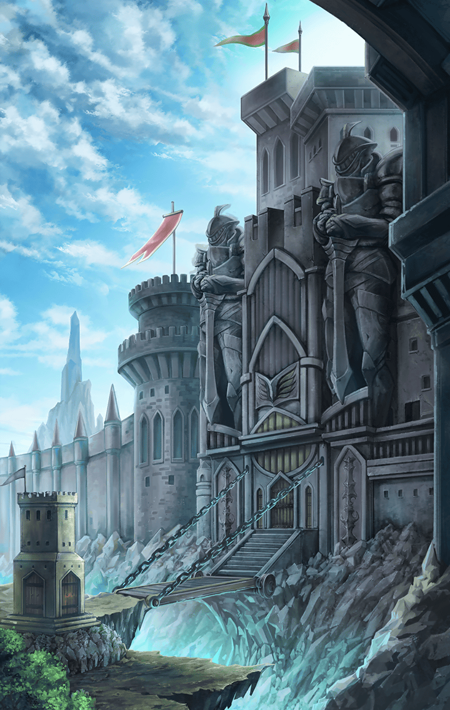

1520101 天上編 第５章 寡黙な番人 第２話 ゲートキーパー バトル開始前の会話

[View script in lisp](../scripts/1520101.txt)

【ゲートキーパー】
…………

【デュリン】
…………

【ゲートキーパー】
…………

【ディーン】
ゴ、ゴホン…
いやぁ…静かっすね…
この厳粛な空気…関所って感じだなぁ

【ゲートキーパー】
…その子は？

【デュリン】
…っ！

【デュリン】
あ…こ、この子は…
王都のフレンネル大公の元へ
送り届ける途中でして…

【ゲートキーパー】
…許可証

【デュリン】
あ…一番、最後に…

【ゲートキーパー】
…っ！
…これは！？

【ティルフィング】
あ、あの…オルトさん…ですか？

【ゲートキーパー】
…………

【デュリン】
違うの？
“学者さま”の息子の、
オルトさんじゃ…

【ゲートキーパー】
…その子供以外の入域を許可する
通れ

【ティルフィング】
ま、待ってください
この子は
“学者さま”の許可証を借り受けて…

【ゲートキーパー】
この関での審判は、
何人たりとも等しく平等…

【ゲートキーパー】
ラグナロク教会の者であろうと、
例外ではない

【ゲートキーパー】
理解した上で…
この許可証での、
この子の入域を主張するのか？

【デュリン】
…っ！ちょ、ちょっと待って！！
すみません、出直します！！
ほら、行くわよ！！

【ティルフィング】
え！？
ちょ、ちょっと…デュリン！？

【ティルフィング】
デュリン、待って！
どうして出てきてしまったの！？

【ディーン】
いや…正解だな。引き時だったぜ

【ティルフィング】
え…？

【デュリン】
“関での審判は、
何人たりとも等しく平等”

【デュリン】
…ラグナロクの人間だろうと、
容赦なく罰するって意味よ

【ティルフィング】
あ…

【ディーン】
ラッキーだったな…
警告なしでいきなり引っ張られても
おかしくないところだ

【ティルフィング】
つまり…学者さまの入域許可証での
入域は、認められないということ？

【デュリン】
そういうことね…
“これ以上粘るなら問題にするぞ”
ってことだから

【ティルフィング】
そんな！
どうするの！？

【デュリン】
それを考えるために、
出てきたんじゃない
さて、どうしたものか…

Next: [1520102](1520102.md)

[Back to index](index.md)
