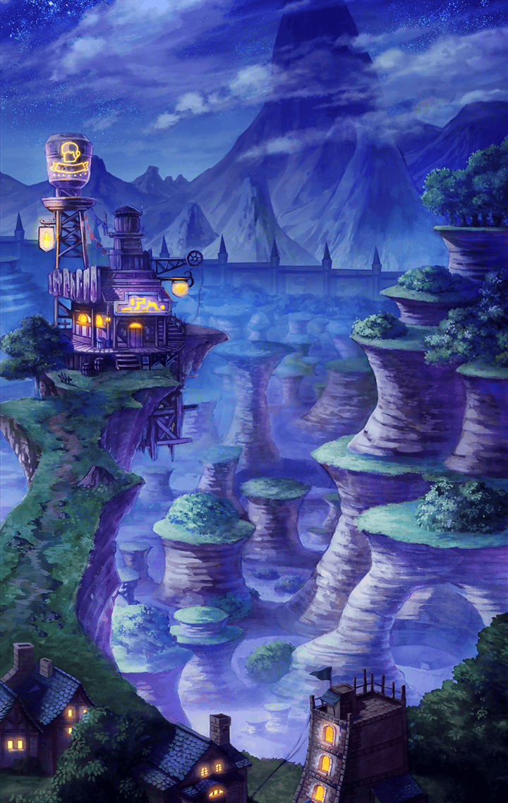

1540101 天上編 第５章 寡黙な番人 第４話 潜入 バトル開始前の会話

[View script in lisp](../scripts/1540101.txt)

【ティルフィング】
オルトさんを…待ち伏せる…！？

【デュリン】
そう。それが、
アタシ達で考え抜いた結論よ

【デュリン】
ゲートキーパーではなく、
“学者さまの息子”としてのオルトと
話をするだけよ

【トト】
…？
同じ、オルトさんじゃないの…？

【デュリン】
違うわよ。関所の中だと、
ゲートキーパーとして
いなきゃならない…

【デュリン】
本音なんか聞き出せやしないわ

【デュリン】
仕事を終えて、ただの
“学者さまの息子”になった
オルトと話がしたいのよ

【ティルフィング】
確かに…彼の本心がわからなければ、
説得のしようもないですね…

【トト】
でもさ…そんなことできるの？

【デュリン】
オルトが出てくるのを見計らって、
尾行するのよ

【デュリン】
…誰かさんが失踪したりして、
騒ぎを起こさなきゃ問題ないはずだわ

【トト】
う…っ！
…ご、ごめん

【デュリン】
ったく…浅はかな考えで行動して、
それで騒ぎを起こされたんじゃ
たまらないっての

【トト】
でも…デュリンは僕を、
耕民区に置いていきたいんでしょ？

【デュリン】
そのほうが、
手間かからなくて楽だけどね

【ティルフィング】
デュリン！

【デュリン】
…別に…もうこの状況じゃ、
アンタがいようがいまいが関係ないわ

【デュリン】
それよりも…突然いなくなったりして
手を焼かされるほうが面倒だっての

【ティルフィング】
ウソよ…トトを連れて行きたいって、
さっき言ってたもの
意地張ってるだけよ

【デュリン】
ちょ、ちょっと…ぉ！

【トト】
デュリン！
…ごめん…もう勝手に
出て行くようなことはしないよ

【デュリン】
べ、別に、アタシは…

【デュリン】
ともかく…出て行くんなら、
せめて一言、言ってからにしてよね！
迷惑だから！

【デュリン】
…ほら、行くわよ！！

【トト】
…うんっ！！

【ティルフィング】
でも…オルトさんを待ち伏せる
っていっても、実際どうするつもり？

【デュリン】
どうするって…表で隠れてて、
仕事が終わって出てくるのを待つのよ

【トト】
でもさ…ゲートキーパーって、
耕民区に住んでるんだね？
なんか、意外だったなぁ

【デュリン】
ん…どういう意味よ？

【トト】
え？だってさ…偉い人だから、
壁の向こうの人民区に
住んでると思うじゃん？

【デュリン】
げ…っ！

Next: [1540102](1540102.md)

[Back to index](index.md)
