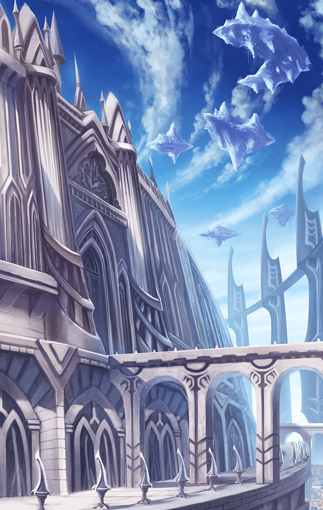

1750603 天上編 第７章 崩れゆく虚像 第５話 崩れゆく美しき世界 バトル終了後の会話

[View script in lisp](../scripts/1750603.txt)

【ティルフィング】
クッ…！

【マサムネ】
…一人で来るとは、
なにを考えている？
力の差はわかりきっているはずだ

【ティルフィング】
私は、
私の力で乗り越えて
行かなければならない…！

【ティルフィング】
あの壁の向こう側には
自分の力で
辿り着かなければいけないの…！

【マサムネ】
フン…

【ティルフィング】
！？
消えた…！？

【マサムネ】
唯一可能性があるとすれば、
他のキル姫達との連携技…

【マサムネ】
それすらも棄てたお前に
もはや勝機はない

【マサムネ】
あの世で後悔するがいい！！

【ティルフィング】
クッ…！
タァァァァァァーッ！！！

【マサムネ】
返した…？

【ティルフィング】
…負けられない！
あの壁の向こうに、
私を待つ人がいるのなら…！

【マサムネ】
なに…？

【ティルフィング】
どんな障害があろうと…
私はこの道を、
迷わずに進まなければいけない！

【ティルフィング】
私の帰りを待ってくれている人が
そこにいるかも
しれないのだから…！！

【マサムネ】
眼差しに迷いがない…
相応に答えるのが筋というものか

【マサムネ】
…奥義にて迎え討つ
そなたのゆく道…
この剣で闇に閉ざしてくれる

【ティルフィング】
…！

【マサムネ】
“黒式・一紅閃”！！！

【ティルフィング】
グ…！！！
…ウグッ…！！！

【マサムネ】
…終わりだ！！

【ティルフィング】
…け…消せ…ない…

【マサムネ】
…？

【ティルフィング】
消せはしない…！

【マサムネ】
なに…！？

【ティルフィング】
愛する人が遺してくれた
意志の炎は…
誰にも消せはしない！！！！

【マサムネ】
なんだと…！？

【ティルフィング】
ショック・トゥ・キル！！！！！

【マサムネ】
グ…
ガハッ…！！！

【ティルフィング】
ハァ…ハァ…

【ティルフィング】
…悠久の時を超え

【ティルフィング】
アナタは待ち続けてくれているの…？

【ティルフィング】
…お母さん！！

Next: [2027121](2027121.md)

[Back to index](index.md)
