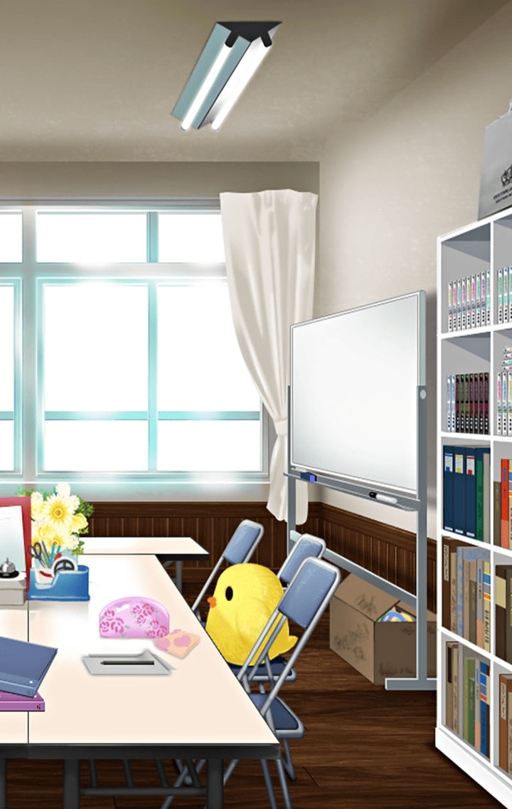

[View script in lisp](../scripts/20048202.txt)

それは、パラシュが
憂鬱な顔を見せる
少し前のこと

もうほとんど人のいない
放課後の校舎――

**【パラシュ】**
マスター、まだ残っていたのかい
なにか用事でもあったのかな？

そういうパラシュこそ
この時間まで
風紀委員の仕事だったのだろうか

だいぶ疲れて見える

**【パラシュ】**
顔が疲れている？
そうかな、いつも通りだと思うけど

**【パラシュ】**
…しいて言うなら
もう少しで実力テストだからね
最近寝るのは少し遅いかもしれない

選択肢:
- 無理は禁物だよ！ → [select_label_01](#select_label_01)へ
- 疲れすぎると効率悪いし… → [select_label_02](#select_label_02)へ
- ちょっと頑張り過ぎじゃない？ → [select_label_03](#select_label_03)へ

…しいて言うなら
もう少しで実力テストだからね
最近寝るのは少し遅いかしれない

#### select_label_01:
 → [select_label_end](#select_label_end)へ

**【パラシュ】**
この程度、まだ序の口だよ

#### select_label_02:
 → [select_label_end](#select_label_end)へ

**【パラシュ】**
適度な疲労は集中力を増すから

#### select_label_03:
 → [select_label_end](#select_label_end)へ

**【パラシュ】**
君の基準で図らないでよ

#### select_label_end:

**【パラシュ】**
今さら言うまでもないけど
ボクは常に理想に描く
最高の結果を求めている

**【パラシュ】**
そのためには
日々の積み重ねこそ重要…
でも、時間は毎日限られている

**【パラシュ】**
だからこそ綿密な計画が必要だ
あとはそれをひたすら実行するのみ

**【パラシュ】**
…たゆまぬ努力というのは
そういうものさ

相変わらずのストイックさに
マスターはただただ感心するのみだ

**【パラシュ】**
決める、そしてやるだけ
違うかい？

**【パラシュ】**
勉強にせよ、身だしなみにせよ…
やればいいとわかっていることを
どうしてみんな怠るんだい？

**【パラシュ】**
ボクにはそれが理解できないし
到底許すことができないんだ

できる人はやっぱり違う…
なんて思うのは簡単だ

こういう人が大成するんだなと
思いつつも、パラシュの頑なさが
少し心配になるマスター

**【パラシュ】**
ボクの心配をしている暇があるなら
自分の心配をするべきだ

**【パラシュ】**
ボクはボクに求めるものを
君にも求めるよ

**【パラシュ】**
そういう会話ができないなら
ボクには構わないでくれるかな

パラシュは厳しく言い放つと
廊下の向こうに消えていった――

**【パラシュ】**
以前のボクは
どこに行ってしまったのか…
だって？

**【パラシュ】**
さぁ、ボクにもわからないよ
ただ、今はとにかく
なにもしたくない気分なんだ…

**【パラシュ】**
こんな愚痴を言うボクは
本当にもうダメなのかもしれないね…

ダメなんかじゃない
疲れているんだろう、休みも大事だよ

マスターはパラシュに
そういう時はしっかり休んだ
ほうがいいよ…優しく声をかけた

**【パラシュ】**
ああ…
そうかもしれないね…

パラシュはマスターの顔も見ずに
気のない返事をした

Next: [90006](90006.md)

[Back to index](index.md)
