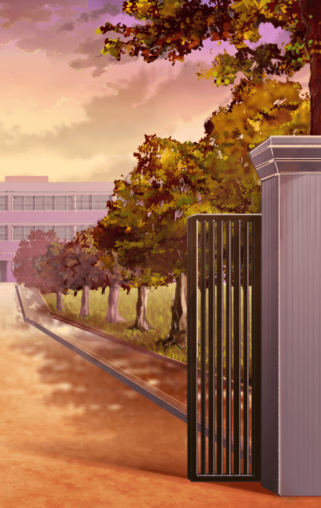

20102213 ウコンバサラ ヴィガ・メテオライト

[View script in lisp](../scripts/20102213.txt)

―放課後の教室

【ウコンバサラ】
マスター、無事！？

【ウコンバサラ】
…ほっ、よかった
元気みたいだね

胸をなでおろすウコンバサラに
マスターは明るい笑みを返す

昼休みの生徒との事件後…
マスターの不幸体質は
さっぱり解消されたのだ

【ウコンバサラ】
大きなケガがなくて
本当によかったよ

【ウコンバサラ】
明日からはいつも通り
過ごせそうだね！
私の役目も終わりかな

【ウコンバサラ】
…えっ？
何かお礼がしたい？

【ウコンバサラ】
いいよ、気にしないで！
私がやりたくて
やっただけだし…

ウコンバサラは遠慮するが、
マスターは真剣に
お返しを考えはじめる

そこでふと思い立ち、
ポケットから
色鮮やかな石を取り出した

【ウコンバサラ】
わあっ…
なにそれ、宝石みたい！
すごく綺麗…！

【ウコンバサラ】
ラッキーアイテム？
そっか、占いが良くなかったから
持ち歩いてたんだね

マスターはその石を
そっとウコンバサラに差し出す

【ウコンバサラ】
えっ…！
い、いいの？

【ウコンバサラ】
ラッキーアイテムなんでしょ？
自分で持っておいた
方がいいんじゃ…

戸惑うウコンバサラに
マスターは照れながら答える

ウコンバサラが
そばにいてくれる方が、
ずっと心強いから…と

【ウコンバサラ】
っ…！！

マスターのストレートな言葉に
顔が熱くなるウコンバサラ

また何かあったら、
頼らせてもらえると嬉しいな…

そんなマスターの声が、
動揺するウコンバサラの心に
響いていく

【ウコンバサラ】
そ、そっか…
ありがとう、大切にするよ！

これまで漠然と抱いていた、
何かを守りたいという想い…

それが今はっきりと、
マスターを守りたい
という想いに昇華していく

自身の心の変化を自覚した
ウコンバサラの胸には…

新たなスキル
『ヴィガ・メテオライト』が
華々しく芽吹くのだった

Next: [20102214](20102214.md)

[Back to index](index.md)
