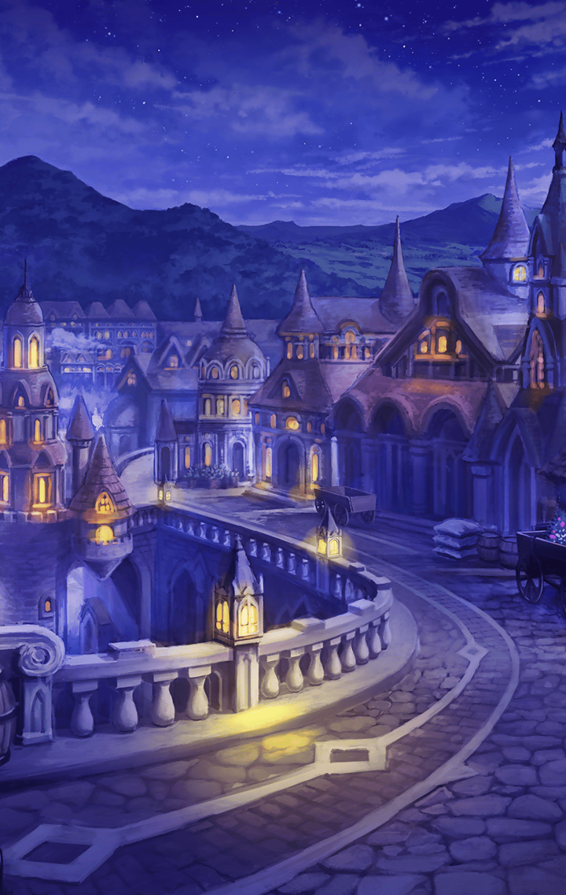

202103070 シークレットリーエバーアフター(Secretly Ever After)(SEA編) 第5章 そして御旗は再び未来にはためく 第１話 そして御旗は再び未来にはためく-7

[View script in lisp](../scripts/202103070.txt)

【フライシュッツ】
…………

【ダモクレス】
…………

【グラーシーザ】
…………

【ネス】
…………

【ミネルヴァ】
…………

【マナナン】
あれ～？
みんな静かになっちゃったね

【マナナン】
ねぇねぇ、マスター
早くミーミルを助けに行こうよ

選択肢:
- マナナンは… → [select_label_01](#select_label_01)へ
- “相棒”は… → [select_label_01](#select_label_01)へ

ねぇねぇ、マスター
早くミーミルを助けに行こうよ

#### select_label_01:

【マナナン】
うーん…
“相棒”のことは気になってるし
探しに行きたいけど…

【マナナン】
ミーミルにマスターのこと
お願いされたから

【マナナン】
それに、この町にいるって
確かに感じるんだ
その気配は消えてない

【マナナン】
だから、ミーミルが戻ってくるまで
私がマスターを守らないとね

選択肢:
- ありがとう → [select_label_02](#select_label_02)へ
- 変わったね → [select_label_03](#select_label_03)へ

だから、ミーミルが戻ってくるまで
私がマスターを守らないとね

#### select_label_02:
 → [select_label_end](#select_label_end)へ

【マナナン】
アハハハ！
お礼を言われるの愉快な気分♪

#### select_label_03:
 → [select_label_end](#select_label_end)へ

【マナナン】
そうかな？
もしそうならマスターとミーミルの
影響かもね～

#### select_label_end:

【ミネルヴァ】
…失礼しました、マスター
エルキュールに言われたことが
引っかかっていて……

【ミネルヴァ】
皆さんも同じだと思います…

選択肢:
- “彼女”というのは… → [select_label_04](#select_label_04)へ
- 君達が忘れているのは… → [select_label_04](#select_label_04)へ

エルキュールに言われたことが
引っかかっていて……
皆さんも同じだと思います…

#### select_label_04:

選択肢:
- うぐっ…？ → [select_label_05](#select_label_05)へ

！？

#### select_label_05:

【ミネルヴァ】
どうしましたっ？
急に喉を押さえて…

選択肢:
- おかしい… → [select_label_06](#select_label_06)へ
- 言葉が出てこない… → [select_label_06](#select_label_06)へ

どうしましたっ？
急に喉を押さえて…

#### select_label_06:

【マナナン】
どうしたの？
普通に喋れてるよ

【ミネルヴァ】
マスター、もしかして…

【ミネルヴァ】
“彼女”のことを
私達が忘れていることについて、
何か知っているのですか？

選択肢:
- そうだけど… → [select_label_07](#select_label_07)へ
- 話したいのに… → [select_label_07](#select_label_07)へ

“彼女”のことを
私達が忘れていることについて、
何か知っているのですか？

#### select_label_07:

【マナナン】
何だか苦しそうだね…

【ミネルヴァ】
マスター
無理に話そうとしないで下さい

【ミネルヴァ】
マスターは今、話したくても話せない
…そのような状況に
あるのではないかと推測します

【マナナン】
ふーん…何で？

【ミネルヴァ】
理由までは分かりません
ただ…

【エルキュール】
あなた達は覚えていない
思い出すこともできない

【エルキュール】
私も“彼女”のことは“彼女”としか
口にできません
大切な存在なのに…！

【エルキュール】
それが普通だって…
理解しています
でも、だからこそ

【エルキュール】
私は抗います
抗って抗って抗って…
“彼女”を取り戻すんです！

【エルキュール】
“彼女”だけが忘れられて…
それでいいはずがないんです

【ミネルヴァ】
あのとき、エルキュールは
“彼女”としか言えないと
言っていました

【ミネルヴァ】
ひょっとすると、
この世界そのものが

【ミネルヴァ】
“彼女”に関することを
伝えられないように
しているのかもしれません

【マナナン】
ええーっ
何それ…

【ミネルヴァ】
ともかく、マスター
無理に伝えようとしなくて
構いません

【ミネルヴァ】
これは私達自身で思い出さなければ
ならない事柄なんです

選択肢:
- 分かった → [select_label_08](#select_label_08)へ
- もどかしい… → [select_label_09](#select_label_09)へ

マスター
無理に伝えようとしなくて
構いません

#### select_label_08:
 → [select_label_end2](#select_label_end2)へ

【マナナン】
何だか面倒臭そうだね～

#### select_label_09:
 → [select_label_end2](#select_label_end2)へ

【ミネルヴァ】
そうですね…
でも、私達は大丈夫です

#### select_label_end2:

【ミネルヴァ】
それより、ミーミルのことです
早く助け出さないと
いけなかったんですよね

【マナナン】
そうだよ！
早く探しに行こう！

【ミネルヴァ】
それについては、そろそろ報告が
あるはずです

【マナナン】
報告？
誰から？

【ミネルヴァ】
もちろん…ああ、来ました！
ニケ！

【マナナン】
あ！フクロウだっ

【ミネルヴァ】
この子はニケ
とても賢い子なんですよ

【ミネルヴァ】
実はエルキュールの後をこっそり
追ってもらったんです

【ミネルヴァ】
彼女の拠点がどこなのか
きちんと見つけてくれたようですね

【マナナン】
アハハハ！
本当に賢いんだね～

【ミネルヴァ】
私の推測では、エルキュールと
スイハは協力関係にあります

【ミネルヴァ】
エルキュールの拠点に
スイハもいるはずです
そして、そこには…

【マナナン】
ミーミルもいるってことだね！

【ミネルヴァ】
はい
ニケ、案内して下さい

【グラーシーザ】
エルキュールのところにいくのだな
では、あたしもどうこうしよう

【ダモクレス】
クレスも！
よく分かんないことをいつまでも
考えてたって仕方ないもんね

【フライシュッツ】
おねーちゃんを置いてかないで～

【ネス】
わたしも、行きます…！

【ミネルヴァ】
分かりました
マスターは、動けそうですか？

選択肢:
- もちろん！ → [select_label_10](#select_label_10)へ
- 一緒に行くよ → [select_label_10](#select_label_10)へ

マスターは、動けそうですか？

#### select_label_10:

【ミネルヴァ】
では、皆で行きましょう！

【マナナン】
…あれ？
今の感覚って…

Next: [202103080](202103080.md)

[Back to index](index.md)
