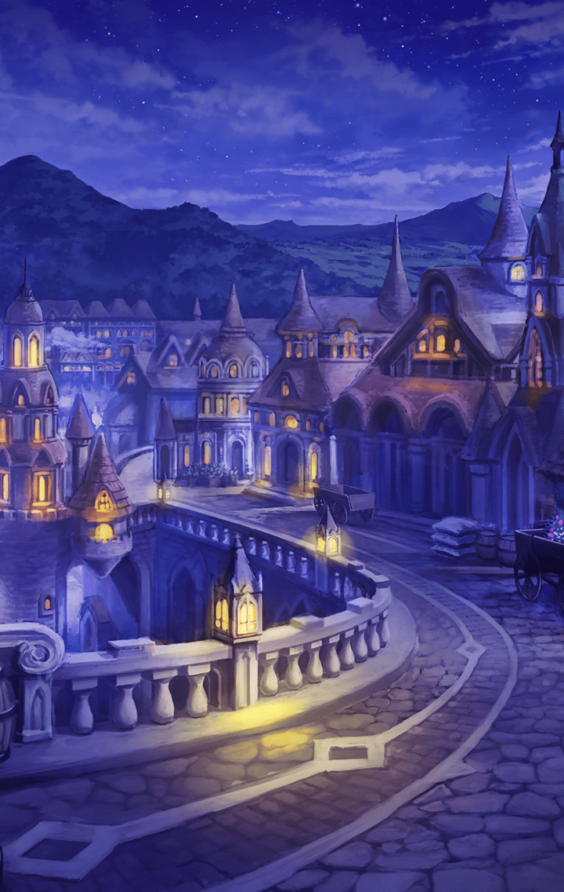

[View script in lisp](../scripts/202103230.txt)

【エルキュール】
私は皆さんの希望にならないと
いけなかったのに…
どうしても届かなかったんです…

【エルキュール】
私は自分に絶望して、
“彼女”を強く求めました
希望を体現していた“彼女”を…

【エルキュール】
本当に、ごめんなさい…

【ミーミル】
謝るようなことでは…

【フライシュッツ】
そうだよー…
おねーちゃん、気づいて
あげられなくてごめんね～っ

【グラーシーザ】
エルキュールはみずからのせいぎを
つらぬこうとしておったのだな

【ダモクレス】
エルキュール、元気出して！

【エルキュール】
無理です…
私は、真の希望になれないんです…

【ミネルヴァ】
すっかり自信を
なくしてしまいましたね

【ネス】
こうなると立ち直らせられるのは
ミネルヴァだけです

【ミネルヴァ】
そう言われても、
こうなったエルキュールは
私でも時間がかかります…

【スイハ】
あまり時間は――

【ミーミル】
きゃあっ…！

【ミネルヴァ】
何が起きたんですか！？
…あああっ！

【ダモクレス】
空に大きな穴が開いてるよ！
あれって地下にあったものが
広がったんだよね？

【グラーシーザ】
そのようだな
しかし、なにゆえだ？

【ミーミル】
マナナンさん達に
何かあったのでしょうかっ？

【スイハ】
何か飛んできます！
伏せて！

【マナナン】
あぐぅっ…！

【ミーミル】
マナナンさん…！？

【マナナン】
あはは…ごめ～ん
思ってたより“彼女”の力が
強くなってるみたい

【マナナン】
もう、私達だけじゃ「穴」を
制御できないかも…

【ミーミル】
そんなっ…

【ミネルヴァ】
直ちに対処します！
皆さん、“彼女”と相対する
覚悟はありますかっ？

【グラーシーザ】
それがせいぎなら
なんのまよいもない！

【ダモクレス】
クレスもやれるよ！

【ネス】
規律を正すためなら、
やります！

【フライシュッツ】
おねーちゃんも頑張るよ！

【スイハ】
ミネルヴァ、指揮をお願いします

【ミネルヴァ】
一旦、不完全な“彼女”を
「裏側」へ押し戻します

【ミネルヴァ】
「穴」から魔獣も
出てくるでしょうから、
それにも適宜、対応して下さい

【ミネルヴァ】
…マスター、ミーミル
エルキュールをお願いします

【ミーミル】
は、はいっ

【エルキュール】
…………

【ミーミル】
エルキュールさん…

【ミーミル】
何か声をかけてあげたいのですが、
何と言えば良いのか…

選択肢:
- 側にいるだけでいい → [select_label_01](#select_label_01)へ
- そっとしておこう → [select_label_01](#select_label_01)へ

エルキュールさん…
何か声をかけてあげたいのですが、
何と言えば良いのか…

#### select_label_01:

【ミーミル】
そういうときもあるのですね
では

【エルキュール】
…………

【ミーミル】
…………

【エルキュール】
…………

【ミーミル】
…………あ、あのっ

【ミーミル】
申し訳ございません
お尋ねしたかったことを
思い出したもので

【エルキュール】
…………何ですか？

【ミーミル】
どうして私を生け贄にしようと
思われたのですか？

【エルキュール】
ごめんなさい…

【ミーミル】
いえ…
スイハさんにもお尋ねした
純粋な疑問でございます

【エルキュール】
…自覚はないんですね
あなたから“彼女”と同じものを
感じるんです

【エルキュール】
それで…「裏側」から出てきた
“彼女”の器になる
存在なのではないかと思って…

【エルキュール】
本当に、ごめんなさい…！

【ミーミル】
なるほど
私が―――――さんと同じ…

【ミーミル】
…あのっ
お伝えし損ねていたのですけれど

【エルキュール】
…はい

【ミーミル】
エルキュールさんは、ご自身に
絶望してしまい、それでも
諦めなかったのですよね？

【ミーミル】
絶望してなお、人々の希望に
なりたいと望んだからこそ、
“彼女”の存在を強く願った…

【ミーミル】
そう考えております

【エルキュール】
…………

【ミーミル】
それは紛れもなくエルキュールさんの
強さであり、希望へと至る
道ではないかと思うのです

【ミーミル】
あ…差し出がましいことを
申し上げましたっ

【エルキュール】
私は…
でも、もう…

選択肢:
- 諦めないで欲しい → [select_label_02](#select_label_02)へ
- まだ終わりじゃない → [select_label_02](#select_label_02)へ

私は…
でも、もう…

#### select_label_02:

【ミーミル】
マスター様？

選択肢:
- どれだけの時がかかっても → [select_label_03](#select_label_03)へ
- どれだけの困難に遭っても → [select_label_03](#select_label_03)へ

マスター様？

#### select_label_03:

選択肢:
- 求め続けていれば → [select_label_04](#select_label_04)へ
- 探し続けていれば → [select_label_04](#select_label_04)へ

どれだけの時がかかっても
どれだけの困難に遭っても

#### select_label_04:

選択肢:
- きっと出会えるから → [select_label_05](#select_label_05)へ
- きっと見つかるから → [select_label_05](#select_label_05)へ

求め続けていれば
探し続けていれば

#### select_label_05:

選択肢:
- きっと、あと一歩なんだ → [select_label_06](#select_label_06)へ
- きっと、あと少しなんだ → [select_label_06](#select_label_06)へ

きっと……

#### select_label_06:

【エルキュール】
マスター…

【ミーミル】
マスター様
ありがとうございます

【ミーミル】
そのお言葉で、ミーミルも
決心がつきました

【エルキュール】
…………！？

【ミーミル】
私、今から―――――さんと
相対してみようと存じます

Next: [202103240](202103240.md)

[Back to index](index.md)
