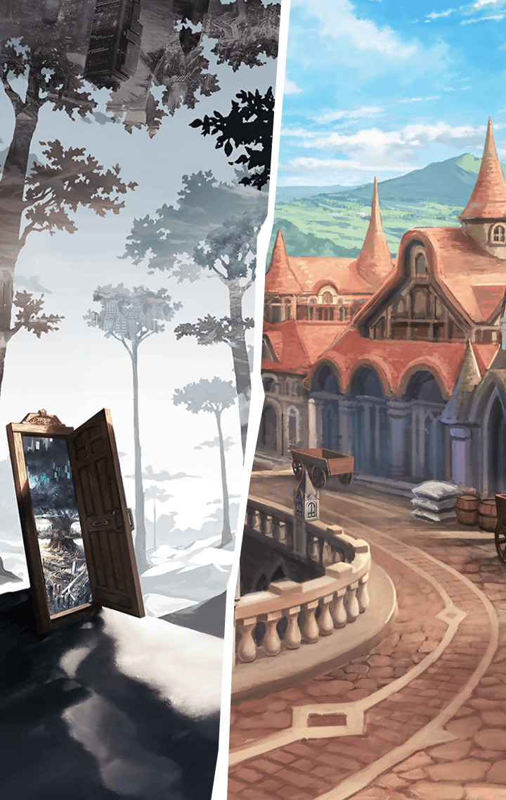

[View script in lisp](../scripts/202103270.txt)

【ティルフィング】
…マスター
そのような事態に
なっていたのですね

【ティルフィング】
ミーミルと全く連絡が取れなくて
心配していましたけれど…

【ティルフィング】
まさか「裏側」に
行ってしまうだなんて…

【ミネルヴァ】
早く助け出したいのですが、
私達では手の打ちようがないんです

【マナナン】
「穴」を開けることはできるけど、
ただ開けただけじゃ
意味ないと思うな～

【マクリル】
「裏側」のマナが流れ込んできて、
また魔獣が現れるだけだと思う…

【ティルフィング】
つまり、正確にミーミルの位置を
特定してから「裏側」と繋ぐ必要が
あるということですね

【ティルフィング】
しかし…「裏側」については
私も観察したことのない領域です

【ミネルヴァ】
ティルフィングでも無理ですか…？

【ティルフィング】
…………

【ティルフィング】
あの…
皆さん、そちらにある教会の名前は
覚えていますか？

【ミネルヴァ】
はい
それが何か？

【ティルフィング】
では、私達が暮らす大陸の名前も？

【エルキュール】
もちろんです！
―――――大陸ですよねっ
…あれっ？

【グラーシーザ】
むぅ…
たいりくのなまえだけ
きこえなかったぞ

【ミネルヴァ】
これは、まさか…
―――――教会…ああっ？

【ティルフィング】
皆さん
それが“彼女”の名前です

【エンシェント達】
！！

【マナナン】
うーん…
何の話してるの？
ミーミルを早く助け出そうよっ

【ティルフィング】
マナナン、
もちろん私も同じ気持ちです

【ティルフィング】
そのためにも、皆さんにより鮮明に
“彼女”のことを思い出して
いただきたいんです

【ティルフィング】
きっとミーミルと“彼女”は今、
「裏側」で一緒にいますから

【マナナン】
そっか！
ミーミルは影みたいなのに
包み込まれてたもんねっ

【スイハ】
…しかし、ティルフィング
どういうことですか？

【スイハ】
この町の教会や、大陸の名前が
“彼女”の名前と
同じになっているなんて…

【フライシュッツ】
ただの偶然なんかじゃないよね？

【ティルフィング】
はい…
“彼女”は本来、この世界に存在する
ことができません

【スイハ】
えっ…！？

【ティルフィング】
“彼女”は前の世界で淘汰されて
消えた存在…
それが事実であり、世界の理です

【エルキュール】
そんな…

【ティルフィング】
それでも私は“彼女”のことを
忘れたくありませんでした
できれば、皆さんにも…

【ティルフィング】
それが叶わない願いだということも
理解していました
ですから…

【ティルフィング】
せめて“彼女”の名前だけでも
残そうと、大陸に“彼女”の名前を
つけました

【ティルフィング】
それから“彼女”の名前を
信仰の対象とした教会も
設立してもらったんです

【ネス】
この町の教会は、ティルフィングが
作らせたものだったんですか！？

【ティルフィング】
世界の理において“彼女”の存在は
消されてしまいます

【ティルフィング】
でも、“彼女”のことを
意識したものでなければ、その名称を
伝えることができる…そう考えて

【ミネルヴァ】
なるほど
確かに「―――――」という言葉は
伝えられてきました

【ダモクレス】
何で今は―――――って言えないの？

【ミネルヴァ】
私達が“彼女”のことを
意識しているからでしょう

【スイハ】
すでに私達は“彼女”と―――――を
切り離して考えることが
できなくなっています

【エルキュール】
だから口にできない…
そんなの、理不尽です…！

【エルキュール】
―――――は私達の大切な仲間で、
希望の御旗なのにっ

【ミネルヴァ】
そうですね、エルキュール
だからあなたは抗ってくれた

【グラーシーザ】
やりかたはごういんだったが、
それがおまえのせいぎだったのだな

【ティルフィング】
皆さん
お願いします

【ティルフィング】
“彼女”のことを強く思って下さい
それから、ミーミルのことも

【ティルフィング】
今から「裏側」も含めた
世界の全てを俯瞰します

【ティルフィング】
初めての試みですので
自信はありませんけれど…

選択肢:
- 大丈夫だ → [select_label_01](#select_label_01)へ
- 頼む！ → [select_label_01](#select_label_01)へ

初めての試みですので
自信はありませんけれど…

#### select_label_01:

【ティルフィング】
ふふっ
マスターにそう言っていただけると
力が湧いてきます

【ティルフィング】
お任せ下さい
必ずミーミルを見つけ出して
みせます！

【ティルフィング】
私も彼女に会いたい…
会って、旅の話をたくさん
聞きたいですから

【ティルフィング】
お願いします、ユグドラシル
どうか私に力を！

Next: [202103280](202103280.md)

[Back to index](index.md)
