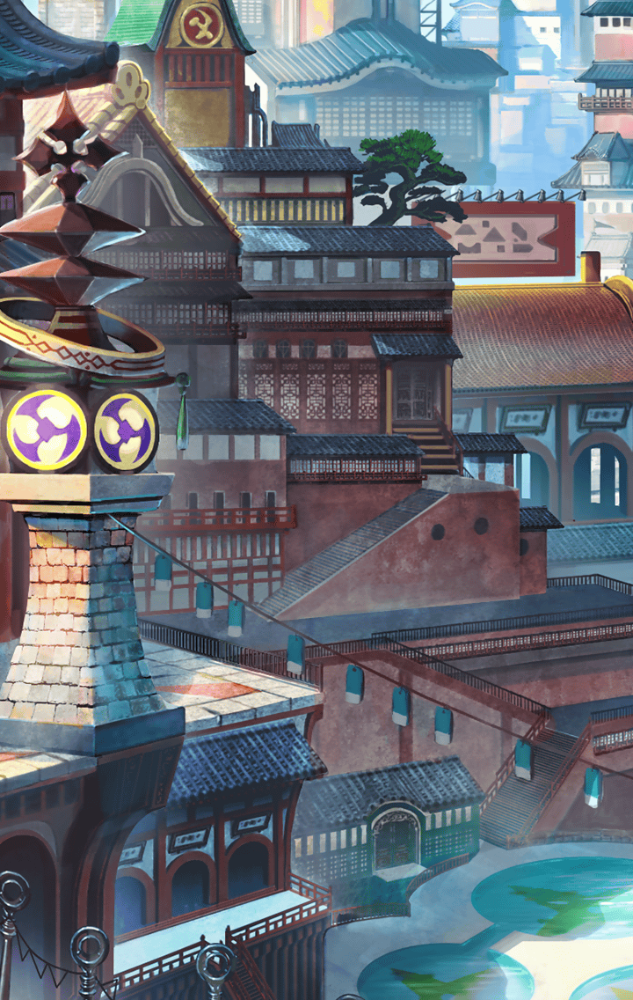

[View script in lisp](../scripts/202207020.txt)

[View source in markdown](202207020.md)

**【ミーミル】**
マスター様、
指定された待ち合わせ場所は
こちらです

**【マナナン】**
いつもと町の雰囲気が違うね！
喜劇的に愉快なことが起きそうっ

**【ミーミル】**
ティルフィング様のお姿は…
見当たりませんね

選択肢:
- 会えるのが嬉しい？ → [select_label_01](#select_label_01)へ
- 会えるのが楽しみ？ → [select_label_01](#select_label_01)へ

ティルフィング様のお姿は…
見当たりませんね

#### select_label_01:

**【ミーミル】**
あ、その…
失礼致しました、マスター様

選択肢:
- いいよ → [select_label_02](#select_label_02)へ
- 楽しみだね → [select_label_03](#select_label_03)へ

あ、その…
失礼致しました、マスター様

#### select_label_02:
 → [select_label_end](#select_label_end)へ

**【ミーミル】**
ありがとうございます

#### select_label_03:
 → [select_label_end](#select_label_end)へ

**【ミーミル】**
はいっ

#### select_label_end:

**【マナナン】**
ねぇねぇ
ティルフィングって、いつもは
ユグドラシルにいるんだよね？

**【マナナン】**
何で、わざわざここに来るの？

**【ミーミル】**
それは…私にも分かりません

**【ミーミル】**
きっとティルフィング様には
深いお考えがあってのことと
推察致します

**【マナナン】**
ふ～ん

**【ミーミル】**
…それにしても、なかなか
お姿をお見かけ致しません
何かあったのでしょうか？

**【マナナン】**
あ！
またペンダントが光ってる

**【ミーミル】**
本当です！
ティルフィング様、
いかがされましたか！？

**【ティルフィング】**
ミーミル
今から言う場所に一人で来て下さい

**【ミーミル】**
えっ？
マスター様と一緒では
いけないのでしょうか？

**【ティルフィング】**
アナタ一人でお願いします

**【ミーミル】**
ですが…ミーミルは
マスター様の専属補佐官として、
お側を離れるわけには…

選択肢:
- 行っておいで → [select_label_04](#select_label_04)へ
- こっちは大丈夫 → [select_label_04](#select_label_04)へ

ミーミルは
マスター様の専属補佐官として、
お側を離れるわけには…

#### select_label_04:

**【ミーミル】**
マスター様がそう仰るのなら
それでは、少しの間、失礼致します
すぐ戻りますので

**【マナナン】**
いってらっしゃ～い！

**【マナナン】**
どうしたんだろ～？
ティルフィング、
道に迷っちゃったのかな？

**【マナナン】**
こっそり後を追ってみよっか？

選択肢:
- ここで待とう → [select_label_05](#select_label_05)へ
- ダメだよ → [select_label_05](#select_label_05)へ

こっそり後を追ってみよっか？

#### select_label_05:

**【マナナン】**
は～い！
マスターは真面目だね～

しばらくして――

**【ティルフィング】**
マスター
お待たせしましたっ

**【ティルフィング】**
すみません
着付けに少し
時間がかかってしまって…

**【ティルフィング】**
ほら、ミーミル
アナタもこちらに

**【ミーミル】**
ティルフィング様…
私、本当に似合っております
でしょうか？

**【ティルフィング】**
大丈夫ですよ
さあ、早く

**【ミーミル】**
マスター様、マナナンさん、
お待たせ致しました…

**【マナナン】**
わぁっ！
ミーミルが涼しそうな格好してる

**【ミーミル】**
これは浴衣と呼ばれる衣服だそうです
い、いかがでしょうか…？

選択肢:
- 可愛い → [select_label_06](#select_label_06)へ
- かわいい → [select_label_06](#select_label_06)へ

これは浴衣と呼ばれる衣服だそうです
い、いかがでしょうか…？

#### select_label_06:

**【ミーミル】**
恐縮です…

**【ティルフィング】**
ふふっ♪
良かったですね、ミーミル

**【マナナン】**
いいな～っ
私も着てみたい！

**【ティルフィング】**
そうでした
アナタがマナナンですね
もちろん、アナタの浴衣も――

**【ミーミル】**
ティルフィング様！

**【ティルフィング】**
どうしました、ミーミル？

**【ミーミル】**
マナナンさんの着替えは、
私にお任せ下さいっ

**【ミーミル】**
その間、マスター様をお願い致します

**【ティルフィング】**
えっ…

**【ミーミル】**
さあ、行きましょう
マナナンさん！

**【マナナン】**
私も浴衣を着られるのっ？
やった～！
