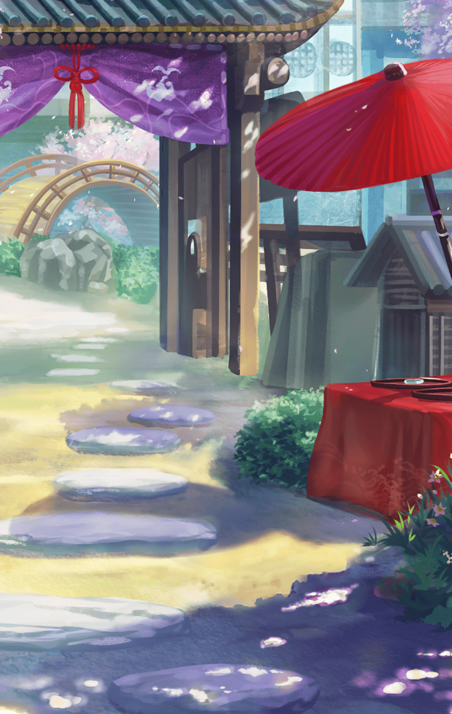

[View script in lisp](../scripts/202207030.txt)

**【ティルフィング】**
…………

選択肢:
- 驚いたね → [select_label_01](#select_label_01)へ
- 強引だった → [select_label_01](#select_label_01)へ

…………

#### select_label_01:

**【ティルフィング】**
はい
私も驚きました…

**【ティルフィング】**
ミーミルは、きっと、
気を遣ってくれたんです

**【ティルフィング】**
旅に出る前は、物事をそのまま
受け取ることしかできなかった
あの子が…

**【ティルフィング】**
他者の気持ちを推し量って
行動するなんて…
成長したんですね

**【ティルフィング】**
全てマスターのお陰です
ありがとうございます

選択肢:
- 何もしてないよ → [select_label_02](#select_label_02)へ
- ミーミル自身の力だよ → [select_label_02](#select_label_02)へ

全てマスターのお陰です
ありがとうございます

#### select_label_02:

**【ティルフィング】**
ふふっ
マスターは謙虚ですね

**【ティルフィング】**
…………あの

**【ティルフィング】**
こうしてお会いするのは、
久し振りですね、マスター

**【ティルフィング】**
それで、その…

選択肢:
- 浴衣、似合ってるよ → [select_label_03](#select_label_03)へ
- その髪型もいいね → [select_label_04](#select_label_04)へ

それで、その…

#### select_label_03:
 → [select_label_end](#select_label_end)へ

**【ティルフィング】**
ありがとうございますっ
実は気に入っていただけるか…
少し不安でした

#### select_label_04:
 → [select_label_end](#select_label_end)へ

**【ティルフィング】**
ありがとうございますっ
この髪飾りもこだわってみたんですよ

#### select_label_end:

選択肢:
- 少し歩こうか → [select_label_05](#select_label_05)へ

…………

#### select_label_05:

**【ティルフィング】**
はい、マスター

**【人々】**
ワイワイ…ガヤガヤ…

**【ティルフィング】**
まだ朝ですけれど、
思ったより人通りが多いですね

**【ティルフィング】**
皆さん、楽しそうです

**【ティルフィング】**
ふふっ
小さな子がお父さんに
肩車されていますよ

**【ティルフィング】**
あのお面は…もしかしてキル姫の
誰かを模しているのではっ？
マスター、どう思い――

**【通りすがりの見物客】**
おっと、ゴメンよ

**【ティルフィング】**
あっ…

選択肢:
- おっと → [select_label_06](#select_label_06)へ
- 大丈夫？ → [select_label_06](#select_label_06)へ

あっ…

#### select_label_06:

**【ティルフィング】**
すみません…
周りを良く見ていませんでした

**【ティルフィング】**
…………

**【ティルフィング】**
マスター
もう少し、腕をお借りしていても
いいですか？

選択肢:
- いいよ → [select_label_07](#select_label_07)へ
- 手を繋ぐ？ → [select_label_08](#select_label_08)へ

マスター
もう少し、腕をお借りしていても
いいですか？

#### select_label_07:
 → [select_label_end2](#select_label_end2)へ

**【ティルフィング】**
ありがとうございます
それでは、もう少しだけ…

#### select_label_08:
 → [select_label_end2](#select_label_end2)へ

**【ティルフィング】**
それはっ…
恥ずかしいです

#### select_label_end2:

**【ティルフィング】**
この辺りは木陰になっていて、
涼しいですね

**【ティルフィング】**
マスター
あちらの茶屋で少し休みませんか？

**【ティルフィング】**
ミーミル
アナタも一緒に

**【ミーミル】**
…………！

**【ティルフィング】**
あっ…
気を遣いすぎですね
それなら…

**【ティルフィング】**
このうちわを、こうですっ

**【ミーミル】**
ああっ
うちわがひらひらと…はたはたと…

**【ミーミル】**
ハッ！
マスター様とティルフィング様の
二人だけの時間を邪魔しては…

**【ミーミル】**
で、ですが…
揺らめくものに抗えません

**【ティルフィング】**
いいんですよ、ミーミル
アナタもこちらに

**【ミーミル】**
は、はい
では、失礼致します

**【ティルフィング】**
アナタも成長しているんですね
嬉しく思います

**【ミーミル】**
えっ？
なんと…恐縮です…

**【ティルフィング】**
ところで、マナナンはどちらに？

**【ミーミル】**
それが…
着替えを終えた途端、一人で
飛び出していってしまって…

**【ミーミル】**
探しに行かなければと思ったのですが
先にお二人に連絡しておこうと思い
私だけ戻ってまいりました

**【ティルフィング】**
そうですか…
大丈夫ですよ、ミーミル

**【ティルフィング】**
彼女が会場内にいることは
把握できています

**【ミーミル】**
なんと！
さすがでございますっ

**【ティルフィング】**
マナナンもしばらく自由にさせて
あげましょう

Next: [90004](90004.md)

[Back to index](index.md)
