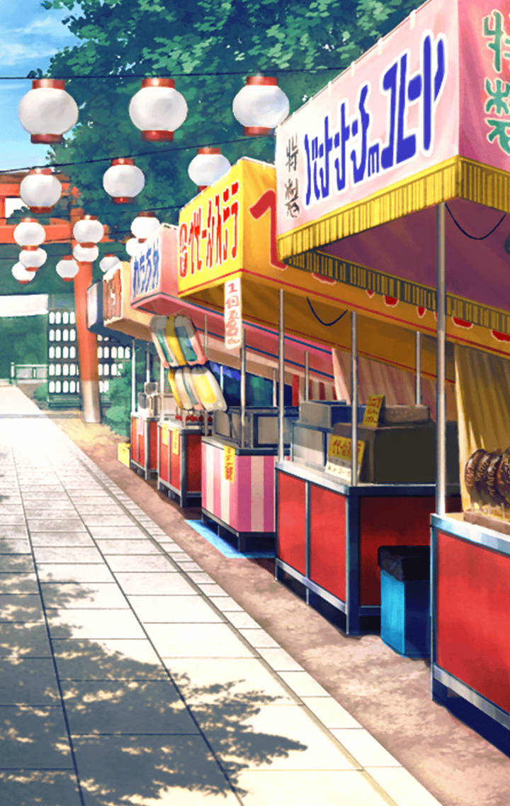

[View script in lisp](../scripts/202207120.txt)

**【ミーミル】**
チョコバナナ
シンプルな組み合わせですが、
奥深い味わいです

**【マナナン】**
アハハハ！
わたあめだって
雲みた～い♪

**【ミーミル】**
ベビーカステラは
優しい甘さですね

**【マナナン】**
んん～？
ラムネの瓶に入ってる玉は何なの？

**【ミーミル】**
ふぅ…
少し苦しくなってまいりました…

**【ミーミル】**
マスター様は如何ですか？

選択肢:
- お腹いっぱい → [select_label_01](#select_label_01)へ
- まだまだいける → [select_label_02](#select_label_02)へ

少し苦しくなってまいりました…
マスター様は如何ですか？

#### select_label_01:
 → [select_label_end](#select_label_end)へ

**【ミーミル】**
どうぞ、お休みになっていて下さい

#### select_label_02:
 → [select_label_end](#select_label_end)へ

**【ミーミル】**
ご無理はなさらないよう
お願い致します

#### select_label_end:

**【マナナン】**
あれ～？
二人とも、どうしたの？

**【マナナン】**
はい！
串カツとビッグウインナーと
ホットドッグ！

**【ミーミル】**
マナナンさん
元気ですね…

**【マナナン】**
アハハハ！
何だか今日は調子が良いんだ～

**【マナナン】**
まだまだ屋台はあるよ！
どんどん食べて「一番」を
見つけようよ！

**【ミーミル】**
は、はい…

**【ミーミル】**
何とか全ての屋台を周り終えました…

**【マナナン】**
美味しかったね～っ♪

**【マナナン】**
それで、何するんだったっけ？

**【ミーミル】**
一旦、牛提灯を…
あ、あそこに…

**【マナナン】**
牛の形した提灯だ
面白いね！

**【マナナン】**
近くにベンチもあるよ
二人とも座ったら？

**【ミーミル】**
マスター様、どうぞ
私も…お言葉に甘えて
座らせていただきます

**【ミーミル】**
ふぅ…
では、気を取り直して

**【ミーミル】**
今まで食べた中から、
「一番」を見つけます

**【ミーミル】**
マスター様
どれが一番美味しかったですか？

選択肢:
- 覚えてない… → [select_label_03](#select_label_03)へ
- 分からない… → [select_label_03](#select_label_03)へ
- お腹いっぱい… → [select_label_03](#select_label_03)へ

マスター様
どれが一番美味しかったですか？

#### select_label_03:

**【ミーミル】**
ああっ…
実は私もです…

**【ミーミル】**
食べ過ぎて、何が何だか
分からなくなってしまいました…

**【ミーミル】**
マナナンさんは
どれが「一番」でしたか？

**【マナナン】**
分かんない！

**【ミーミル】**
そうですか…
困りました…

**【マナナン】**
じゃ、ちょっと行ってくる！

**【ミーミル】**
マナナンさん、どちらへ！？

**【マナナン】**
もう一度、全部の屋台を
回ってくるよ！

**【ミーミル】**
ええっ？
マナナンさん、まだ
食べ足りないのですか…

**【ミーミル】**
ようやく落ち着いてきました
これなら少しくらいは
食べられそうです

**【ミーミル】**
マナナンさんと合流して…あっ

**【マナナン】**
うーん…

**【ミーミル】**
お帰りなさい、マナナンさん
…どうされました？

**【マナナン】**
何だか変だよ…

**【ミーミル】**
何があったのか、
お話しいただけませんか？

**【マナナン】**
あんまり美味しくないんだ…

**【ミーミル】**
えっ…？

**【マナナン】**
アハハハ！
さっき食べたたこ焼きだ～
中にたこが入ってるんだよね

**【マナナン】**
…………

**【マナナン】**
そうだ！
かき氷のシロップはどれが
美味しいのか比べないと

**【マナナン】**
…………

**【マナナン】**
ねぇねぇ
このチョコバナナ…

**【マナナン】**
…………

**【マナナン】**
うーん…
さっきと味が違う…

**【マナナン】**
さっき二人と一緒に食べたのと
同じもののはずなのに…
何で味が変わっちゃったんだろう？

**【ミーミル】**
それは…
別のお店のものだったのでは？

**【ミーミル】**
もしくは、気温の変化で味の感じ方が
変わったのかもしれません

**【マナナン】**
お店は同じだよ…
だって全部回ったから

**【マナナン】**
ねぇねぇ
変だよね？

Next: [90006](90006.md)

[Back to index](index.md)
