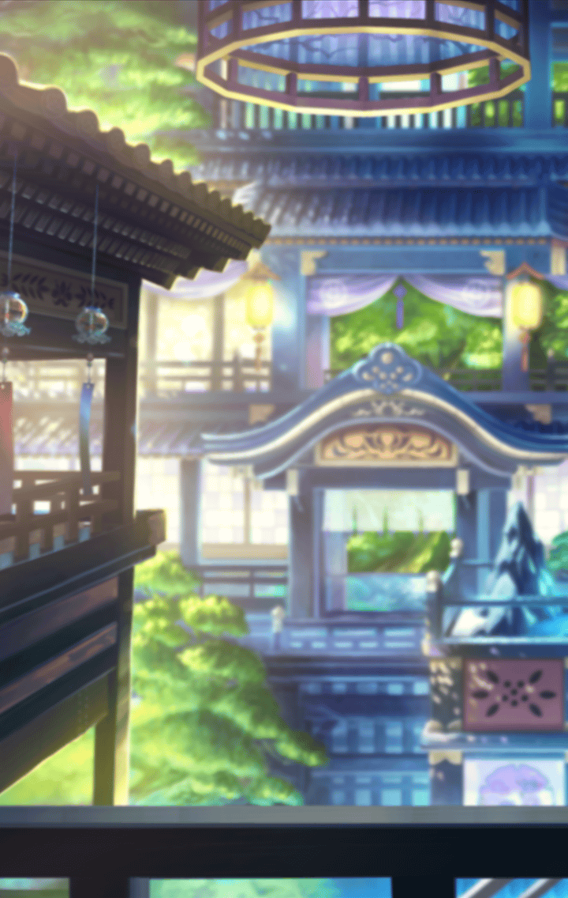

202208110 限定クエスト 夏祭りイベント アナタと巡り、見上げた大輪の花 -第２話 残光の庭、宵の青葉そして…- アナタと巡り、見上げた大輪の花 -第２話 残光の庭、宵の青葉そして…- 残光の庭、宵の青葉そして…-1 残光の庭、宵の青葉そして…-1 残光の庭、宵の青葉そして…-1

[View script in lisp](../scripts/202208110.txt)

【ミーミル】
「世界を見渡す庭」…
こちらで合っておりますでしょうか

【ミーミル】
高台にある神社
ここからなら、夏祭りの会場を
見渡すことが可能でございます

【ミーミル】
ですが、ティルフィング様の
お姿は…

【カシウス】
…………

【ミーミル】
あ！
あちらにいらっしゃるのは
カシウスさんです

【ミーミル】
少しお話しを伺ってまいります

【ミーミル】
カシウスさん、こんにちは
…いえ、こんばんはと言うべき
時間帯でしょうか？

【ミーミル】
私、ミーミルと申します
あちらにいらっしゃるマスター様の
専属補佐官でございます

【カシウス】
わたしはカシウス
そう…あなたがミーミルなのね

【ミーミル】
私のことをご存知なのですかっ？

【カシウス】
ええ
ティルフィングから言付けを
預かっているの

【カシウス】
「世界を見渡す庭から
最高の形を作りあげて」

【カシウス】
そう伝えるよう言われた

【カシウス】
大事なことだから、
もう一度伝えるね

【カシウス】
「世界を見渡す庭から
最高の形を作りあげて」

【カシウス】
ティルフィングからの言付けは
それだけよ

【ミーミル】
ありがとうございます
…最高の形とは、何でしょう？

選択肢:
- 格好良い形かな → [select_label_01](#select_label_01)へ
- 可愛い形かな → [select_label_02](#select_label_02)へ

最高の形とは、何でしょう？

#### select_label_01:
 → [select_label_end](#select_label_end)へ

【ミーミル】
なるほど…
格好良いのは魅力的です

#### select_label_02:
 → [select_label_end](#select_label_end)へ

【ミーミル】
なるほど…
可愛いと人目を惹きます

#### select_label_end:

【カシウス】
最高の形…
それはきっと、円環を現す

【ミーミル】
円環…輪ということでしょうか？

【カシウス】
輪…円…球体…
輪廻の理を現す完全なる形よ

【ミーミル】
なるほど…
勉強になります

【カシウス】
そう…

【ミーミル】
あの…不躾な質問になりますが、
カシウスさんはこちらで何を？

【カシウス】
わたしは…皆を見ているの

【カシウス】
穏やかな日常を過ごしている人々を

【ミーミル】
ここからなら、夏祭りの会場が
一望できますね

【カシウス】
そう…
だけど、気になってる…

【カシウス】
人々は本当に、穏やかな日常を
望んでいるの？

【ミーミル】
もちろんでございますっ
皆さん、とても楽しそうにして
いらっしゃいます

【カシウス】
楽しい…
それは、穏やかとは
異なる意味をもつ言葉

【カシウス】
人々が本当に望んでいるものは
別にあったの？

【カシウス】
わたしは思考を止めない
変わらない穏やかな日常の価値を
見定めなければ…

【ミーミル】
カシウスさん…

【カシウス】
わたしのことは気にしなくていい
あなた達は為すべきことを為して

選択肢:
- 少し一緒に歩こう → [select_label_03](#select_label_03)へ
- 別のところからも観察しよう → [select_label_03](#select_label_03)へ

あなた達は為すべきことを為して

#### select_label_03:

【カシウス】
…御館様がそう望むなら

【ミーミル】
それでは、輪っかや丸いものを
探してみましょう

【カシウス】
このリンゴ飴は丸いわ

【ミーミル】
リンゴ飴…
これが最高の形なのでしょうか？

【カシウス】
向こうに輪投げもあった

【ミーミル】
輪投げでございますか…

【カシウス】
ボールを投げる的当てもあった

【ミーミル】
なんと…
どれが正解なのでしょう…

Next: [202208111](202208111.md)

[Back to index](index.md)
