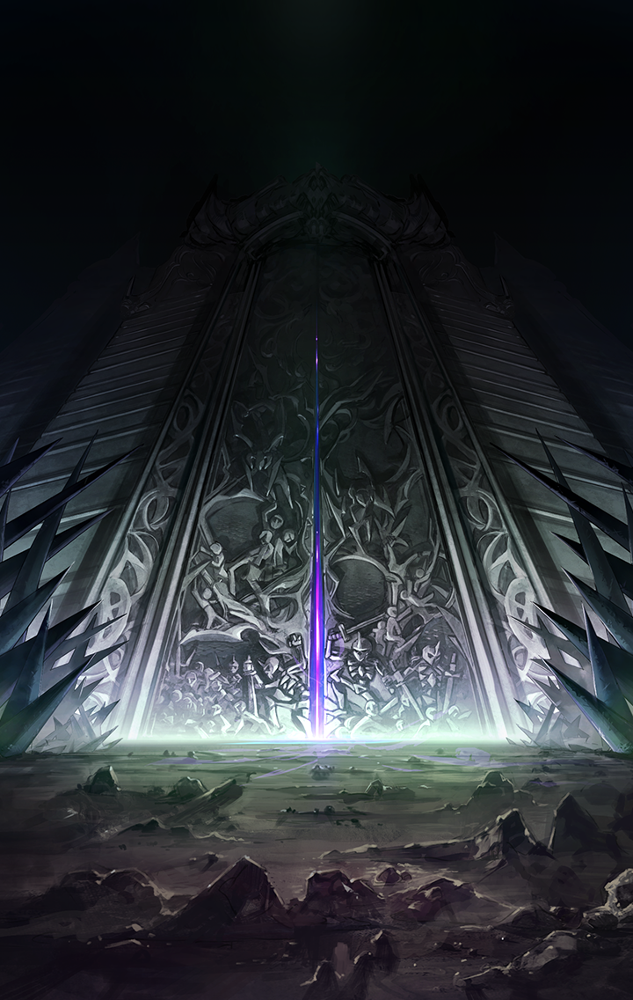

202209910

[View script in lisp](../scripts/202209910.txt)

【？？？】
希望？
そうね…

【？？？】
私はそれが何なのか、
理解できていなかったの…

【？？？】
皆さんがそう望むから、
希望になれるように行動して
みたけれど…

【？？？】
なりたいものが何なのか、
分かっていなかった私は何者にも
なれないまま…

【？？？】
皆さんの希望を砕いて、
絶望させてしまったのね…

【？？？】
希望って何なのかしら…？

【？？？】
私には、もう――

【パンドラ】
…………

【パンドラ】
うぅっ…
ここは…？

【パンドラ】
私…アスモデウスに負けて、
ベルゼブブに食べられて…

【パンドラ】
でも、吐き出されて…
そのまま野垂れ死ねって言われて…

【パンドラ】
ああ…私、死んだのね…
それじゃあ…ここは、あの世？

【パンドラ】
真っ暗だわ…
そう…皆さんの期待に応えられず、
希望になれなかった私は…

【パンドラ】
地獄に落ちるのが相応しいのね…

【パンドラ】
大きな門…
ここを潜れば良いのかしら？
そうすれば…

【ベルフェゴール】
あらぁ
見覚えのある娘が来たと思ったら
あなただったのねぇ

【パンドラ】
あなたは…
私に力をくれると言った人…
どうして、こんなところに？

【ベルフェゴール】
アハッ！
あなた、相変わらずねぇ

【ベルフェゴール】
そういえば、私の正体を話して
いなかったわぁ

【ベルフェゴール】
私はベルフェゴール
七魔王の一人、
“怠惰”のベルフェゴールよぉ

【パンドラ】
まぁっ
あなた、悪魔だったの…

【ベルフェゴール】
そうよぉ
木偶どもに負けちゃって、
このザマだけれどねぇ

【ベルフェゴール】
あなたも落ちてきたってことは、
誰かに殺されたのよねぇ？

【ベルフェゴール】
怠惰なのは好きだけどぉ
少し退屈してたのよぉ
何があったのか話してくれなぁい？

【パンドラ】
…いいわ
私も、これまでのことを整理して
みたいから

【パンドラ】
…それで、私はここに落ちてきたの

【ベルフェゴール】
アハハハハハハハ！
無様ねぇ
本当に無様！

【ベルフェゴール】
私がせっかく丹精込めて美しく
作り上げたのに、いいように
利用されて…

【ベルフェゴール】
あげく殺されて捨てられるなんて
本当に哀れな娘

【パンドラ】
私は…何を間違えたの…？

【ベルフェゴール】
ふふっ
あなたは何も間違えてないわぁ
これは当然の結果よぉ

【ベルフェゴール】
だって、あなたはちゃんと役割を
果たしたんだものぉ
「希望」の持つ最大の役割を

【パンドラ】
私、役割を果たせていたのっ？
…皆さんの希望を台無しにして
絶望させてしまったのに

【ベルフェゴール】
それでいいのよぉ
それが、あなたの役割だったんだから

【パンドラ】
えっ…？

【ベルフェゴール】
いい、パンドラ？
哀れで罪深い箱入り娘さん
希望っていうのはね…

【ベルフェゴール】
最悪の災厄なのよぉ！

【パンドラ】
希望が、災厄…？
よく分からないわ…

【ベルフェゴール】
簡単なことよぉ
人間が何かに立ち向かうとき、
何かに抗うとき…

【ベルフェゴール】
彼ら彼女らが抱いているのは何？
絶望かしら？諦めかしら？
違うわよねぇ

【ベルフェゴール】
希望よぉ
未来への希望を抱いているから、
人間は抗うのぉ

【ベルフェゴール】
無謀にもねぇ

【パンドラ】
無謀…

【ベルフェゴール】
ええ、そう
希望を抱いてる人間ってねぇ
物事が見えなくなってるのぉ

【ベルフェゴール】
だから、どんな無謀なことにも
挑戦できるしぃ、勝てない相手にも
挑めるのよねぇ

【ベルフェゴール】
そして、失敗して
踏みにじられて
世界を呪うのよぉ！

【ベルフェゴール】
アハハハハハハハ！
希望を抱いてしまって、
本当に可哀想

【ベルフェゴール】
なまじ希望を抱くから、人間は
いつまでも傷つき、苦しみ続けるのぉ

【ベルフェゴール】
分かったでしょぉ？
希望こそが、最悪の災厄なのよぉ

【ベルフェゴール】
あなたは、その役割をちゃぁんと
果たしたのぉ

【パンドラ】
私の…希望が…
皆さんを苦しめた…

【ベルフェゴール】
あなたを信じて悪魔に抗った人間は
どうなったかしらぁ？
みぃんな蹂躙されちゃったわよねぇ

【パンドラ】
私…私がっ…

【ベルフェゴール】
いいのよ、パンドラ
あなたはもう眠りなさい

【ベルフェゴール】
ここで怠惰に、永遠の眠りにつけば
いいのよぉ

【パンドラ】
私は…

Next: [202209920](202209920.md)

[Back to index](index.md)
