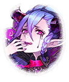

202209990

[View script in lisp](../scripts/202209990.txt)

【ミーミル】
…………

【ミーミル】
なるほど…
「希望について」
興味深い内容でした

【ミーミル】
希望は道標…
救い…
災厄…

【ミーミル】
希望には、各々によって
幾つもの解釈があるようです

【ミーミル】
私は…希望は「支え」
そのように感じました

【ミーミル】
希望があれば、完全に落ちて
しまうことなく、どこかで
踏みとどまれる

【ミーミル】
そんな心の支えになれるのが
希望ではないかと…

【ミーミル】
それにしても、
パンドラというキラープリンセスに
ついて全く存じ上げませんでした

【ミーミル】
このような方がいらっしゃったなんて
…その全てをもって世界に希望を
もたらした方

【ミーミル】
お会いして、お話ししてみたかった
です…

【ティルフィング】
ここにいたんですね、ミーミル
今日も記録を読んでいたんですか？

【ミーミル】
ティルフィング様！
はいっ
こちらの本を

【ティルフィング】
あら？
その本、読めたのですかっ？

【ミーミル】
はい
とても興味深い内容でした

【ティルフィング】
そんな…
今まで開くことすらできなかった本
なんですよ

【ミーミル】
なんと
私、普通に開いて読むことが
できました…

【ティルフィング】
ミーミル…
やはり、この子は何か特別な…

【ミーミル】
ティルフィング様？

【ティルフィング】
…いえ、何でもありません
それより、どのような内容だったのか
聞かせていただけますか？

【ミーミル】
はい！
私もお尋ねしたいことがございます

【ミーミル】
パンドラというキラープリンセスに
ついて…

【パンドラ】
…………

【パンドラ】
えっ…？
ここは…？
私、生きているの…？

【パンドラ】
どうして…？
私の存在そのものが世界に
解き放たれたはずなのに…

【パンドラ】
…そういえば、何だか以前とは
世界の雰囲気が違うような

【パンドラ】
そう…
これが転生というものね
完全に理解したわ

【？？？】
いや、分かってないでしょ

【パンドラ】
えっ？
今、誰かの声が…この箱からかしら？

【パンドラ】
箱…しかも鍵の掛かった箱…
開けたいわっ

【？？？】
うふふっ
相変わらずねぇ

【パンドラ】
また声がしたわっ
どうしよう…開けてはいけない
ような気がするのだけれど…

【？？？】
キャキャキャ！
我慢することないよっ

【パンドラ】
…そうよね
ちょうど鍵もここにあるようだから
これを使えば…開いたわ！

【ベルフェゴール】
あらあらぁ
本当に罪深い女ねぇ、パンドラ

【アスモデウス】
アハッ！
私達を世界に解き放つなんて

【ベルゼブブ】
キャキャッ！
ベル、お腹空いたな～

【パンドラ】
あなた達…！？
そんなっ…

【パンドラ】
ティルフィング達に倒されたのでは
なかったの？

【ベルフェゴール】
そうよぉ
あなたとも地獄で会ったでしょぉ
でもねぇ…

【アスモデウス】
私達は“七つの大罪”
人間達が背負い続ける“欲望”
そのものなのよ

【ベルゼブブ】
だから、ベル達は不滅なの
死んでも蘇るんだよ
キャキャキャキャキャ！

【パンドラ】
へぇ…
それなら、また人間を、
世界を支配しようとするの？

【パンドラ】
…でも、おかしいわね
今のあなた達からは
以前の邪悪さを感じないわ

【ベルゼブブ】
キャキャキャキャキャ！

【アスモデウス】
アハハハハハハハハ！

【ベルフェゴール】
ふふっ
あなたにも以前、言ったでしょ
私達、悪魔は…

【ベルフェゴール】
強者に従うのよぉ

【アスモデウス】
忌々しいけれど、人間は私達に
勝ったわ

【ベルゼブブ】
だから、この世界の支配権は
人間にあるの
それは認めてあげる！

【ベルゼブブ】
その代わり、ベル達もこの世界で
好きなように過ごすよ

【アスモデウス】
人間達の言う「愛」がどんなもの
なのか、今度はそっちを探求して
みるのも面白そうよね

【ベルフェゴール】
この世界の人間達はどんな「意思」で
生きていくのか、見届けさせて
もらおうかしらぁ

【悪魔達】
アハハハハハハハ！
キャキャキャキャキャ！

【パンドラ】
そう…
あなた達は自由なのね

【ベルフェゴール】
あらぁ
あなただって自由でしょ、
パンドラ

【パンドラ】
えっ…

【アスモデウス】
好きに生きればいいのよ
あなたの“欲望”のままにね

【アスモデウス】
ああ…
「意思」のままにって言って
あげた方が良かったかしら？

【ベルゼブブ】
キャキャッ！
今のパンドラは美味しそうだね

【ベルフェゴール】
じゃあねぇ、パンドラ
今度こそ、お別れよぉ

【アスモデウス】
その顔は、割と好みだったわ
ふふっ

【ベルゼブブ】
バイバイ、お姉ちゃん！

【パンドラ】
三人とも行ってしまいました…

【パンドラ】
自由に生きればいい…
そうね…

【パンドラ】
風が心地よいわ
空も澄み渡って高い

【パンドラ】
分からないことだらけだけれど、
まあ、どうにかなるでしょう

【パンドラ】
だって、
この世界は
こんなにも美しいんだから

Next: [202210010](202210010.md)

[Back to index](index.md)
