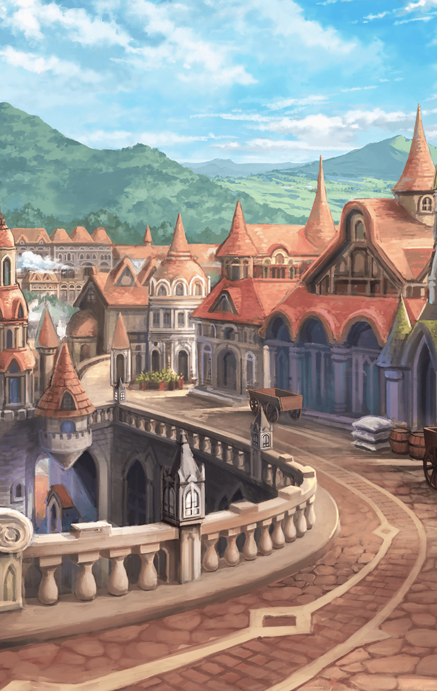
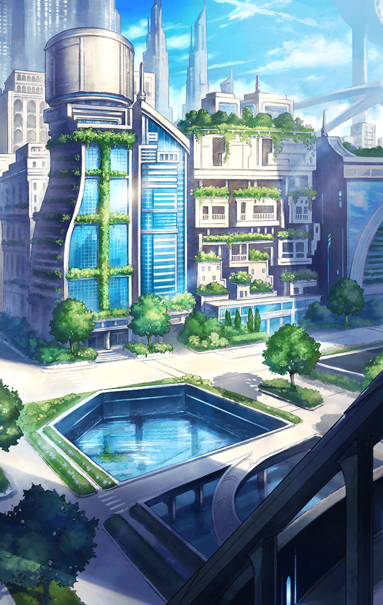

[View script in lisp](../scripts/202210600.txt)

**【ティルフィング】**
…………

ティルフィングは
四人の帰りを待っている

**【マナナン＆マクリル】**
わくわく、わくわく！

マナナンとマクリルは
幕が下りるのをわくわく待っている

**【マナナン】**
さぁ、行くよ、フィナーレだ！

**【マクリル】**
さぁ、戻るよ、現実に！

**【ティルフィング】**
ああ…おかえりなさい、皆さん！

「裏側」より帰還した四人は
旅立つ前と見違えるほどに
自信に満ち溢れていた

**【イチイバル】**
可能性に惹かれてた理由は
至極簡単なことだった訳だ

**【ヒョウハ】**
なんつーか、情けないっ！
でも仕方ない！

**【ミュルグレス】**
仕方ないとか自分に甘すぎない？

**【ヒョウハ】**
ミュルグレスだって
あたしのこと言えないだろー！

**【ミュルグレス】**
なんですって！

**【イチイバル】**
まぁまぁ、帰ってきて早々
きゃんきゃんにゃんにゃん吠えないで

**【ヒョウハ＆ミュルグレス】**
吠えてない！

**【ティファレト】**
「裏側」へ行かねば
きっと見て見ぬ振りをし続けた
自身の弱さが「揺らぎ」の原因でした

**【ティルフィング】**
…その弱さを抱くことは
決して悪いことではありません

**【ティファレト】**
…ふふ、見ていたんですものね
ティルフィングもいたずらさんですね

**【ティルフィング】**
そ、そんなつもりでは！？

**【ティファレト】**
ティルフィングの言う通りですね
弱さを抱くことは悪いことではない

**【ティルフィング】**
…はい、その弱さから目を逸らし
逃げ続けてしまうことが
悲劇を生むことになるのです

**【ティファレト】**
耳の痛い話ですが、
「揺らぎ」にならずともそれは
いずれ悲劇の芽となるものです…

**【ティルフィング】**
誰だって「ああだったらいいな」
と思ってしまうものですから…

**【ティルフィング】**
でも、こうして自分と向き合うことで
選んできた道も間違いではないと
気付いて欲しかったのです

ティルフィングの言葉に
自分にできることがあれば
これからも手伝うと口々に言う四人

**【マナナン】**
そろそろいいかな？

**【マクリル】**
お話し中だからダメかな？

**【ティルフィング】**
あ、ごめんなさい！
「穴」を閉じないと、ですよね！

**【ティルフィング】**
マナナン、マクリル
お願いします

**【マナナン】**
めでたしめでたし

**【マクリル】**
めでたしめでたし

**【マナナン＆マクリル】**
四つのお話が終わったよ
四つの可能性が潰えたよ

**【マナナン】**
それでもこれは大団円

**【マクリル】**
それでもこれはハッピーエンド

**【マナナン＆マクリル】**
さぁさぁ終わらせよう！
今の続きを始める為に終わらせよう！

マナナンとマクリルの手によって
「裏側」への「穴」は閉じられた

そしてこれは、カーテンコール

**【ティルフィング】**
皆さんが「裏側」で
「揺らぎ」の対処をしてから
しばらく経ちました

**【ティルフィング】**
皆さんはその後どうしているでしょう

**【フライクーゲル】**
ホワッツ！？
だって今日はケーキを食べるって
言ってたよね！？ 

**【ティファレト】**
気が変わったのです
もう、付き合ってくれても
いいじゃないですかフライクーゲル

**【フライクーゲル】**
エスコートする身にも
なってよね

**【ティファレト】**
ふふ、大丈夫
私はひとりでもちゃんと歩けます♪

**【フライクーゲル】**
それは困るよ
わたしが隣にいるならひとりではなく
ふたりになるんだからさ

**【ティファレト】**
…そうね、ふふ
ありがとう、フライクーゲル

**【イチイバル】**
やぁ、おかえり
久しぶりだね、ロジェ

**【ロジェスティラ】**
はい、ただいま戻りました
イチイバルさん！

ロジェスティラの旅先での話を
愛おしそうに聞くイチイバル

**【ロジェスティラ】**
――それでですね、えぇと

**【イチイバル】**
…ねぇ、ロジェ

**【ロジェスティラ】**
あ、すみません！
わたしばかり話しちゃって！

**【イチイバル】**
ああ、違うんだ
話を聞くのは楽しいからいいんだ

**【ロジェスティラ】**
…イチイバルさん？

**【イチイバル】**
ありがとう、ロジェ

**【ロジェスティラ】**
へっ！？

**【ロジェスティラ】**
あの、あの、それは
わたしのほうこそお礼を
たくさん言わないといけなくて――

**【イチイバル】**
それはたくさん貰ってるよ
だから、イチイバルさんも
もっと返さないとって思ってね

**【ロジェスティラ】**
返したら、どうなるんですか？

**【イチイバル】**
それは…雪だるま式に
大きなありがとうになっていくのさ

**【イチイバル】**
ボクはたくさん貰っていたから
まずはそれを返すところから、だけど

**【ロジェスティラ】**
イチイバルさん…

**【スイハ】**
…………

**【ヒョウハ】**
…いや、やっぱスイハは
何考えてんのかわかんねぇ！

**【ヒョウハ】**
一体どうしたら…

**【スイハ】**
…………あの、ヒョウハ

**【ヒョウハ】**
へあ！？
あ、お、おう、なんだ

**【スイハ】**
えっと…

**【ヒョウハ】**
待った、あんたが先に動いたけど
その次の一手はあたしに出させてくれ

**【スイハ】**
は、はい

**【ヒョウハ】**
あのー、だな…
今度、茶でもしねぇか？

**【スイハ】**
…………

**【ヒョウハ】**
いや、変な感じになってるけど
あたしらってあんまちゃんと
話してこなかったりしただろ？

**【スイハ】**
…私も、そうしたかったんです
スイハである私はヒョウハである
あなたと、話がしたかった

**【ヒョウハ】**
――そ、そうなのか！？

**【ヒョウハ】**
それなら早く言ってくれっていうか
早く言えばよかったっていうか…

**【ヒョウハ】**
じゃあ、次のオフにでも――

**【スイハ】**
あ、その日は集まりが…

**【ヒョウハ】**
えー…

**【ミュルグレス】**
さーて、オルフェのライブが
始まるまでまだ時間あるし
カステラでも食べに…ん？

ミュルグレスの目の前で
右往左往しているキル姫が

**【ミュルグレス】**
あははっ、これなら
カステラ食べに行かなくても
退屈しないでいいかも

**【ミュルグレス】**
むしろ、カステラも食べられるかな？

**【ナーゲルリング】**
あ、あの、そこのあなた
私はナーゲルリングと言います
ちょっと困っていまして…

**【ミュルグレス】**
いいわ、助けてあげる
その代わりに…

**【ナーゲルリング】**
う、何事も等価交換
差し出すものがなければ
得られないのですね…

**【ミュルグレス】**
ミュルは、ミュルグレスって言うの
ねぇ、ミュルと友達になってくれる？

**【ナーゲルリング】**
それはいいですけど…
どうして初対面の私に？

**【ミュルグレス】**
さぁ？
ミュルとアンタが似てるからかもね

**【ナーゲルリング】**
たしかに言われてみれば…
ふふ、なんだか
初めて会った気がしませんね、私達

**【ミュルグレス】**
…そうね

**【ミュルグレス】**
それで、
ナーゲルリングはどうするのかしら？

**【ナーゲルリング】**
お受けいたしましょう
ミュルグレス、よろしくね

**【ミュルグレス】**
ふふ、いいわ
それじゃあ困ってるお友達を
助けてあげなきゃね！

誰しもが自身を大切にし
今こうして目の前にいる誰かを想う

その結末に辿り着けたのは
それぞれがそれぞれを救えたから

**【ティルフィング】**
最後まで私は祈ることしか
できませんでしたね…

**【ティルフィング】**
けれど、それも私の役目のひとつ

で、あれば
もうひとつ祈ろう

**【ティルフィング】**
私の想いも込めて

**【ティルフィング】**
皆さんの可能性に、祝福を

Next: [202210610](202210610.md)

[Back to index](index.md)
