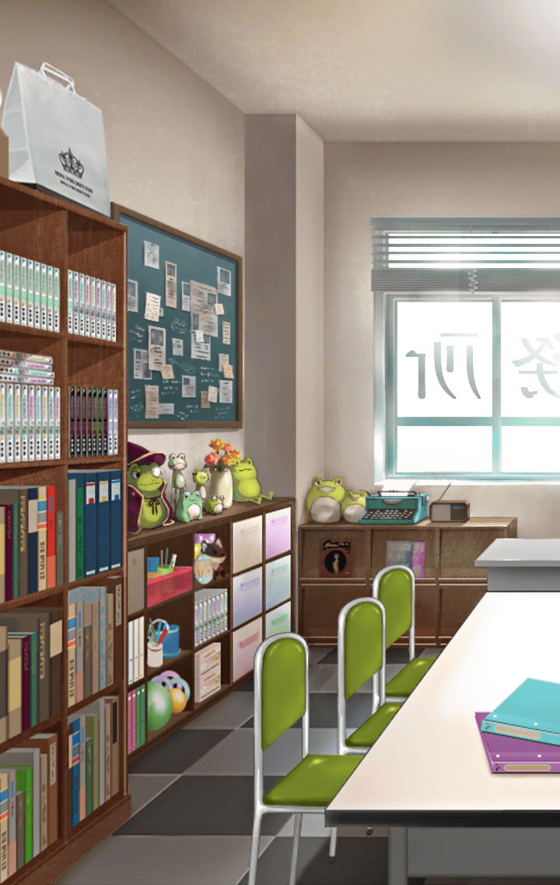

202210630 初心者クエスト 異聞不可分フォーハング 異聞不可分フォーハング 異聞不可分フォーハング　第1部 異聞不可分フォーハング-3 異聞不可分フォーハング 第1部-3 異聞不可分フォーハング 第1部-3

[View script in lisp](../scripts/202210630.txt)

【ティファレト】
この景色は…

【イチイバル】
「裏側」が見せる世界に
記録された可能性のひとつ、
だろうね

【ダモクレス？】
みんなを救う？
生きていたら苦しむのに？

【ダモクレス？】
本当の救いは、愛は
生の苦しみから
解放してあげることじゃない？

【ダモクレス？】
それが、愛でしょう？

【ダモクレス？】
もちろん、誰かにやらせたりしない
クレス様の手で殺して、愛して
すべてを救ってあげるの！

【ティファレト？】
…そんなもの

【ダモクレス？】
なぁに？

【ティファレト？】
そんなもの、愛ではありません！

【ダモクレス？】
ティファレトだって
自分が「こうだ」って思った
愛を与えているだけなんでしょう？

【ダモクレス？】
愛の形は違っても
やってることが変わらないなら
否定される謂れはないよね？

【ティファレト？】
そう、かもしれません…ですが！

【ティファレト？】
一方的に奪うことを愛とは言いません

【ダモクレス？】
一方的に与えるのも違わない？

舞台上で繰り広げられるは
いつかどこかで織られた物語
演じられなかった物語

エゴにまみれた他称聖女は戦う

自分の都合で愛を振りまく敵と
自分の都合で愛を振りまく聖女が戦う

愛の為に戦う姿は滑稽で
見るに堪えないもので

もうひとつの舞台にライトが灯る

【ヒョウハ？】
よっしゃぁぁぁ！
みんな円陣組もうぜ、円陣！

【ミュルグレス？】
何でミュルがそんなことしないと
いけないの？

【イチイバル？】
困った子達だね
ボクが面倒見てあげないと

【イチイバル】
…こっちがボクのほうか

【ティファレト】
コマンドキラーズの仲間達…
ふふ、ヒョウハもミュルグレスも
ああ見えて仲がよさそうですね

【イチイバル】
何を遠い目なんかしちゃって
キミにだって仲間がいただろう？

【ティファレト】
仲間…

【イチイバル】
ああ、ここでボクはキミと
近いところにいたからね
ちょっと見てしまったのさ

【イチイバル】
キミのいくつもの可能性は
いつだって誰かがそばにいてくれた

【ティファレト】
それは…私が与える存在だったから
与えられた者達がいてくれたから…

【イチイバル】
ふぅん…

【イチイバル】
それでも、ほらご覧よ
そこのボクよりはマシだろう？

舞台に視線を戻すと
そこにはイチイバルひとりが
スポットライトで照らされていた

【イチイバル？】
ボクの仲間達は中々酷な役目を
背負っている子達なんだ

【イチイバル？】
だから、ボクがやるしかない
そう思って、想って、いたのに

【イチイバル？】
みんなお人好しだからね
恨まれ役は空虚なボクに適任だろ？

楽しい道行を歩み出したのは
悲しい役者、孤独な独り芝居

【イチイバル】
仲間、仲間、友達、光…
そう言って求めた居場所は
オーディンが仕向けた関係性だってさ

【イチイバル？】
オーディンの欲さえなければ
こんなことにはならなかったのに

【イチイバル】
ああ…これは利用しやすい
オーディンめ、神令の性質を
とことん上手く使っている

【イチイバル】
さすがは貪欲に知識を求めた神だ
その貪欲さすら利用するなんて

【ティファレト】
これは…イチイバルの可能性ですよね

【イチイバル】
ん、ああ、そうかもしれないね
そして、少し前も同じ理由で
酷い目に遭ったりしたものさ

【ティファレト】
そう、ですか…
それでも、イチイバルは
本当に仲間を大切に想って…

【イチイバル】
それはコマンドキラーズだったから
それがボクの立ち位置だったから
オーディンの思惑通りだったから

悲劇的な役目が与えた仲間との
喜劇的でコミカルな物語

役にしがみつこうともがく独り芝居
その姿はとても滑稽で
見るに堪えないもので

【ティファレト】
あ…――

やがてどちらの舞台からも
役者は降りてしまう

幕が上がったままの舞台から
主役はいなくなってしまう

そうして、
次の舞台が始まってしまった

【イチイバル】
でも、残された舞台…
いや、「裏側」には強い思いが
残っていたからボク達が引き寄せた

【ティファレト】
それは一体…？

【ダモクレス？】
それは愛よ

明かりの消えた舞台の上から声がする

「裏側」の思い、想いが
ひとつの形となって声になる

【ダモクレス？】
クレス様のように
愛を振りまくことを望んだの

【ティファレト】
あなたの愛は
独善的なモノでしかなかった
それを私が求めると？

【ダモクレス？】
はぁ…
何度も同じ問答を
繰り返すつもりはないんだけど？

【ダモクレス？】
ティファレトだって
与えるだけの独善的な愛でしょう？

【？？？】
エゴイストだって言うんだ？

【ダモクレス？】
！？

【イチイバル】
ほら、言ったでしょ？
いつだってキミのそばには
彼女がいた

【イチイバル】
違うかい？

【ティファレト】
…ああ、そうなのですね
あなたは、ここでも
私を奮い立たせてくれる

【ティファレト】
そう、そうなのです
私の愛はただただ与え続ける
独善的な愛ではなかったのです

【ティファレト】
でも私の中のミカエルは
法の執行者ですから…

【ティファレト】
身を削り生命エネルギーを
他者に与える私が犠牲を不要とした
その代わりに枷をつけていた

【ダモクレス？】
そう、それが
今のミカエルを宿したあなたの本質

【ダモクレス？】
代償がない代わりに、
自分を強く律することで
天秤の釣り合いをとったんだね

【ティファレト】
私の本質？
ふふ、あなたの愛はそれを聞いても
私を愛してくれると信じています

【ティファレト】
失望しても…
それでも愛を説き続けたのは
あなたですから

【ティファレト？】
誰だって愛されたいじゃないですか

舞台を放棄したはずの役者が
舞台の上へ向けて声を放つ

【ダモクレス？】
愛、される…？

【ティファレト】
私は愛されたかった
だから、人を愛した

【ティファレト】
貪欲で卑しい、エゴイストなのです

【ダモクレス？】
でも、その想いを
ティファレトの中のミカエルが
許すはずがないじゃない

【ダモクレス？】
破ったらすべてを失うのよ？

【ティファレト】
すべてを失うことだって
もう怖くはありません

【ティファレト】
それに、失っても
補ってもらえると信じています

【ティファレト】
ですよね

気付きを得て
確信をもった眼差しで
確認のようにイチイバルを見る

【イチイバル】
…ああ、そうだ
ボクが言った言葉は取り消さない

【イチイバル】
キミのそばには仲間がいた
支え、愛してくれた仲間が

【ティファレト】
すべての人を救う為の誓いと
愛されたいという欲求は…
相反するものではありません！

【ティファレト】
でしょう？
自分が敷いた法を犯している
訳じゃありませんから

【ダモクレス？】
なっ！
そんなの詭弁よ！

【ティファレト】
愛されたいと望むから
愛の価値がわかる

【ティファレト】
愛したいと願うから
救える存在がいる

【ティファレト】
エゴイストでもいい
綺麗ごとでもいい

【ティファレト】
私は愛し、愛されたい

【？？？】
――ウェイクアップ、ティファレト

【ティファレト】
それが、
誰かと繋がるということですから！

【ダモクレス？】
く、うぅ、ああああ！

【ティファレト】
あなたの愛のおかげで
私は私の、原初の愛に気付けました

【ティファレト】
ありがとう、ダモクレス
そう、あなたは私さえも
愛してくれていたのですもの

【ティファレト】
私とは対極にあった愛ですが
あなたからの愛は、この身に…

それはかつての戦いの決着とは
違う形だったかもしれない

けれど、ティファレトは再度
ダモクレスの愛を否定…いや
その違う愛にすら愛されることで…

卑しいほど貪欲に
愛され愛すことを貫き通した

【ティファレト】
自分の最初の想いが
自らを律するという支配に
繋げられていたのでしょう…

【ティファレト】
それも、ミカエルの少々過ぎた
私を含めた世界への
愛が故なのでしょうか？ 

【イチイバル】
…茶目っ気まであって
親近感が湧く聖女様だね

【ティファレト】
キラン☆
…というものでしょうか？

【イチイバル】
おっと、これは一本取られたね

【ティファレト】
ということでひとつ
私らしく愛を説いてみようと思います

【イチイバル】
…そう来るのは
このイチイバルさんじゃなくても
予測できた流れだね

【イチイバル】
…キミの話の流れで
嫌でも気付かされたよ

【イチイバル】
ボクにも仲間がいたって
そう言いたいんだろう？

【ティファレト】
ええ、それは決して
誰かに…ましてや神なんかに
仕組まれた居場所ではなかったはず

【ティファレト】
「裏側」のマナの流れは
キル姫の感情に強く惹かれる…

【ティファレト】
そんな世界で
私達が同じ場所へ辿り着いた意味…

【イチイバル】
そんな、ボクは聖女なんかじゃない

【ティファレト】
私もですよ、イチイバル

【ティファレト】
「他者に何も望まなければ」
…なんて、最初から気付いていた
ようなものじゃありませんか

【イチイバル】
気付いたとて
それはオーディンの欲望だ

【イチイバル】
何もないボクには
対処のしようがなかったのさ

【ティファレト】
ふふ、それは知らなかっただけ
初めて出会った感情であっただけ

【ティファレト】
与えられた愛が、あったのでは？

【イチイバル】
憎まれていたかもしれないだろう？

【ティファレト】
そうやって心を閉ざすことで
愛を受け取らなかっただけでは？

【イチイバル】
はっ、エゴイスト宣言までした
聖女様は容赦がないね

【イチイバル】
心を閉ざしていた訳じゃない
ただ、執着が身を滅ぼすことを
ボクの中のキラーズが知っていたのさ

【ティファレト】
ふふふっ

【イチイバル】
な、何がおかしいのさ

【ティファレト】
ですから…
あなたは初めから気付いて、
けれど見て見ぬ振りをしていたのです

【？？？】
憧れだったんです

【イチイバル】
…ああ、この声は――

【イチイバル】
この感情、この想いは…

【ティファレト】
あなたの、あなただけのものです
受け入れていいのです、イチイバル

【イチイバル】
ボクに刻まれた逸話は
それを避けろと言っている

【イチイバル】
ボクを支配した神話は
それを求めろと言っている

【ティファレト】
それで、あなたの想いは
どう言っているのですか？

独り芝居はもう終わり

【イチイバル】
ボクにだって欲望はあるんだ

【イチイバル】
ボクだって愛されたい
キミと違って世界の人々になんて
大きなことは言わないけれど

【イチイバル】
それでも、あの日出会えた
キラキラと眩しい光に触れたい

【イチイバル】
この感情は、この欲望は
他の誰のものでもない
ボクだけのものだ

【イチイバル】
オーディンなんかに
奪わせてやるものか

スポットライトが広がり
舞台を、イチイバルを
温かな光が包んでいく

【イチイバル】
ああ…
ボクを照らしていてくれたのは
ロジェ、キミなんだね

そしてひとつ、またひとつと
明かりが増えていく

【イチイバル】
みんなも…

【ティファレト】
祝福、ですね

【イチイバル】
欲を出すと痛い目を見るのが
世の常ってやつなんだけど…

【イチイバル】
それがなんだって言うんだ
痛い目くらい見たっていいだろう？

【ティファレト】
転んだら痛いのは
当たり前のことですから

【イチイバル】
…それに、痛みがなければ
きっとあの光に触れてることも
感じられない

【イチイバル】
そんなの嫌だよ、ロジェ
ボクはあの光を手放したくない

【ティファレト】
たまにはそうやって
素直でいるのもいいじゃないですか

【イチイバル】
気味悪がられないかな…
貪欲なボクを見て失望されないかな

【ティファレト】
そんなことありませんよ

【ティファレト】
たとえそうなったとしても
私はあなたを愛しますから

【ティファレト】
ここで出会ったふたりきり
せっかくなら私も愛してほしいですし

【イチイバル】
…自分の欲に正直な聖女様は
なかなかどうして魅力的じゃないか

【イチイバル】
…ボクもそうなれたらいいな

【ティファレト】
はい、それは決して
オーディンに支配されたからでなく
あなたの本当の欲望

【イチイバル】
ああでも、こう思えるのは
オーディンのおかげでもあるよ

【イチイバル】
ボクの正直な気持ちで
オーディンの欲望すら飲み込んで
全部ボクの糧にしてやるのさ

【ティファレト】
ふふ、あなたの欲深さは
私にだって計れないほどですよ？

見て見ぬ振りをしてきた自分への
大きな大きな愛を感じるイチイバル

【イチイバル】
ロジェ達、それに目の前の聖女様
個々に貰った愛はいずれなんとか
返していくとして…

【イチイバル】
世界に愛を返してやらないとね

世界に、神に愛と称して
与えられた主に投げ返してやる

イチイバルはもう、揺らがない

【ティファレト】
私も世界へ与えた愛の
見返りをたっぷりいただきませんと

【ティファレト】
今まで与えた分、
しっかりと私を
愛していただきます

オーディンすら嫉妬するほどの
欲深き聖女は宣言する

ティファレトはもう、揺らがない

【マナナン＆マクリル】
幕を閉じよう終わらせよう
ふたりが辿り着いた物語との決別
それは幸か不幸か後悔か

【マナナン】
それは答えのないハッピーエンド？

【マクリル】
答えは出てもメリーバッドエンド？

【マナナン＆マクリル】
さぁさぁ始めよう
物語の続きはあなたの胸に

【マナナン＆マクリル】
それではまた次の舞台で
お会いしましょうごきげんよう

Next: [202210640](202210640.md)

[Back to index](index.md)
