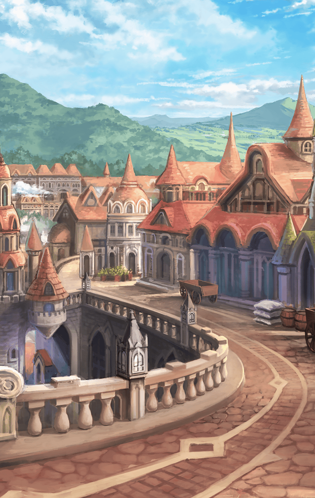

202210650 初心者クエスト 異聞不可分フォーハング 異聞不可分フォーハング 異聞不可分フォーハング　第2部 異聞不可分フォーハング-2 異聞不可分フォーハング 第2部-2 異聞不可分フォーハング 第2部-2

[View script in lisp](../scripts/202210650.txt)

【ヒョウハ】
えーっと、えーっと
こういう時は整理するんだよな

【ヒョウハ】
とりあえずあのスイハはスイハだ
でも、スイハじゃない

【ヒョウハ】
まあ、なんで「裏側」にスイハが…
ってとこからなんだけど

【ヒョウハ】
ティルフィングがスイハも
「揺らぎ」の影響を受けたって
言ってたし、その時の残滓か…？

【ヒョウハ】
…って訳でもなさそうだよな

要はスイハであるのは確かだが
表にいるスイハ本人ではない

【ヒョウハ】
なんでそういうのがわかるか…
って、ああもう頭こんがらがってきた

【ヒョウハ】
だから考えるのはあたしの
役割じゃないんだって

【ヒョウハ】
そんなあたしと違って
スイハはいつも何か考えてたな…

何考えてるかわからない
それは当たり前のことだけれど

【ヒョウハ】
「裏側」っつーか「揺らぎ」のこと
先にいろいろ気付いていたのも
いつだってスイハだったな…

【ヒョウハ】
おわっ！？

【スイハ】
…………

【ヒョウハ】
おい、スイハ
来週の勤務シフトだけどな

【スイハ】
…………

【ヒョウハ】
おい！
聞いてんのかっ？

【スイハ】
…すみません
何か用ですか、ヒョウハ？

【ヒョウハ】
…ったく、お前なぁ

【ヒョウハ】
これが「裏側」が見せる
そうであったかもしれない
そうではなかった記憶ってのか

【ヒョウハ】
ああ、そうか
この時にはもう「裏側」のこと
スイハは気付いてたんだな…

【ヒョウハ】
…たしかに、ここであたしが
スイハの変化に気付けてたなら
何かが違ったかもしれない、か

【スイハ】
…………

【ヒョウハ】
…そ、そういや
こないださぁ

【スイハ】
…えっ？
何か言いましたか？

【ヒョウハ】
くっ…な、何でもないよ！

【ヒョウハ】
そんなところまで
見せてくれなくていいんだっての！

【ヒョウハ】
スイハがあたしのことを
眼中にないのはよくわかってるよ！

【ヒョウハ】
同じ職場で一緒に働いてたって
なんとも思ってなかったんだよ

【ヒョウハ】
万が一、あたしのこと考えてても
スイハの表情なんも変わんないし
気付けないだろうけどさ…

【ヒョウハ】
だあああ！
近しい存在だーって言われても
あたしにはなんもわかんないの！

【ヒョウハ】
だって、スイハとあたしは
絶対的に違うんだから…

【ヒョウハ】
…………

【ヒョウハ】
だから！もう！
うだうだ考えるのは
性に合わないんだってば！

【ヒョウハ】
――って、だめだ！
ここでわーってなったら
いつも通りだもんな

【ヒョウハ】
それに…あたしだって
スイハのこと理解できたら…

【ヒョウハ】
あれ、でも「裏側」って
そうはならなかった可能性を
見ることになる場所じゃなかった？

【ヒョウハ】
さっきのって…

【ヒョウハ】
あれ、どこ行くんだよ！？

それからどれほどの
時間が経っただろうか

【ヒョウハ】
どこまで行く気なんだよ…
いやむしろ行き先なんてあるのかここ

あてどなく進むのは
すべてがあってすべてがない
「裏側」だからこそなのか

それとも、彼女が見るべき
可能性がないから？
それともありすぎるからなのだろうか

【ヒョウハ】
あっ――

【スイハ】
哀れな…バイブスの犬
私は犬は嫌いです

【ヒョウハ】
な、あたしは犬じゃない！

【ヒョウハ】
って、あれ？
いつも通り反応しちゃったけど
スイハじゃんか

【ヒョウハ】
…これも「裏側」が
見せるどこかの世界の記憶？

【スイハ】
ようやく“神令”が
行き渡ったようですね
それでは命じましょう

【スイハ】
総力を挙げ、苦しみの元凶である
バイブス所持者を
この世界から消し去りなさい

【ヒョウハ】
神令されたあいつの戦い、か

【ヒョウハ】
はは、なんでもかんでも
自分ひとりでやろうなんて
この世界でもそうだったんだ

【？？？】
何をするって、決まってんだろ
バイブスもキラーズも、
在るべき場所に還すんだよ！

【ヒョウハ】
あれ、今のは…？

【ヒョウハ】
また見えるものが変わった…

【？？？】
何故、バイブスを…共鳴をそんなに
忌避するの…？
あなた達は…どこから来たの…？

【スイハ】
…壊れてしまった世界から

後悔

可能性、記録、記憶、過去
様々な呼び名のある
それが見せたのは、後悔という想い

無理に孤独を背負おうとしてまで
戦うスイハが抱える後悔とは何か

「裏側」はすべてを語らない
だが、その可能性を与えてしまう

【ヒョウハ】
なんだ、この気持ちは…
なんであたしがこんな気持ちに…

【ヒョウハ】
これはスイハのモノだろ？
どうしてあたしに見せるんだよ！

ヒョウハは与えられた感情を
どうすることもできず、ただ、叫ぶ

【ヒョウハ】
スイハの「揺らぎ」の原因も
後悔だったって聞いたけどさ

【ヒョウハ】
それはあたしのものじゃない

「裏側」がそれを見せるのは
ヒョウハとスイハのキラーズに
刻まれた想いが故なのか…

【ヒョウハ】
あぁ…また、違うのが――

【ヒョウハ】
この景色は…

それは今まで見せられたモノと違う
ヒョウハの可能性の物語

何故そう感じたのか
それは彼女が忘れられても
彼女の記録が忘れないからだろう

【？？？】
確かエンシェントキラーズの…
ほら、弓を使うっ
ええと…

【ヒョウハ】
そうだ、これは呪いを受けた
あたしの記憶、物語…

【ヒョウハ】
あたしは今まで、ずっと
自分とあいつを比べてたんだ

かつて口にしたであろう言葉を
今の想いも乗せて口にするヒョウハ

その上で、自身の覚悟も思い出す

【ヒョウハ】
何もしないで世界が滅びるのを
ただ眺めてるだけなんて、
やっぱりあたしにはできないや

【ヒョウハ】
あたしはあたしにできることを
全力でする、そのうえで
自分の評価は自分で決めるよ

その思いに嘘はない
その記憶に嘘はない

【ヒョウハ】
エンシェントキラーズだって
呼ばれていろいろやってたあいつ

【ヒョウハ】
神令されて戦ったあいつ

その記録に嘘はない

しかし、知ってしまったら――

知った上で出会ったなら？

【ヒョウハ】
そうだ
あたし達は出会ったんだ…

ヒョウハは「揺れる」

【ヒョウハ】
何で剣なんか持ってんだよ！？
あたし達は「矢」だろうが！
ふざけるな！

【スイハ】
ふざけてはいません
これは皆さんと供にあるため
私が選んだ新たな姿です

【スイハ】
その力、ここで示してみせましょう

【ヒョウハ】
そうかよ…
こんな形で会うことになるとは
予想してなかったけど…

【ヒョウハ】
やったぜ！
ついに白黒つけられる！

【ヒョウハ】
知らなかったあたしは
自分の使命だけを知った気になって
あいつのことなんて考えないで…

「考えなしに」
それは神令された軍神の影響？

【ヒョウハ】
姿を変えてまで戦ったスイハの覚悟
神令してまで戦ったあたしの覚悟

【ヒョウハ】
全部知ったら、知ったらさぁ…！

スイハという相手の感情
ヒョウハという自分の感情

そのすべてを永い時をかけて知った
そのすべてを一瞬にして思い知った

ヒョウハは揺らぐ

【ヒョウハ】
これじゃダメだ…
そんなのわかってる…

【ヒョウハ】
あたしはどうしたらいいんだ…

スイハとの関係は因縁めいたもの
気になるものは気になるから仕方ない

抱いた感情の発散方法も
知らないのだから、仕方ない

【？？？】
白黒、つけますか？

【ヒョウハ？】
ああ、上等だよ

かつてあったかもしれない会話劇
なかったことにされたような物語

舞台の上に立つのは…

さて、何人？

Next: [202210660](202210660.md)

[Back to index](index.md)
