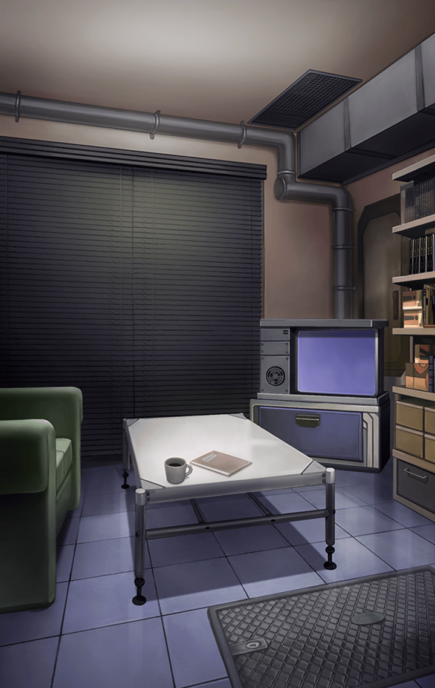

[View script in lisp](../scripts/202212113.txt)

**【アロンダイト】**
私に刻まれたキラーズが持つ伝承は…

**【アロンダイト】**
自らの罪によって
聖杯を得るに至らなかった
という記憶…

**【アロンダイト】**
かの王の剣で在った彼女に
そのことを指摘された私はまた
感情の渦に飲み込まれてしまいそうで

**【アロンダイト】**
夢…

自身の罪を改めて
突き詰められたような最悪の目覚め

**【アロンダイト】**
…と、そうではなくて
私はたしか森の中で――

**【？？？】**
よかった！
目が覚めたんですね！

**【シタ】**
おはようございます！

アロンダイトに声を掛けたのは
キル姫、シタだった
