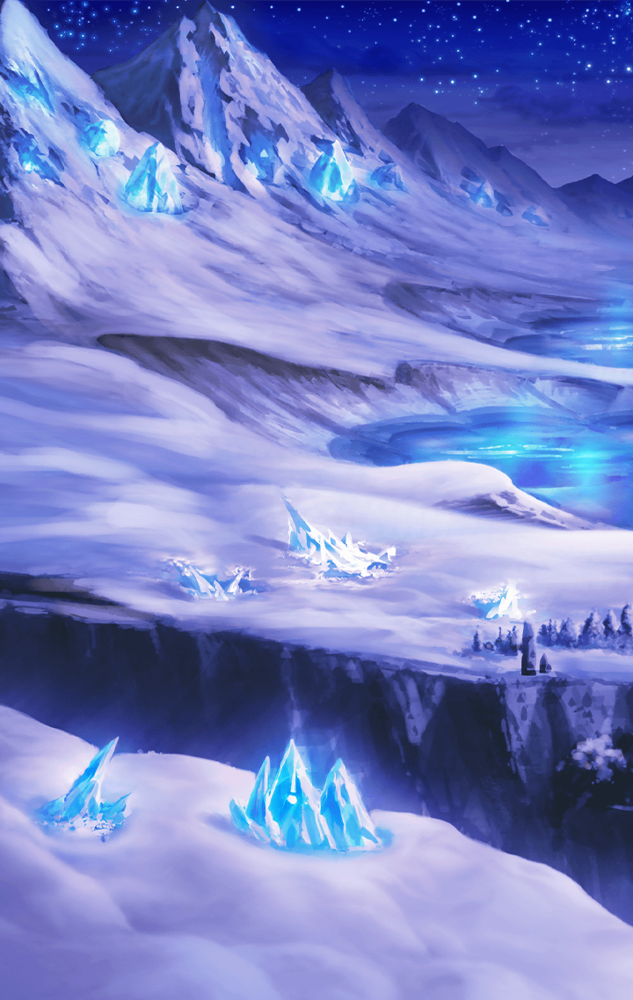

**【アロンダイト】**
はぁ、はぁっ、はぁ、くっ、うぅ…

**【シタ】**
…………

シタの急襲に困惑しながらも
いなし続けたアロンダイトだったが
次第に追い詰められていく

**【アロンダイト】**
理由はわかりませんが
シタは一切手を抜いていない
本気で私を…

**【シタ】**
えい！

**【アロンダイト】**
くっ！

**【アロンダイト】**
これ以上は、まずい…

**【シタ】**
…わかりませんか？

**【アロンダイト】**
わ、わかる訳ないでしょう！
突然あなたが私を狙うなんて…

**【シタ】**
最初に出会った
…いえ、あなたを
見つけた時もそうでした

**【シタ】**
素人が雪山に入っていくなんて
いくらキル姫であろうと自殺行為です

**【アロンダイト】**
…？

**【シタ】**
アロンダイトさんは
自覚がないようですけれど
ただ自虐をして満足してるだけです

**【アロンダイト】**
何を――

**【シタ】**
自分は苦痛を受け入れるべきだ
と思っているのではありませんか？

**【アロンダイト】**
…どう言われようと
私が暴走してからでは遅いのです！

**【アロンダイト】**
だから、私は
独りでいようとしているだけです

**【シタ】**
それが間違いだとしても、ですか？

**【アロンダイト】**
最善最良ではないかもしれません
ですが、私に与えられた選択肢は
孤独しかないのです！

**【シタ】**
わたし、怒りました
もう許しません！

**【アロンダイト】**
だから、何を…っ！

シタとアロンダイト
双方の考えが違うことはわかる

だが、アロンダイトにとって
シタが何に怒り、何を許さないのか
皆目見当がつかない

**【シタ】**
あなたは自分自身の怒りを遠ざけ
罰を与えることからも逃げるんですね

**【アロンダイト】**
罰…
逃げてなんていません！

**【シタ】**
いいえ、逃げています
受け入れているフリはしてますけど

**【アロンダイト】**
…っ！

**【シタ】**
なら、わたしが代わりに
あなたに罰を与えます

どうしてこうなってしまったのか
アロンダイトにはやはり理解できない

怒りを避けることの何が悪いのか？
罰を与えることから逃げているとは？

アロンダイトに襲い掛かる
困惑はシタの攻撃をいなす
剣を鈍らせていく

**【アロンダイト】**
っ！

アロンダイトは追い込まれ
いつしか崖を背にしていた

**【シタ】**
はぁっ！

**【アロンダイト】**
ぐっ！

**【アロンダイト】**
怪我は…大したことはありません
雪がクッションになったんですね

アロンダイトの身体には
無数の擦り傷ができたが
どれも致命傷足りえない

だが…

**【アロンダイト】**
動けない…

精神が不安定な状態で
戦ったことも影響しているのか
アロンダイトは酷く消耗していた

**【アロンダイト】**
シタ…

**【シタ】**
…………

そんなアロンダイトを追って
シタが現れる

**【アロンダイト】**
…ふ、ふふ
あなたに殺されるのなら
それも悪くはありませんね

**【シタ】**
またそうやって逃げるんですか

**【アロンダイト】**
…………

**【アロンダイト】**
…逃げることの、何が悪いんですか

**【シタ】**
怒りはとても怖い感情です
恐れ、忌避するのも当然です

**【シタ】**
アロンダイトさんの場合は
暴走の引き金になるかもしれない
とすればなおさら恐ろしいでしょう

**【アロンダイト】**
…………う、うぅ

アロンダイトの内では
どう表現するのが適切かわからない
感情が渦巻いていた

**【シタ】**
でも、です

**【シタ】**
それでも人は、キル姫は
誰だって感情と共に生きているんです

**【シタ】**
その現実からは、逃げられないんです

**【アロンダイト】**
なら、どうすればいいんですか…っ！

アロンダイトの悲痛な叫びが
荒れる雪山にこだまする

**【シタ】**
恐い恐い感情を抱えて
生きるしかないんです

**【シタ】**
逃げても、苦しい思いが続くだけです

**【アロンダイト】**
逃げても逃げなくても同じなら
私は誰かを傷付けない方を――

**【シタ】**
そう言って逃げて逃げて
ずっと孤独でいればいいと？

**【アロンダイト】**
そうです
私はいままでもそうやって…

**【シタ】**
そう言う癖に、恩義に厚いなんて
おばかだって、思わないんですか

**【アロンダイト】**
…………

**【シタ】**
優しいアロンダイトさんが
孤独でいられるなんて信じていません

**【アロンダイト】**
シタ…

**【シタ】**
う、うぅ
アロンダイトさんのばかぁ

シタは泣いていた
つい先ほどまで斧を向けていた
相手の為に、泣いていた

**【シタ】**
自分に対しても誰かに対しても
怒ったっていいんです
叱ってもいいんです

**【シタ】**
罰だって…適切でほどほどなら
きっと大丈夫なんです、たぶん

**【シタ】**
その上で、赦せばいいんですから

**【アロンダイト】**
！

**【シタ】**
あなたは怒りから目を逸らし
赦す機会すら失おうとしている
ただのおおばか者です！

涙ながらに語るシタの言葉に
ショックを受けるアロンダイト

**【アロンダイト】**
おおばか者、ですか

**【シタ】**
それでも、アロンダイトさんが
逃げることを、孤独でいることを
選ぶと言うのであれば…

**【シタ】**
わたしとアロンダイトさんの間に
紡がれた絆を自分勝手で
壊そうと言うのなら…もう知りません

**【アロンダイト】**
きず、な…

**【シタ】**
わたしは手を下しません
最後は逃げず
潔くひとりで死ぬべきです

大粒の涙を流しながら去って行くシタ

アロンダイトはその後ろ姿を
ただ見送ることしかできない

**【アロンダイト】**
…………

**【アロンダイト？】**
「どうすればいいのか」
助けを求めても振られましたね

**【アロンダイト？】**
やっとの思いで絞り出した声じゃ
誰にも届かないんですよ

ひとりになった途端
幻影がうるさく宣う

**【アロンダイト】**
私は、独りだ…

そうあるべきと望んだのに
どうしてこうも胸が痛むのか

**【アロンダイト】**
この気持ち、感情は…
ああ、そうですね

その感情は怒りだ

遠ざけ続けたが故に
この、視界が赤く染まるような
強い怒りは久しぶりの感覚だ

**【アロンダイト】**
暴走したとしても
こんな崖の下でうずくまって
動けない私なら問題はないでしょう

**【アロンダイト】**
は、ははは…

**【アロンダイト】**
ん…

いつしか意識を失っていた
アロンダイトだったが
遠くから感じる地響きに目を覚ます

崖の上、そのさらに遠くから感じる
横たわっていたから気付けた地響き

**【アロンダイト】**
…雪崩

日が暮れ、強くなった雪は
積雪の許容量を超え雪崩を
引き起こしたようだった

**【アロンダイト】**
どんどん、揺れが強くなって…

**【アロンダイト】**
っ！

**【アロンダイト？】**
よかったですね
この規模なら、
麓の村は飲み込まれるでしょうね

**【アロンダイト？】**
自ら手を下さずに
望み通り綺麗さっぱり
すべて断ち切ることができますよ

**【アロンダイト】**
それは…

それは雪崩によって麓の村が
崩壊することを良しとするということ

自らと共に
終わることを良しとするということ

**【アロンダイト】**
そう、ですね

すべて無くなるなら孤独でいられる
それなら、たしかに良いかもしれない

ゆっくりと目を閉じたアロンダイト

その瞼の裏に浮かぶのは――

**【シタ】**
おおばか者です！

ハッと、目を開けるアロンダイト

**【アロンダイト】**
シタ…

**【アロンダイト】**
く、うぅ…

満身創痍の身体に鞭を打ち
アロンダイトは立ち上がる

**【アロンダイト】**
行か、ないと…

彼女の涙、そして怒りから
目を背けてはいけない気がした

忠義の騎士は、立ち上がった
