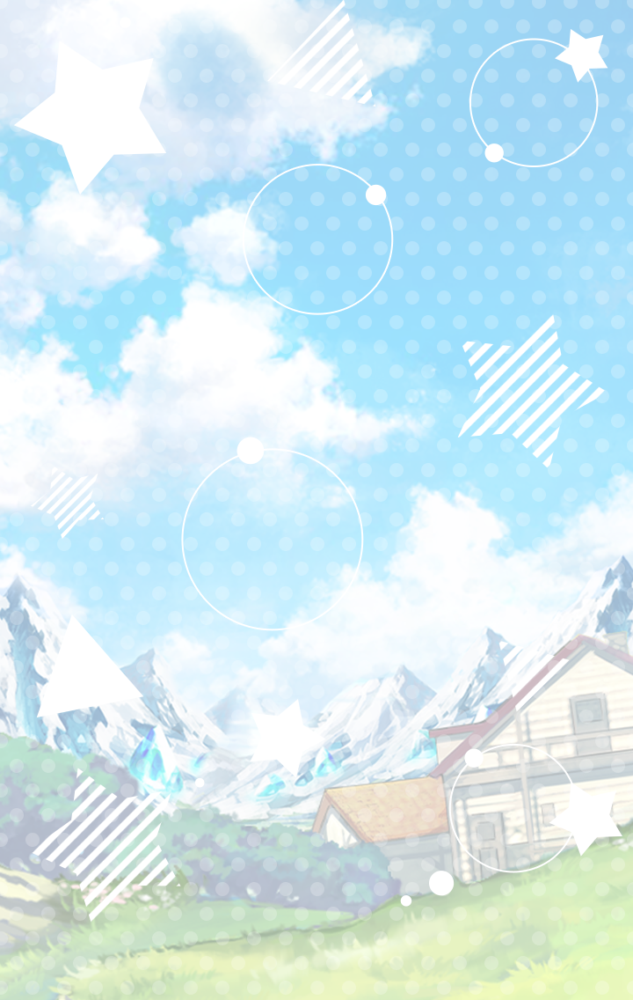

[View script in lisp](../scripts/202250011.txt)

**【アズサ】**
ハルカラ～！
聞こえてたら返事して～！

**【ライカ】**
ハルカラさ～ん！
みなさん心配していますよ～！

**【アズサ】**
ライカ、そっちはどうだった？

**【ライカ】**
すみません、アズサ様…
ダメです、全然見当たりません…

**【アズサ】**
参ったなぁ～…
一体どこ行っちゃったんだろう？

**【アズサ】**
まさか…家出とか？

**【ライカ】**
そ、そんなことありません！
ハルカラさんに限って…

**【アズサ】**
そうだよねえ…

夕暮れ時、
高原近くの森にて――

高原に家を構える『高原の魔女』
アズサと、その弟子であるライカは
頭を悩ませていた

それは同じく居を共にする
エルフのハルカラのこと

**【アズサ】**
朝、「キノコを採ってきます」って
置き手紙を残して、
それっきりだから…

**【ライカ】**
恐らく森で迷っているだけ…
であれば良いのですが

行方不明となったハルカラを探し
アズサとライカは彼女が入ったと
思しき森を捜索していた

**【アズサ】**
丸一日だもんね…
さすがに心配だよ…

**【アズサ】**
そろそろ暗くなって来ちゃったし…
モンスターに襲われたりしてたら…

**【ライカ】**
…あっ！　アズサ様！
あれを見て下さい！

**【アズサ】**
あれって…ハルカラがいつも
キノコ採りで使ってるカゴ？

**【ライカ】**
しかも周りに
キノコが散らばっています！
点々と…

ライカが指し示す方向には、
ハルカラが落としていったキノコが
道しるべのように点々と連なっていた

**【アズサ】**
こっ、これは…
なんて古典的な…

**【ライカ】**
これをたどってみましょう！

**【ライカ】**
もしかするとハルカラさんの
元に行けるかもしれません！

**【アズサ】**
そうだね…
ほかに手がかりもないし
追ってみようか

落ちたキノコを追って
歩いて行くアズサとライカ

既に日は傾き、暗くなった森は
徐々に視界も悪くなっていくが、
二人は歩き続けた

そして、森の奥地に到達した時
二人の眼前に『それ』は現れた

**【アズサ】**
な…なにこれ…？

空中に浮かぶ奇妙な穴…
しかもそれは、渦巻きのように
怪しく回転している

**【ライカ】**
これは魔法…でしょうか？

アズサは慎重に前に出て、
穴の正体を自身の魔法で観察する

**【アズサ】**
う～ん…魔力は感じないけど…
何か別の空間に繋がっているような…
私も上手くは言えないんだけど

**【ライカ】**
アズサ様でもわからないとは…！
一体何者がこんなことを…！

**【アズサ】**
人為的なものとは限らないけど
ただこんな自然現象、
聞いたこともないけどね

**【ライカ】**
もしかすると、ハルカラさんは
これに呑み込まれたのでしょうか？

**【アズサ】**
それは…ありそう
前の日飲み過ぎてたし、
二日酔いでうっかり…とか

**【ライカ】**
そうですよ！
きっと、フラフラして
うっかりと…

**【ライカ】**
これはしっかり調査しなければ…！

意を決したライカは
穴へと近付いていく

**【アズサ】**
あ、不用意に近づくと危ないよ
ここは私が…

**【ライカ】**
いえっ！　ここは我が！
アズサ様に危険なことを
させるわけには…

そう言って、
ライカが手を伸ばした瞬間

彼女の手は
竜巻に飲み込まれるように、
穴へと吸い込まれて行ってしまう

**【ライカ】**
ひゃっ！？　ひゃあああっ！？
あ、アズサ様！　す、吸われてます！

**【アズサ】**
わ、わあああ！　ライカ！？
ストップ！　ストーップ！

**【ライカ】**
だ、ダメですアズサ様！
ドンドン呑み込まれて…！

必死に穴から手を抜こうとする
ライカだったが、抜けるどころか
更に呑み込まれて行く

あっと言う間に、ライカの腕全体が
穴へと吸い込まれてしまっていた

**【アズサ】**
ライカ！！

**【ライカ】**
あ、アズサ様！

慌ててライカの脚を掴むアズサ
ライカの体を穴から
引っ張り出そうとするが…

**【アズサ】**
うぐぐぐ…！

レベルMAXの力を以てしても
ライカを引き寄せることはできず…

**【アズサ】**
あ……あああああっ！？

**【ライカ】**
きゃああああああっ！？

アズサもろとも
穴に吸い込まれてしまったのだった

**【アズサ】**
…う、うぅ

**【ライカ】**
だ、大丈夫ですか？
アズサ様…

**【アズサ】**
な、なんとか…
ライカこそ大丈夫？
ケガは無い？

**【ライカ】**
はい、ですが…

ゆっくりと周囲を見回す二人
そこには一面の草原が広がっていた

**【アズサ】**
うっ…眩しい…？

**【ライカ】**
そんな…
さっきまで夕方だったのに…

**【アズサ】**
ここって、一体…？

**【ティルフィング】**
これは、「揺らぎ」？
別の世界からの影響…？

**【ティルフィング】**
だけど、
邪悪な意思は感じられない…

**【ティルフィング】**
しばらく様子を見てみましょう

とある平原にぽつんと建つ一軒家

相当年季の入った
建物であったものの、
そこにひとりのキル姫が入居してきた

**【ミストルティン】**
はぁ…遂に買ってしまいました…

**【ミストルティン】**
しかしあの安さなら買わない手は
ないでしょう…
曰く付きではありますが…

**【ミストルティン】**
この何も無い静かな場所…
戦いから離れてひっそり暮らすには
うってつけですよね

ミストルティンには夢があった
それは森の近くで、
静かなスローライフを送ること

そのために少しずつしていた
貯金を使い、つい先日
この家を購入したのだった

**【ミストルティン】**
ふふっ…まずはお掃除をしないと
夢の第一歩ですからね♪

家の中には以前の持ち主が置いて
いったらしい本やアイテムが
乱雑に散らばっていた

さっそく鼻歌交じりに家の掃除を
開始することにしたミストルティン

**【ミストルティン】**
ふんふ～ん♪

**【ミストルティン】**
あら…これはなんでしょう？

掃除の最中、
ふと奇妙な物体を見つける

よくわからない材質でできた
何らかの生き物の像

布で埃を拭ってみると
古代文字が刻まれていた

**【ミストルティン】**
う～ん…見たことの無い金属に…
これまた知らない動物のような置物…
一体なんでしょうか…？

ミストルティンはなんとなしに
古代文字が刻まれた部分に触れる

**【ミストルティン】**
きゃあっ！？
な、なんですか！？

突然光り輝くアイテムに
驚いたミストルティンは、
そのアイテムを床に落としてしまう

と、ほぼ同時に家の玄関に
『ドン』と言う鈍い音が聞こえた

**【ミストルティン】**
えっ…えっ…！？

恐る恐る玄関を開ける
ミストルティン

**【？？？】**
う、うぅ～ん…？

**【ミストルティン】**
えっ…！？　人！？

そこには長い耳と
豊満な体型を持った
ひとりの女性が倒れていた

そして翌日―

**【ミストルティン】**
は、ハルカラさん…
あの…食事が出来ました

**【ハルカラ】**
あ、ありがとうございますぅ～！

**【ハルカラ】**
んん～！　美味しいです！
ミストルティンさんって、
お料理が上手なんですねぇ～！

**【ミストルティン】**
い、いえ…それほどでも

ミストルティンが用意した
食事を幸せそうに頬張るハルカラ

そんなハルカラの姿を、
ミストルティンは内心
びくびくしながら観察していた

**【ミストルティン】**
ハルカラさん…
悪い人には見えませんけど

**【ミストルティン】**
でも、キル姫にも人にも見えない…
彼女は一体何者なのでしょうか…

**【ハルカラ】**
いやぁ、
もう本当にびっくりなんですよ！

**【ハルカラ】**
興味本位で穴に入ってみたらこう…
ズボーーーーって！

**【ハルカラ】**
それで…昨日の話なんですけど…
本当に、よろしくお願いしますね！

**【ミストルティン】**
は…はいっ

ハルカラの必死な様子に
ドキリとするミストルティン

**【ハルカラ】**
お願いしますよミストルティンさん！
一生のお願いです！

**【ハルカラ】**
なんとか帰る方法を見つけますので、
それまでの間
わたしを泊めて下さいぃ～！

ミストルティンに縋り付き、
泣きわめくハルカラの姿に
ミストルティンは困惑していた

**【ミストルティン】**
わ、わかりましたから
落ち着いて下さい

**【ミストルティン】**
す、少しぐらいなら大丈夫なので

**【ハルカラ】**
本当ですか！？　本当ですね！？

**【ハルカラ】**
ありがとうございます
ミストルティンさん！
このご恩は必ず…！

こうして半ば押し切られる形で
ハルカラと同居することに

当初の計画だった
静かなスローライフは
初日で頓挫したのだった

**【ミストルティン】**
と…とにかく
一緒に頑張っていきましょう
私も出来る範囲で協力しますから…

**【ハルカラ】**
ミストルティンさん！

**【ミストルティン】**
あっ、その…
抱きつかないで…

そして数日が経った―

**【ハルカラ】**
いやぁ～こっちのお酒も
いいですね～ミストルティンさん
あははははは！

**【ミストルティン】**
は、ハルカラさん…
あまり飲み過ぎないで…

**【ハルカラ】**
大丈夫れすよ～これぐらい…
うっ！？

**【ミストルティン】**
ハルカラさん！？

**【ミストルティン】**
あの、お掃除は私が…
ハルカラさんは休んでいて
構いませんので…

**【ハルカラ】**
大丈夫です！
居候の身ですから！
少しは協力を…

言いながら、ハルカラは
高所の埃を払おうとするが…

**【ハルカラ】**
このハシゴ安定が…
あっ…あっ…！？

**【ミストルティン】**
は、ハルカラさん！
動かないで！

ハルカラがいろいろ雑用を
手伝ってくれようとするが…

助けになるよりも、
ミストルティンの手間を増やす
結果になることの方が多かった

しかし、そうこうしている内に…

**【ハルカラ】**
んん～！
このキノコも美味しそうですね～
焼くと風味が出て…

**【ミストルティン】**
わぁ…凄いです！
シチューにしても良さそう

**【ハルカラ】**
やってみましょう～！
二人ならきっと最高の
お料理が作れますよ～！

**【ミストルティン】**
はい…！

**【ミストルティン】**
ハルカラさ～ん！
お茶の用意が出来ました～！

**【ハルカラ】**
ミストルティンさ～ん！
いつもありがとう～！

**【ハルカラ】**
んん～美味しいです！
このクッキーも格別！

静かなスローライフは
ほど遠いものになったが…

ハルカラの明るい性格のためか
共同生活は思いのほか
平穏に過ぎていた

**【ミストルティン】**
ところでハルカラさん、
元の場所に帰る方法は
見つかったんですか？

**【ハルカラ】**
うぅ～ん…そうですよねえ
もう数日も留守にしちゃって…
きっと皆さんにご心配を…

**【ハルカラ】**
ここ数日森であの穴を探したり、
図書館に行ってみたりしましたけど～

**【ハルカラ】**
特になんの成果も
ありませんでしたし…

**【ハルカラ】**
でもでも、念のためキノコで
目印を付けておきましたから！

**【ハルカラ】**
必ず世界最強のお師匠様！
高原の魔女様が助けてくれます！

**【ハルカラ】**
だから、慌てず騒がずが一番です

**【ハルカラ】**
そもそもですね、
わたしが下手に動くと返って
良くない結果になりそうですし～

楽観的に構えるハルカラに
ミストルティンはふと笑みを浮かべる

**【ミストルティン】**
世界最強のお師匠様ですか…

**【ミストルティン】**
話を聞く限り、温厚そうな方で…
そんな方の元で庇護されて暮らせる…
なんだか羨ましいです

**【ハルカラ】**
ふふふ～お師匠様は凄いんですから！
きっと会ったらミストルティンさんも
お師匠様にドキドキしちゃいます！

**【ミストルティン】**
きゃっ！？

**【ハルカラ】**
ひゃあああっ！？

突然の爆発音と振動に
身構える二人

どうやら家のすぐ近くで
何か起きているようだった

**【ミストルティン】**
い、一体何が…？

ミストルティンは
びくびくとしながら、
玄関の扉をゆっくりと開いた…

**【ライカ】**
大丈夫ですか！？
アズサ様！

**【アズサ】**
びっくりした～…
あんなモンスター見たこと無いよ

**【ハルカラ】**
…！？　お師匠様！？

**【魔獣】**
グワアアアアアア！！

**【ライカ】**
アズサ様！
もう１匹来ます！

**【アズサ】**
よ～し、任せといて！

**【ハルカラ】**
わたし達も行きましょう、
ミストルティンさん！

**【ミストルティン】**
えっ…ええっ！？

ハルカラに手を引かれ、
魔獣と戦っているアズサの元へ
向かうことになるミストルティン

**【ハルカラ】**
お師匠様～～～！

**【ミストルティン】**
ま、待って下さい！
私、戦いは…ハルカラさ～ん！

Next: [202250021](202250021.md)

[Back to index](index.md)
