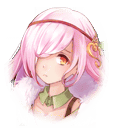

202250051 限定クエスト スライム倒して300年コラボ　1日1ヶ月のスローライフ スライム倒して300年コラボ　1日1ヶ月のスローライフ　ストーリークエストⅡ 1日1ヶ月のスローライフ　ストーリークエストⅡ 1日1ヶ月のスローライフ【EP5】 1日1ヶ月のスローライフ【EP5】 1日1ヶ月のスローライフ【EP5】

[View script in lisp](../scripts/202250051.txt)

【？？？】
グオオオオオオ…

【ミストルティン】
…はっ！？

深夜、寝ていた
ミストルティンは何かの
気配を感じて目を覚ます

【ミストルティン】
…気のせい？

きっと寝ぼけていたのだろう
そう自分に言いきかせて、
ミストルティンは再び眠りについた

【魔獣】
グオオオオオーーー！？

【アズサ】
よし、２５匹っと

【ミストルティン】
わ、私も２５匹…！

【ヴォータン】
私はとっくに終わったぞ！

【アズサ】
おっ、早くなったね～
二人とも、凄いじゃない！

日課である魔獣退治をこなす
二人ももう慣れた様子で
笑顔でアズサに報告した

【ヴォータン】
ふ、ふん！　当然だな！
私はスローライフで
きっちり成長しているんだ

【ミストルティン】
私も…ちょっとだけ…
楽しいかな、って…

【ライカ】
あ、アズサ様！

そんなアズサ達の元へ
血相を変えたライカとハルカラが
走ってやって来る

【ハルカラ】
お師匠様～～～！
見て下さい、これ！

ハルカラが持っていたのは、
あの謎のアイテムであった

しかし数日前と様子が違い、
それは光を放っていた

【アズサ】
うわわっ！？
どういうこと！？
なんで急に！？

【ハルカラ】
わからないです！
特に何かしたわけじゃないんです！

【アズサ】
何もしていないのに
アイテムが勝手に
起動はしないよねえ

【アズサ】
私達がしたことと言えば…

【ライカ】
…魔獣退治でしょうか？

【ヴォータン】
ま、まさか…！

【アズサ】
…一定の魔獣を倒すと
エネルギーが充填される仕組み？

【ハルカラ】
言われてみると、装置の形が
毎日倒している
魔獣に似てますね～

【アズサ】
自前では足りないから、
そういう形で補ったのかな

【ミストルティン】
本来この世界にいるはずのない
魔獣の存在が、異世界を繋ぐ
エネルギーになったのでしょうか…

【アズサ】
う～ん、そうかも
研究のためとはいえ、
困った研究者だよね

【ハルカラ】
良かった～！　これで元の世界に
帰れますよ～お師匠様～～！

【ライカ】
ほっとしました。
解決の糸口が見えない
状態でしたからね

【ライカ】
これもミストルティンさん
ヴォータンさんのおかげ…

【ミストルティン】
うっ…うっ…

【ヴォータン】
そ、そうだな…
良かった…本当に…

気付けばミストルティン達の
目から、涙が溢れていた

【アズサ】
ミストルティン…
ヴォータン…

【ヴォータン】
な、泣いてない！
泣いてないぞ！

【ミストルティン】
さ、寂しいです…

【ヴォータン】
お、おいミストルティン！
ここは笑って…ううっ…

【アズサ】
…そうだよね
このままお別れなんて…
なんだか私も嫌だな

【アズサ】
ねえライカ、ハルカラ…
もう少しだけこっちにいない？

【アズサ】
帰れるってなっても、
いつ帰るかは
自分たちで決めればいいし

【ライカ】
…そうですね

【ハルカラ】
あともう何日かいても、
向こうの朝には帰れます～

【アズサ】
…と、言うことで

【アズサ】
ミストルティン、ヴォータン
みんなで思い出作りをしようよ！

【ミストルティン】
お、思い出…？

こうして残された時間を、
思い出作りをすることに
決めた一行…

ドラゴンの姿になった
ライカの背に乗り、
この世界を縦横無尽に駆け抜けた

【ヴォータン】
うおおお～～～！
凄いぞ～！　地上が小さい！

【ミストルティン】
わあ…！　綺麗…！

日の出に照らされる
巨大な世界樹を見て、
ミストルティンは目を輝かせる

【アズサ】
こんな光景があるなんて…
こっちの世界も素敵だね

【ミストルティン】
アズサさん達の世界も…
きっと素敵だと思います

【アズサ】
ふふ、ありがと

【アズサ】
いつか二人が…
私達の世界に来てくれたらなぁ

【アズサ】
なんて、ちょっと無理な
お願いだったかな

【ミストルティン】
ふふ…そうできたら
本当にいいですね

【？？？】
グオオオオオオ…

【ミストルティン】
…はっ！？

【ミストルティン】
ま、また…？
気のせいじゃない…？

【ヴォータン】
…お前も気付いたか？

【ミストルティン】
ヴォータンさん！？

【ヴォータン】
どうも地下から気配を感じる…

【ミストルティン】
うん、魔獣の鳴き声みたいな…

それからミストルティンと
ヴォータンは音の正体を
探るべく家の中を探索し始めた

すると…

【ヴォータン】
まさか、こんな場所に
隠し通路があったとは…

【ミストルティン】
キッチンの下に階段が…！

【ヴォータン】
よし、行ってみるぞ

【ミストルティン】
だ、大丈夫でしょうか…？

【ヴォータン】
怖じ気づいてどうする？
ここはお前の家だろう？

【ミストルティン】
そ、そうでした…
これを解決できないと、
住むこともままなりません

ヴォータンに手を引かれ、
隠し階段を下っていく
ミストルティン

やがて、二人は
大きな空洞に降り立った

【ヴォータン】
ずいぶん広い空間だな…

【ミストルティン】
ヴォータンさん！
あれ！

ミストルティンが
指し示した方向にあったのは、
あの転移装置と同じ物だった

【ヴォータン】
なるほど…あれがもうひとつの
試作品…！　ここは実験室か！

【魔獣】
ウオオオオオオオ！！

【ミストルティン】
きゃあああっ！？

突然の揺れに驚いた
ミストルティンは思わず目を瞑る

【ミストルティン】
なっ！　なんですかっ！
あの魔獣は！

ミストルティンが目を開くと
そこには巨大な魔獣の姿があった

【ヴォータン】
なるほど…異世界から
転移した魔獣か？

【ヴォータン】
日課で獲得したエネルギーが
こちらにも流れたみたいだな

【ミストルティン】
それで起動して、
あれを喚び込んだ…？

【アズサ】
ミストルティン！
大丈夫！！

【ハルカラ】
ミストルティンさ～ん！
…って、ひいいいいっ！？
なんですかあの魔獣は！？

【ヴォータン】
お前達、どうしてここに？

【アズサ】
さすがにあんな騒音出されたら
目が覚めるって…

【ライカ】
それにしても…
こんなところに魔獣とは…

【アズサ】
あーなるほどアイテムの試作機が
ここにもあったわけか
灯台もと暗しだね…

【魔獣】
ウオオオオオオオオ！！

【ミストルティン】
ひゃああっ！？

【ハルカラ】
あの魔獣、ミストルティンさんを
睨み付けてませんか？

【ヴォータン】
恐らく、召喚主と思っているのだろう

【アズサ】
なるほど、急に連れてこられて
怒っていると…

【ミストルティン】
と、とばっちりですよ～！

今にも逃げ出したい…
と思っていたミストルティン
だったが…

【ミストルティン】
でも、アズサさん達の前で
情けない姿は見せられない…

【ミストルティン】
別れる前に…成長した私を、
みなさんに見て貰わないと…！

拳を握りしめ、
すっと立ち上がるミストルティン
しかしその体は小刻みに震えている

【ヴォータン】
お、おい大丈夫か！？

【ミストルティン】
私が、やらないと…
でも…

立ち向かう意思はあれど
ミストルティンの体は
思うように動いてくれない

憎悪を向けてくる強大な敵と
対峙するのは、日課での戦闘とは
まるで違っていた

【アズサ】
ミストルティン…！

【アズサ】
大丈夫！　どうしても嫌だったら
逃げてきちゃっても大丈夫だから！

【ミストルティン】
アズサさん…！

【ミストルティン】
そう…怖かったら逃げてもいい…
逃げても、大丈夫…！

そう考えた途端、ミストルティンは
体の震えが収まったのに気づく

【ミストルティン】
え～～～いっ！

【魔獣】
ウオオオオオ！？

あとはほとんど何も考えず
体が動くままに任せる

ミストルティンの強烈な一撃が
魔獣の頭に加えられた

【ヴォータン】
さっきまであんなに怖がってたのに
見事な一撃だ…
いったい何をしたんだ？

【ミストルティン】
自分で無理でも…
みんながいるから大丈夫って…
そう思ったら、なんか出来ました…

【ヴォータン】
な…なんだその理由は…

【アズサ】
うんっ、それでいいんだよ

【アズサ】
出来ないことは出来なくていい
他のみんながいるなら、
任せたっていいんだよ

【ミストルティン】
はいっ…！　
頼りにしてます！
ヴォータンさんも！

【ヴォータン】
う、うむ…
って、私もか！？

【ミストルティン】
一緒に頑張りましょう！

【ヴォータン】
な…なんで私…私が…

【ヴォータン】
ま、まあ頼りにされるのは
悪い気分じゃないからな！

ミストルティンの言葉に、
ヴォータンは顔を赤らめる

【ヴォータン】
よ～し！
大船に乗ったつもりで任せろ！

【ミストルティン】
はいっ…！

Next: [202250060](202250060.md)

[Back to index](index.md)
