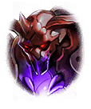

202259051 初心者クエスト 災厄の姫は絶望の地で希望を謳う 災厄の姫は絶望の地で希望を謳う 災厄の姫は絶望の地で希望を謳う　第１話 “希望”の創造-5 “希望”の創造-5 “希望”の創造-5 戦闘前

[View script in lisp](../scripts/202259051.txt)

しばらく後――

【ベルフェゴール】
ああっ！素晴らしいわぁ！

【ベルフェゴール】
一口で舌をとろけさせ、
二口で胸を燃え上がらせ、
三口で心を奪い去る

【ベルフェゴール】
人間の“意思”は
どんな美酒より甘くて苦いのぉ

【ベルフェゴール】
これさえあれば無尽蔵に
力が湧き上がってくる

【ベルフェゴール】
「夢の国」を作りあげた甲斐が
あったわねぇ

【ベルフェゴール】
絶望した人間達を眠りに就かせ、
楽しい夢を見せながら…

【ベルフェゴール】
生きる“意思”を吸い出していく
干からびて死ぬまで、
人間達は私の養分

【ベルフェゴール】
複雑で芳醇な味わい
もっと、もっと人間達を増やして、
より味わい深いものを作りたいわねぇ

【ベルフェゴール】
…………そういえば、最近、
「夢の国」に来る人間が
減っているような

【ベルフェゴール】
手下の子達が怠けてるだけなら
別にいいんだけどぉ
ちょっと気になるわねぇ…

【ゼロ】
せいっ！

【魔獣】
ガアアアア…

【ベルフェゴール】
…何なのよ、あれぇ
何て、何て醜い木偶なのぉ

【上級魔獣】
人間の体内に魔獣の血を入れて
強化しているようです

【ベルフェゴール】
ふぅん…
他にも何か混ざってるわねぇ
あれって…

【ベルフェゴール】
少し前に人間達が騒いでいた
神器…だったかしら？
その力を抽出したもの？

【ベルフェゴール】
嫌だわぁ…
ただでさえ不完全な人間が、
あんな見苦しい姿になって…

【上級魔獣】
我々に対抗するためとはいえ、
実に醜悪ですね

【ベルフェゴール】
どうやって作っているのかしらぁ？
さぞ、醜い実験場なんでしょうねぇ
ちょっと調べておいてぇ

【上級魔獣】
承りました、ベルフェゴール様

【ベルフェゴール】
ふぅん
ここがラグナロク機関…

【ゼロ】
何だ！？おい、天井が……

【ベルフェゴール】
あらぁ
こんなところで木偶を作ってるのねぇ

【ゼロ】
てめえ、何者だ！？

【ベルフェゴール】
威勢が良いわねぇ、坊や
私は地上世界を治める悪魔
ベルフェゴールよ

【ヴァリン】
ベルフェゴール！？
嘘でしょっ…七魔王の！？

【ティルフィング】
ヴァリン、下がって！

【ティルフィング】
彼女は間違いなく、
地上世界に君臨する七大勢力の
ベルフェゴールです！

【ベルフェゴール】
あらぁ、そこの女…

【ベルフェゴール】
あっちの木偶と違って美しいわねぇ
ただ、神の血が混じってるわぁ

【ベルフェゴール】
木偶の制作現場を
見に来ただけだったけど……
少し遊んであげるわねぇ

Next: [202259053](202259053.md)

[Back to index](index.md)
