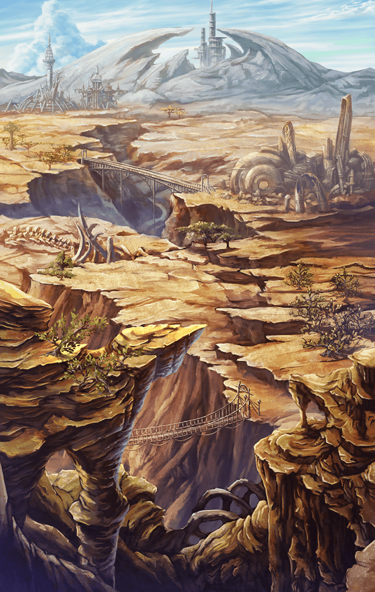
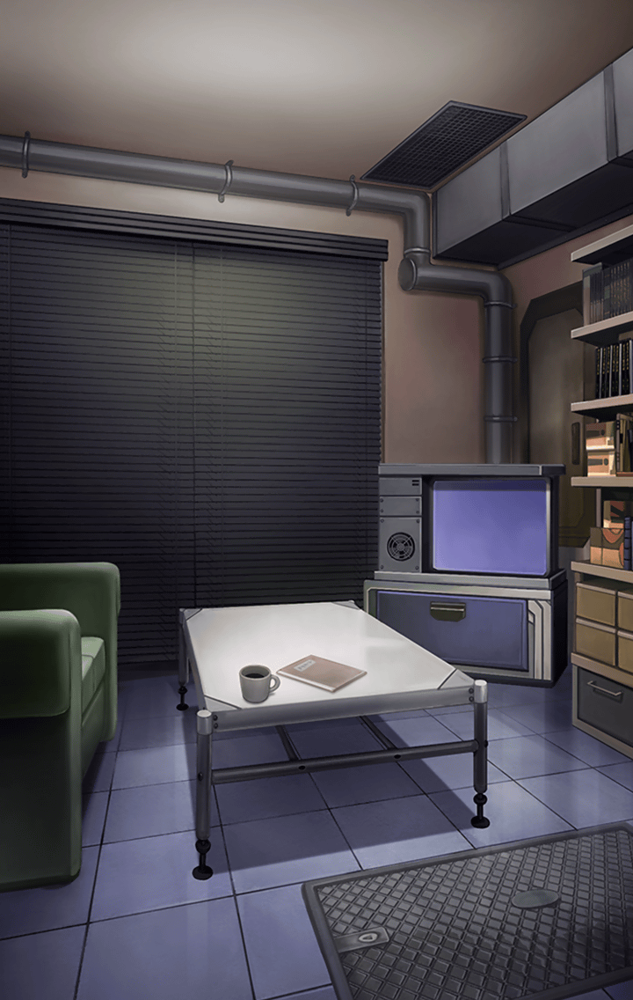
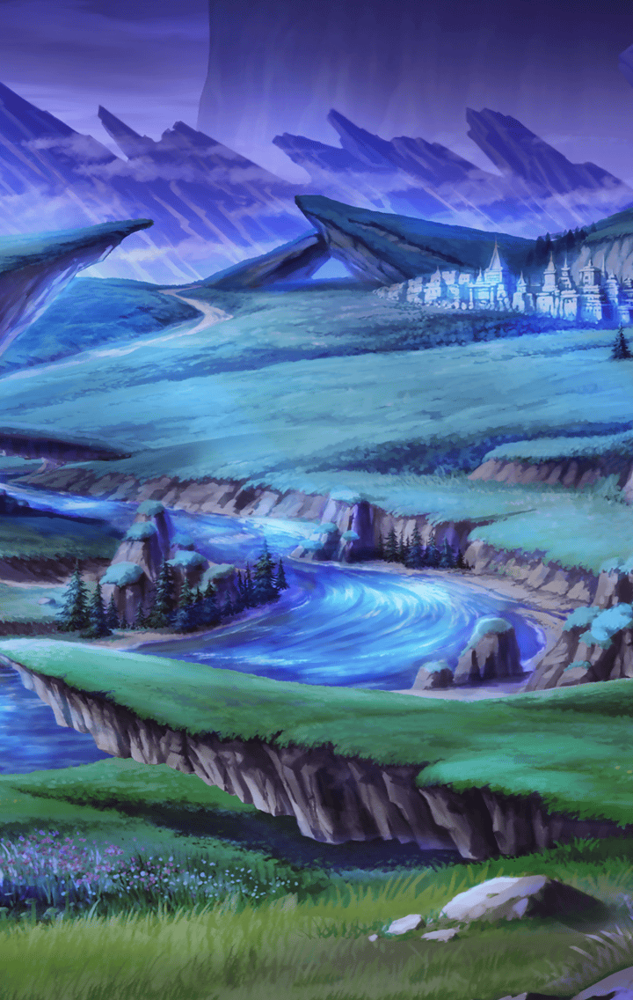

202271020 限定クエスト  PSYCHO-PASS サイコパス ２　懊悩の監視官　ストーリークエスト PSYCHO-PASS サイコパス ２　懊悩の監視官　ストーリークエスト 3 - 【EP2】似た者同士 懊悩の監視官-2 懊悩の監視官-2

[View script in lisp](../scripts/202271020.txt)

美佳に助けられた剣士は、
マサムネと名乗った

【霜月美佳】
それにしても、
お互い助かって良かったね

しかし――

【マサムネ】
拙者は、
そなたに助けてくれと言った
覚えはないが

【霜月美佳】
……は？

【霜月美佳】
なに言ってんのよ？
あのまま戦ってたら、
あなた どうなってたか…！

【マサムネ】
それで命を失ったとしたら、
拙者は所詮、
それまでの器だったということ

【霜月美佳】
ちょっと、あんたねぇ～！

マサムネに反感を抱く美佳

――だが、

【霜月美佳】
……！

【マサムネ】
……ッ！！

美佳は気づいた
強く、強く握り締められた
マサムネの拳に

【霜月美佳】
……そっか

【マサムネ】
……拙者は…
マサムネ

【マサムネ】
憤怒の業を背負う、
ただの一振りの刀だ

【霜月美佳】
憤怒って言ったっけ……

【霜月美佳】
怒ってるんだ……
無力な自分に

怒りで握り締められた
マサムネの拳を見て、
美佳は思う

【霜月美佳】
今になって分かった……

【霜月美佳】
元の世界に帰りたい…
なぜ、先輩達に
あんなことを言ったのか……

【霜月美佳】
私も……怒ってたんだ

【霜月美佳】
ただ嘆くだけで、
前に進めない無力な自分に……

【常守朱】
『この世界』でどうありたいか、
どうあるべきか……、
考えてみてください

【六合塚弥生】
事態は急を要します
もし気持ちに整理がついたら……
私達に追いついてきてください

【霜月美佳】
あの２人は現実を受け入れ、
戦っているっていうのに……

【霜月美佳】
拗ねて、悲しんでるだけの
無力な自分に……
怒ってたんだ………

拳を握り締めるマサムネを見る美佳

【マサムネ】
……不甲斐ない

【霜月美佳】
この人……
もしかしたら……
そんな私に似てるのかも

【霜月美佳】
……ねぇ

【マサムネ】
…なんだ？

【霜月美佳】
これ……貸してあげようか

自身のドミネーターを
マサムネに見せる美佳

【マサムネ】
……

【霜月美佳】
新種の標的に、
あなたの武器は効かない

【霜月美佳】
でもこの銃なら、倒せるわよ

【マサムネ】
……結構

【霜月美佳】
なっ、なんでよ…！？

【マサムネ】
拙者は剣一筋に生きてきた

【マサムネ】
剣を捨てるということは、
己を棄てること……！

【マサムネ】
剣を捨てたら、
拙者は拙者でなくなって
しまうのだ！

【霜月美佳】
でも……
その武器じゃ勝てないって
言ってんの！

【マサムネ】
拙者は一振りの刀
さらに己を磨き、
新種ですら斬ってみせる

そう言って、
去っていこうとするマサムネ

【霜月美佳】
ちょっ……！

【霜月美佳】
なによ！
貸してあげるって
言ってんのに！

【霜月美佳】
どうなっても知らないからねっ！！

【マサムネ】
……

口ではそう言いつつも、
先程の異族との戦闘もあり、
マサムネが気になってしまう

【霜月美佳】
……もう！

なんだかんだ言いつつ、
マサムネの後を追う
美佳だった

その夜――

【マサムネ】
ふっ！ふっ！

鍛錬のため、
マサムネは剣を振り続けている

【霜月美佳】
……

そんな彼女を見ている美佳

【霜月美佳】
いくら努力しても、
その武器じゃ勝てないのに……
馬鹿みたい

【霜月美佳】
でも……

【常守朱】
でも、
立ち止まっていても、
なにも解決はしませんよ

【霜月美佳】
まるで……
私と同じ

【霜月美佳】
目の前にある現実を
頑なに受け入れようとしないで……

【マサムネ】
ふっ！ふっ！

そんなマサムネに、
美佳が語り掛ける

【霜月美佳】
あなたの気持ち…
分かる気がする……

【マサムネ】
……？

【霜月美佳】
あなたは、
剣を心の拠り所にしている

【霜月美佳】
でも、あの異族には
普通の武器は通じない

【霜月美佳】
私はこっちの世界に来て、
『シビュラシステム』という
心の拠り所を失ったわ

【霜月美佳】
拠り所を失うのは……
とても怖いわよね

【マサムネ】
……

【霜月美佳】
でも私は、尊敬する
先輩達に教えられた

【霜月美佳】
それでも人は…
前に進まなくちゃいけない

【霜月美佳】
立ち止まってちゃ…
成長はないって

【マサムネ】
なにを突然、偉そうに……

【マサムネ】
そんなことを言って、
そなたも異族に
敵わなかったではないか

【霜月美佳】
…う、ごもっとも

【霜月美佳】
だから…変わりたいの

【霜月美佳】
あなたは私に似ている
だからこそ……

【霜月美佳】
一緒に変わっていきたい

【マサムネ】
……

Next: [202271031](202271031.md)

[Back to index](index.md)
