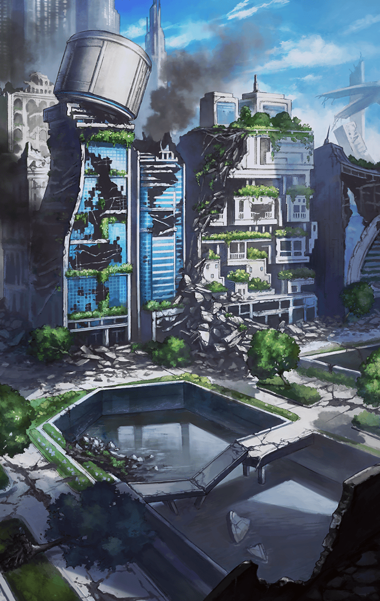

202304023 初心者クエスト 不可欠彩度レルム 不可欠彩度レルム　第3部 不可欠彩度レルム　第3部 不可欠彩度レルム-2 不可欠彩度レルム 第3部-2 不可欠彩度レルム 第3部-2 戦闘後

[View script in lisp](../scripts/202304023.txt)

突如としてあちこちに出現した魔獣
その対応にそれぞれキル姫があたる

パンドラとマクリルは
その中でも『裏側』の気配が濃く
『揺らぎ』が起きそうな場所へ向かう

【マクリル】
向こう…うん、もうすぐ！

パンドラはマクリルの案内に従う
そして辿り着いた先には…

【フライシュッツ】
あ、ふたりとも来てくれたの！

面倒を見ていると話していた
子供達を背に魔獣と対峙する
フライシュッツの姿があった

【パンドラ】
フライシュッツ…
マクリル、もしかして！

マクリルは悲しそうな顔で頷く
そう、やはりフライシュッツに
『裏側』が引き寄せられていたのだ

【フライシュッツ】
みんな助けが来たから大丈夫だよ！
戦えはしないけどみんなのことは
おねーちゃんが絶対に守るから！

子供達の不安を拭うフライシュッツ
だが、その心は『揺らいで』いた

まず、戦わなければ
大切な人を失わずに済むという思い

そして何よりも…

【マクリル】
どんどん濃くなってる…っ！

『ああ、呪いがなければ
街の子供達とも…大切な友人達とも
もっと一緒にいられるのに』

Next: [202304031](202304031.md)

[Back to index](index.md)
